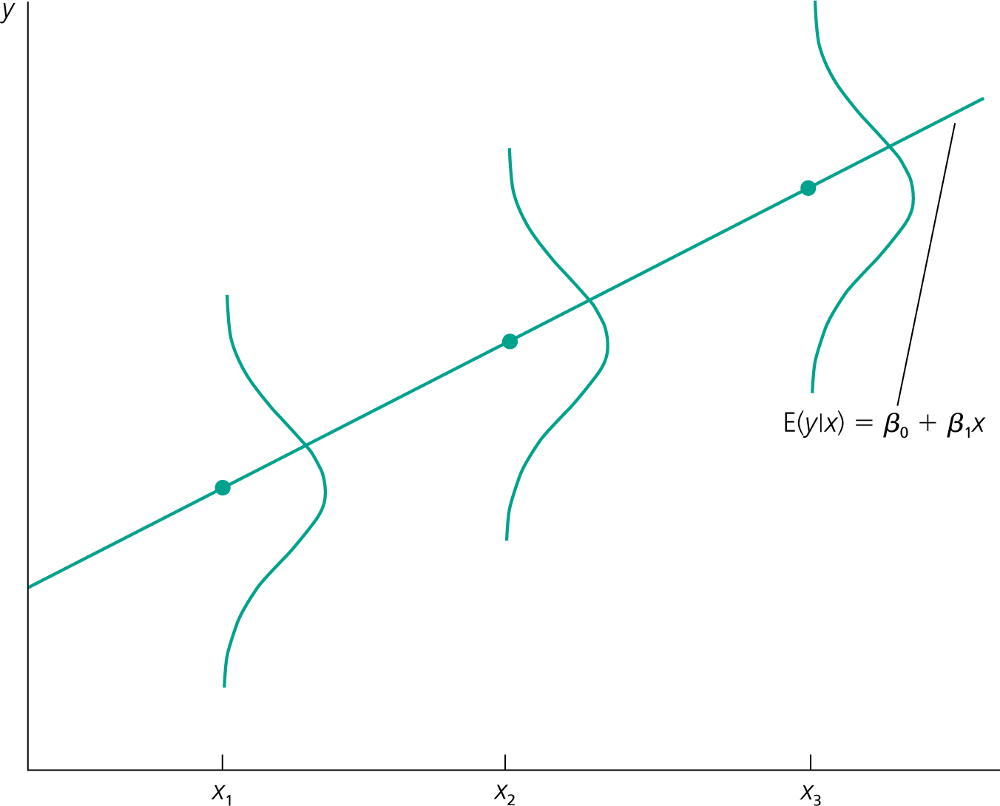
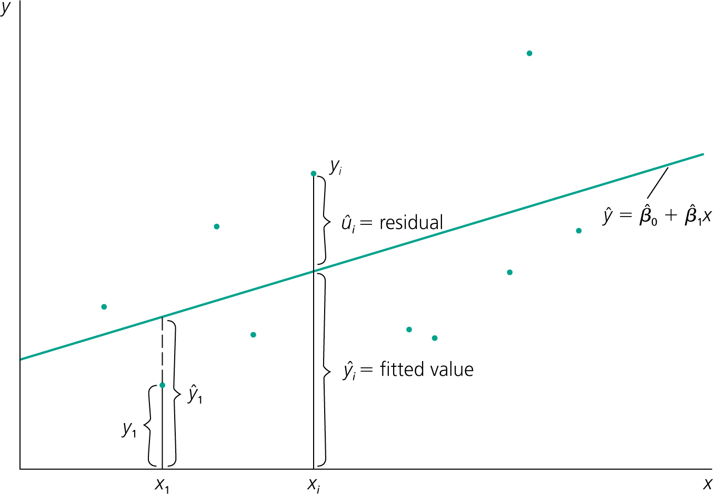

```{r setup, include=FALSE}
options(htmltools.dir.version = FALSE)
library(knitr)
library(kableExtra)
opts_chunk$set(
  fig.align="center",
  dpi=300, 
  fig.path='figs/',
  cache=T,
  echo=F,
  message = F,
  warning = F
  )
library(tidyverse)
require(cowplot)
require(ggpubr)
require(haven)
require(here)
 

```

layout: true

<div class="msu-header"></div>  

---

class: inverseMSU
name: Overview

# This lecture  

__Goal:__

1. Introduce the problem we'll be working on for a while

2. Define the **Population Regression Function**

3. Intuition of "fitting a line"
--

4. Define the assumptions for OLS

5. Ordinary Least Squares estimator

6. Computing OLS estimates in the **Sample Regression Function**

7. Descriptive analysis vs. causal

8. Other methods of calculating OLS

---
class: MSU

# The problem at hand...

We have some data on two (or more, later) variables that we think move together in an interesting way.
- (Insert one of many examples we've talked about before here)

--

We want to quantify and test this relationship
- Predict a change
- Test a theory
- Win a bet?

--

We have a **sample**, but want to predict/test something about the population


---
class: MSU

# The problem at hand...

Wage data used in Wooldridge `wage2`

```{r Wooldridge, echo=F, include=T, out.width='90%'}
df = read_dta('../data/WAGE2.dta')
meanwage = mean(df$wage)
meaneduc = mean(df$educ)
covwageeduc = cov(df$educ, df$wage)
d = ggplot(df, aes(x = educ, y = wage)) + geom_point() + theme_bw()
d
```

.footnote[Data from Blackburn and Neumark (1992), "Unobserved Ability, Efficiency Wages, and Interindustry Wage Differentials" *Quarterly Journal of Economics* 107, 1421-1436]


---
class: MSU

# The problem at hand

.pull-left[
The data looks like this:  

```{r Wooldridge2, echo=F, include=T, message = F, warning=F, out.width = '60%'}
knitr::kable(head(df %>% dplyr::select(wage, educ)), format = 'latex') %>%
  as_image(file = '../graphics/wol2.png', width=4)
  
```
]

.pull-right[
```{r Wooldridge3, echo=F, include=T, warnings=F, out.width='120%'}
d

```

<br>
- $N = 935$
- $\overline{wage} = `r round(meanwage, 2)`$
- $\overline{educ} = `r round(meaneduc, 2)`$
]

--

What we'd like to have is a function that tells us how $wage$ and $educ$ move together in the **population** 

---
class: MSU
# Population Regression Function

### In a perfect world, we would have some function for $X = educ$ and $Y = wage$:

$$g(x) = y$$

Where we give the function any realization of $x$, and it spits out exactly $y$.


### But that isn't going to happen
Think about the data we just looked at - $educ = 12$ we observed $wage=769$ and $wage=650$. The dream function doesn't exist! There are other things not accounted for besides $educ$.

---
class: MSU
# Population Regression Function

### So we settle for something that tells us about the **expectation** of $Y$. The Population Regression Function

$$E[Y|X] = \beta_0 + \beta_1 X$$

The *Population Regression Function* (PRF) describes the relationship between $X$ and the **conditional expectation** of $Y$.
- $X$ and $Y$ are random variables
- $\beta_0$ and $\beta_1$ are **population parameters**
- We have restricted the $E[Y|X]$ to be a *linear* function of $X$.
  - It can be drawn as a straight line with an intercept and constant slope
  - We will be estimating $\beta_0$ and $\beta_1$
  
---
class: MSU
# Population Regression Function

### The PRF:
$$E[Y|X] = \beta_0 + \beta_1 X$$

Let $Y=wage$ and $X=educ$
- $E[Y|X=x]$ gives us the expectation of $Y$ (wage) conditional on some realized value of $X=x$ (educ)

- So, if $educ=16$, then $E[Y|X=16] = \beta_0 + \beta_1 \times 16$
  - We can plug in any $x_i$ and get the **expected value** of the paired $y_i$
  
---
class: MSU
# Population Regression Function

### Question: Will the PRF return exactly $y_i$ given a value $x_i$?

---
class: MSU
name: WoolPRF

# Population Regression Function

```{r Wooldridge21, echo=F, out.width='80%', fig.cap = 'Ch. 2.1 of Wooldridge, example of a conceptual PRF. The line defines the PRF, the expectation of Y conditional on X'}


# .footnote[From Ch. 2.1 of Wooldridge. Shows an example of a conceptual PRF. The line defines the PRF, the expectation of $Y$ conditional on $X$]

```


---

class: MSU

# Population Regression Function

```{r PRF, echo=F, include=T, out.width='90%'}
df$educf = as.factor(df$educ)
v = ggplot(df, aes(x = (educf), y = wage)) + geom_violin()  + xlab('educ')
v
```

This is the wage data. Each "blob" is an empirical histogram of the data for that value of $educ$ (they are symmetrical). This is called a *violin plot*. It is the empirical counterpart of the [previous plot from Wooldridge](#WoolPRF)

---

class: MSU

# Population Regression Function

```{r PRF2, echo=F, include=T, out.width='90%', warning=F, message=F}
v + geom_point(data=df %>% dplyr::group_by(educf) %>% summarize(mwage = mean(wage, na.rm=T)), aes(x = educf, y=mwage)) 
```

Each point is the sample mean for each value of $educ$.

--

A (linear) PRF would be the straight line that best connects the points. **Regression fits that line**. A brief look at the line shows that it certainly won't be perfect!

---
class: MSU
# Fitting the line

### What happens, then, if we want to write $Y$ exactly?
The PRF gives us the *expectation* of $Y$
- So we add a **stochastic error term**, the difference between $E[Y|X]$ and $Y$:

$$Y = E[Y|X] + U = \beta_0 + \beta_1 X + U$$
This is the stochastic population regression function

$U$ is also the **population error term**, and is itself a **random variable**.
- It must be that $E[U] = 0$

---
class: MSU
name: regEqn
# Fitting the line

### Now we can write our **simple linear regression model**:

$$y = \beta_0 + \beta_1 x + u$$

This is a statement about the relationship between observed realizations $(y_i, x_i)$ based on the population parameters $\beta_0, \beta_1$

We will call $u$ the **error term** - it is the difference between the conditional expected mean and the observed $y_i$ given a value of $x_i$.
- It might be different for two identical realizations of $x_i$

--

Naturally, we would think that the "right" value of the population parameters, $\beta = \{\beta_0, \beta_1\}$<sup>*</sup>, minimizes all of the $u_i$ values in a sample.

----
.footnote[<sup>*</sup> A parameter vector is just a list of numbers.]

---
class: MSU
# Fitting the line

### The Sample Regression Function

$$\hat{y}_i = \hat{\beta}_0 + \hat{\beta_1} x_i$$

### The "hats" are important
They mean we have a *sample estimate* of the population parameters.
- $\beta_0, \beta_1$ are the population
- $\hat{\beta}_0, \hat{\beta}_1$ are the sample estimates and will change when the sample changes
  - So they are random variables!

--


### Where did $u$ go?
Since we have a hat on $y_i$, there is no $u$, but $\hat{y}_i \neq y_i$.
- Define $\hat{u}_i = \hat{y}_i - y_i$.
- $\hat{u}_i$ is the *residual*.
  
---
class: MSU
# Fitting the line

### To summarize:

The $PRF$ is
$$E[Y|X] = \beta_0 + \beta_1 X$$

The simple linear regression model is:
$$y = \beta_0 + \beta_1 x + u$$

The SRF is:
$$\hat{y}_i = \hat{\beta}_0 + \hat{\beta}_1 x_i$$

And if we want to write the sample regression model:
$$y_i = \hat{\beta}_0 + \hat{\beta}_1 x_i + \hat{u}_i$$


---
class: MSU
# Fitting the line

## How do we get those $\hat{\beta}$'s in the SRF?
<br>
#### We make two assumptions:

**First**, if the expectation of $Y$ equals $\beta_0 + \beta_1 X$, then *in expectation*, $E[U] = 0$. Because:
$$E[Y|X] = \beta_0 + \beta_1 X \quad \text{and} \quad Y = \beta_0 + \beta_1 X + U$$
<br><br>

**Second**, our first assumption should hold no matter what $x$ is. So, it should be true that $E[U|X] = 0$ for **all** possible values of $X$.

There are very important assumptions as they will define our Sample Regression Function (SRF).

---
class: MSU
# Fitting the line

### Let's make these assumptions formal:

1. $E[U]=0$. 
  - As long as there is a $\beta_0$ (regardless of $\beta_1$), this is true. We call this assumption **trivial**.

2. $E[U|X] = E[U]$ 
  - **Mean independence**. The **mean** of $U$ is the same, regardless of the value of $X$:

These are **population moments**
- A **moment** is a specific attribute of a distribution
- The mean is the "first moment". Variance is the "second moment".

--

Economists spend a lot of time showing mean independence $E[U|X] = E[U]$.

---
class: MSU

# Fitting the line

Two quick reminders before we introduce the Ordinary Least Squares (OLS) estimator for $\beta$:
$$Cov(Y,X) = E[YX] - E[Y]E[X]$$
and
$$\text{If} \quad E[U]=0$$
then 
$$Cov(U,X) = E[UX] - E[U]E[X] = E[UX] - 0$$

--

And note that the simple linear regression model $y = \beta_0 + \beta_1 x + u$ implies that:
$$u = y - \beta_0 - \beta_1 x$$


---

class: MSU
# OLS in 1 variable

### Since $u = y - \beta_0 - \beta_1 x$:
Let's write Assumption 1 and Assumption 2 using expectations of the [regression model from before](#regEqn)
- $E[U]=0 \Rightarrow E[(y - \beta_0 - \beta_1 x)] = 0$
- $E[U|X] = 0 \Rightarrow E[x(y - \beta_0 - \beta_1 x)] = 0$
  - To see this, picture any expected value of $x$. Now, multiply it by $0$.


- How many equations?

- How many unknowns?


## Let's solve for $\beta$. To the board!

--

These are *moments*, and this way of deriving $\beta$ is known as "method of moments".

---

class: MSU

# OLS in 1 variable

What we just derived on the board depends on **population** moments: $Cov(Y,X)$ and $Var(Y,X)$.

But, just as before when we didn't know $\mu$ but we could calculate $\bar{y}$ (and we even know something about the distribution of $\bar{y}$)...

--

...we can calculate sample values for $Cov(y,x)$ and $Var(x)$

---
class: MSU
# OLS in 1 variable

First, let's tackle the *estimate* of $\beta_0$.
- We know, from the board, that $\beta_0=E[y] - \beta_1 E[x]$
- We have a good, unbiased sample estimator for $E[y]$: $\bar{y}$.
- And we have a good, unbiased sample estimator for $E[X]$: $\bar{x}$
  - $\bar{y} = \hat{\beta_0} + \hat{\beta_1}\bar{x}$
  
The hats stand for (sample) estimates! We don't observe $\beta_0$, but we can estimate it.
This is very common notation.

---

class: MSU
# OLS in 1 variable

Of course, we still have to calculate $\hat{\beta_1}$.

We know how to calculate the sample covariance:
- $\widehat{Cov}(Y,X) = \frac{1}{N-1} \sum_{i=1}^{N} (x_i - \bar{x})(y_i - \bar{y})$

We know how to calculate the sample variance:
- $\widehat{Var}(X) = \frac{1}{N-1} \sum_{i=1}^{N} (x_i - \bar{x})^2$

$$\hat{\beta}_1 = \frac{\widehat{Cov}(Y,X)}{\widehat{Var}(X)} = \frac{\frac{1}{N-1} \sum_{i=1}^{N} (x_i - \bar{x})(y_i - \bar{y})}{\frac{1}{N-1} \sum_{i=1}^{N} (x_i - \bar{x})^2}$$

--

What is important here is that **these are all observable in the data, and you know how to calculate them**. You know how to calculate $\bar{x}$ and $\bar{y}$, you know how to sum things, and you know $x_i$ and $y_i$ in the data.

**As long as your assumptions hold**, you have an estimate of the PRF.

---

class: MSU

# OLS in 1 varible

So let's "regress x on y" in groups with a very small N: 
  
.pull-left[
```{r exampleOLS, echo=F, include=T, out.width = '40%'}
beta0 = -1
beta1 = 2
ex = data.frame(ID = 1:5,
                X = rpois(5, 3),
                unum = rnorm(5))
ex$Ynum = beta0 + ex$X*beta1 + ex$unum

# write_dta(ex, path='../temp/single_variable_data.dta')

knitr::kable(ex[,c('Ynum','X')], digits=1, col.names = c('  Y  ','  X  '), align='cc', format = 'latex') %>%
  # kable_styling(bootstrap_options = c("striped")) %>% # do not use bootstrap options with latex -> as_image!
 # column_spec(1, width = '10em') %>% 
 # column_spec(2, width = "10em") %>%
  as_image(file = '../graphics/datatableasdfg.png', height = 3)

# plot(ex[,c('X','Ynum')], pch=16, cex=2, ylab='Y')

```
 
```{r exampleOLSplot, echo=F, include=T, out.width = '100%'}
plot(ex[,c('X','Ynum')], pch=16, cex=2, ylab='Y')
```
]

.pull-right[
- Calculate $\bar{x}$
- Calculate $\bar{y}$
- Then, calculate each $x_i - \bar{x}$
  - Then square each of them
- Calculate each $y_i - \bar{y}$
- Calculate each $(y_i - \bar{y})(x_i - \bar{x})$
]


---
class: clear
count: false
---
class: MSU
# OLS in 1 variable

```{r exampleOLSPlot2, echo=F, include=T, out.width='90%', caption='The regression line'}
lm1 = lm(Ynum ~ X, data=ex)
plot(ex[,c('X','Ynum')], pch=16, cex=2, ylab='Y')
abline(lm1, col='red')
```

The red line is the *sample regression function*, or *SRF*.

--

Why is it the "sample" regression function?


---
class: MSU
# OLS in 1 variable

A couple important terms:
- The **fitted value**, $\hat{y}_i = \hat{\beta_0} + \hat{\beta_1}x_i$
- The **residual**, $\hat{u}_i = y_i - \hat{y}_i = y_i - \hat{\beta}_0 - \hat{\beta}_1 x_i$

And note that:
- $y_i = \hat{\beta_0} + \hat{\beta_1}x_i + \hat{u}_i$
  - The $\hat{u}_i$ "trues up" the fitted value.
--


Note that the residual is not the same as the error term. 
- The residual is an empirical estimate from the sample
- The error term, $u_i$, is different

---
class: MSU
# OLS in 1 variable

What's inside the error term?

In $u_i$
- Omitted variables
  - There might be another covariate, $x_2$, that is missing.
- Measurement error
  - That $x$ might not be correctly measured.
- Non-linearities
  - Maybe there are some non-linear effects included in there.
  
These are all in $u_i$.

$$y_i = \beta_0 + \beta_1 x_1 + \underbrace{\beta_1 (x^*_1 - x_1) + \beta_2 x_{omitted} + f(nonlinears) + \tilde{u}_i }_{\text{other things, u}}$$

Our estimator, $\hat{\beta}$ assumes alllllll these things are 0 in expectation, no matter the value of $x$

---
class: MSU
# OLS in 1 variable

```{r Wool24, echo=F, include=T, out.width='90%', fig.cap='Wooldridge Fig. 2.4'}

```

---

class: MSU

# OLS in 1 variable

```{r exampleFit, echo=F, include=T, out.width='90%', fig.cap = 'Regression line for wage2 data'}
dfit = ggplot(df, aes(x = educ, y = wage)) + geom_point() + geom_smooth(method='lm', se=F, col='red') +  theme_bw()
dfit
```


---

class: MSU
# OLS in 1 variable

It will always be the case that, for any estimates $\beta$ from a sample:
- $\sum_{i=1}^N (\hat{u}_i) = 0$
- $\sum_{i=1}^N (x_i \hat{u}_i) = 0$
- The point $(\bar{y}, \bar{x})$ is always on the regression line


---

class: MSU 
# Descriptive Analysis vs. Causal

In a mathematical sense, we can always calculate a $\beta$ such that $\bar{u} = 0$ for all values of $x$.

But what might throw us off is if there is something else unobserved, $w$, that is "in the error term".
- What is "in the error term?"
  - Everything in the world that isn't $educ$

  
--

For our example, let's think about $a=ability$.
- Since $ability$ is unobserved, it is "in the error term"
- $ability$ is also pretty correlated with $educ$ (high ability people go to college)
- In a way, we're attributing the causal effect of $ability$ to $educ$
- So, $E[u | educ = high]>0$
  - The unobserved error term, $u$, is higher due to the $ability$ part

For now, we will work as if our assumption $E[U|X]=0$ is true.
---

class: MSU

# Putting the "Least Squares" in OLS

The "squares" part refers to the squaring of the error term.

The "least" part refers to a minimzation of the (squared) error term.

Let's define the **sum of squared residuals** as:

$$SSR = \sum_{i=1}^{N} \hat{u}_i^2 = \sum_{i=1}^{N} (y_i - \hat{\beta}_0 - \hat{\beta}_1 x_i)^2$$

And $\beta$ is the "Least Squares" estimate if it minimizes $SSR$. How?

--

Take the derivative and set it equal to zero:

$$\frac{\partial SSR}{\partial \hat{\beta}_0} = 2 \sum (y_i - \hat{\beta}_0 - \hat{\beta}_1 x_i) = 0$$
and

$$\frac{\partial SSR}{\partial \hat{\beta}_1} = 2 \sum (y_i - \hat{\beta}_0 - \hat{\beta}_1 x_i)x_i = 0$$

---
class: MSU

# Goodness of fit

## SSR, SSE, and SST

We know that $\beta_{OLS}$ minimizes the sum of squares. How do we measure how good of a fit we get?

Define two more in addition to $SSR$:
- Sum of Squares Total: $SST = \sum_{i=1}^N (y_i - \bar{y})^2$
  - $SST$ is a total sum of squares (notice no hats).
- Sum of Squares Explained: $SSE = \sum_{i=1}^N (\hat{y}_i - \bar{y})^2$
  - $SSE$ can be thought of as how much is *explained* by $\hat{y}_i$, *...relative to just guessing the obvious:* $\bar{y}$

---
class: MSU
# Goodness of fit

### $SST = SSR + SSE$
The total variance is the sum of the variance of the residuals (what isn't explained by your model) and the $SSE$ (the variance that is explained).

This is a *decomposition* of variance.

---
class: MSU

# Goodness of fit

### The $R^2$ 

$R^2$ ('r-square') is the comparison of $SSE$ to $SST$. Since $SSE<SST$ always, and both are always positive, $0<R^2\leq 1$

$$R^2 = \frac{SSE}{SST} = 1 - \frac{SSR}{SST}$$

The $R^2$ is often interpreted as the "fraction of variance explained by the model"
- Your regression, the SRF, is a model
- The variance being explained is the variance in the outcome, $y$.


---

class: MSU

# Goodness of fit

From earlier:

```{r Wool24b, echo=F, include=T, out.width='80%', fig.cap='Wooldridge Fig. 2.4'}

```


---

class: MSU
# Goodness of fit


```{r regression, echo=T, include=T}
# Ynum is the column name for the outcome variable
# X is the column name for the independent variable and ex is the name of the data frame
summary(lm(Ynum ~ X, data=ex))
```


---
class: MSU
# Final notes

### Terminology

$$y = \beta_0 + \beta_1 x + u$$
.pull-left[
$y$ is called
- The dependent variable (DV)
- The "left hand side" (LHS)
- The outcome variable
- The response variable
]

.pull-right[
$x$ is called
- The independent variable
- The "right hand side" (RHS)
- The explanatory variable
- The control variable
- A covariate or a regressor
]
  
  
$u$ is called
- The residual (when $\hat{u}$)
- The error term (when $u$)
  

---
class: heading-slide

On to transformations and functional forms!


```{r outputChromePrint, include=F, eval=F}

require(pagedown)
currentfile = gsub(pattern='\\.Rmd', '', basename(rstudioapi::getSourceEditorContext()$path))
inputpath = paste0('https://ajkirkpatrick.github.io/EC420MSU/',currentfile, '/', paste0(currentfile, '.html'))
browseURL(inputpath)
pagedown::chrome_print(input = inputpath,
                   output = file.path(currentfile, paste0(currentfile, '.pdf')),
                   #wait = 3,
                   timeout = 300,
                   format = 'pdf')

```