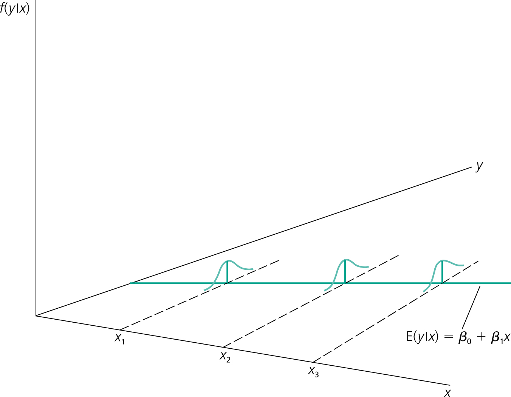
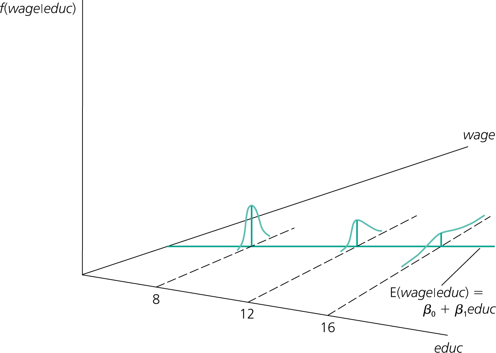

```{r setup, include=FALSE}
options(htmltools.dir.version = FALSE)
library(knitr)
library(kableExtra)
opts_chunk$set(
  fig.align="center",fig.height=4, #fig.width=7,# out.width="748px", #out.length="520.75px",
  dpi=300, #fig.path='Figs/',
  cache=T,
  echo=F,
  engine.path=list(stata="C:/Program Files/Stata16/StataIC-64.exe")#, warning=F, message=F
  )
library(tidyverse)
require(cowplot)
require(ggpubr)
require(haven)
require(Statamarkdown)
```

layout: true

<div class="msu-header"></div> 
---
class: inverseMSU
name: Overview

# This lecture  

__Goal:__

1. Review where we are in single-variable regression

1. Review statistical inference

1. Expectation of the estimate $\hat{\beta}$

1. Variance of the estimate, $\hat{\beta}$

1. Homoskedasticity assumption

1. An example


---
class: heading-slide

Review

---
class: MSU

# Review single-variable OLS

### We have a linear-in-parameters single-variable model:

$$y = \beta_0 + \beta_1 x + u$$
- "In terms of the random sample" (W2.5a):  $y_i = \beta_0 + \beta_1 x_i + u_i$
 
--
 
- "Fitting a line" 
  - The PRF and the SRF
  
--

- $\hat{\beta}_1 = \frac{\widehat{Cov}(x,y)}{\widehat{Var}(x)}$

- $\hat{\beta}_0 = \bar{y} - \hat{\beta}_1 \bar{x}$

--

- SST (Sum of Squares Total) = $\sum_{i=1}^{N}(y_i - \bar{y})^2$
  - SSE (Sum of Squares Explained) = $\sum_{i=1}^{N}(\hat{y}_i - \bar{y})^2$
  - SSR (Sum of Squares Residual) = $\sum_{i=1}^{N}\hat{u}^2_i$


---
class: MSU

# Review statistical inference

When we have a random variable with a population characteristic of interest
- $X$ with population mean $\mu_X$

And a sample $x_i$ of observed draws from the RV, then we can make a *hypothesis* about $\mu_X$:
- $H_0: \mu_X = 0 \quad and \quad H_A: \mu_X \neq 0$

--

Then, we can develop a sample *test statistic* for the population characteristic:
- $\bar{X} = \frac{1}{N}\sum x_i$

--

And we know two things about $\bar{X}$:
- $E[\bar{X}] = E[X] = \mu_X$
- $Var(\bar{X}) = {\frac{\sigma^2_X}{N}}$

---
class: MSU

# Review statistical inference

If we're smart, we make a sample test statistic with a distribution that we know:
$$\frac{\bar{X}-H_0}{\sqrt{\frac{\hat{\sigma}^2}{N}}} \sim N(0, 1)$$

or if we don't know $\sigma^2_X$
$$\frac{\bar{X}-H_0}{\sqrt{\frac{\hat{s}^2}{N}}} \sim t_{df}$$

--

We can test our hypothesis by comparing our sample test statistic result to the hypothesized value.
- If observed $\bar{X} = 4$ and observed $\frac{\hat{\sigma}_X}{\sqrt{N}} = 1$, is $H_0: \mu_X = 0$ likely to be rejected?


---
class: MSU
# Review statistical inference

### We can think of $\beta_1$ as the test statistic for the relationship between $x$ and $y$

What do we need to test a hypothesis?

--

A distribution
- $E[\hat{\beta}_1]$
- $Var(\hat{\beta}_1)$
- $\hat{\beta}_1 \sim N(?,?)$ (let's assume we know it's Normal for now)

If we did know these three things, we could test any interesting $H_0$
- Anyone know one that might be interesting?

---
class: MSU
# Expectation of the estimate

Now, remember that we are looking at $\hat{\beta}$, not $\beta$ itself.
- $\beta$ is a population parameter, 
  - It is unobserved
  - It is a constant
  - Because it is a constant, it can move in and out of $E$xpectations and variances as a constant would.
  
- $\hat{\beta}$ depends on the sample. It is therefore a random variable.
  - It has an expected value
  - It has a variance
  - We can use a statistical test on hypothesis about $\hat{\beta}$.
  
These are two different things, we are interested in whether or not they are the same in $E$

---
class: MSU
# Review statistical inference

We will need to make the following four assumptions to get $E[\hat{\beta}]$

### Gauss-Markov Assumptions

1. SLR.1: In the population, $y$ is a linear function of the parameters, $x$, and $u$: $y = \beta_0 + \beta_1x+u$

2. SLR.2: the sample $(y_i, x_i): i= 1, 2, \cdots, n$ follows the population model and are independent.

3. SLR.3: "Sample Variation in the Explanatory ( $X$ ) Variable". That is, $x_i$ is not the same for all $i$'s.

4. SLR.4: "Zero conditional mean". $E[u|x] = 0$ for all $x$.

<br>
File these away for a minute. We'll need them.


---
class: MSU
# Expectation of the estimate

We know how to calculate, from our sample, $\hat{\beta}$

We would hope (and will now prove) that $E[\hat{\beta}] = \beta$
- This is the first step in deriving the distribution of $\hat{\beta}$
- Section 2.5a of Wooldridge
  - If $E[\hat{\beta}] = \beta$, then the estimator is **unbiased**. Let's see if this is the case:

--

$$\hat{\beta}_1 = \frac{\widehat{Cov}(X,Y)}{\widehat{Var}(X)} = \frac{\frac{1}{N-1} \sum(x_i - \bar{x})(y_i-\bar{y})}{\frac{1}{N-1} \sum(x_i - \bar{x})^2} = \frac{\sum(x_i - \bar{x})y_i}{\sum(x_i-\bar{x})^2}$$
- The first equality is from our definition two lectures ago.
- The second uses the definition of Covariance and Variance
- The third cancels out the $\frac{1}{N-1}$ and does some simplification of the numerator (see Appendix A of Wooldridge)


---
class: MSU
# Expectation of the estimate

Let's rewrite, then take expectations to see what the expectation of the estimate is: 
$$\hat{\beta}_1 = \frac{\sum(x_i - \bar{x})y_i}{\sum(x_i-\bar{x})^2}$$

- Rewrite $\sum (x_i - \bar{x})^2$ as $SST_x$. After all, it's the total sum of squared deviations from $\bar{x}$.
  - We are just adding that subscript to make sure we remember where it come from. 
  - Remember, we originally introduced $SST$ as the *Sum of Squares Total* in a regression and it referred to the total variance in $Y$, the left-hand-side (LHS) of our regression.
--

- Substitute our model for $y_i$: $y_i = \beta_0 + \beta_1 x_i + u_i$, our model:
--

- Rename $x_i - \bar{x}$ as $d_i$, for **d**eviations from $\bar{x}$.
  - This will make it easier to work with.

---
class: MSU
# Expectation of the estimate

$$\hat{\beta}_1 = \frac{\sum(x_i - \bar{x})(\beta_0 + \beta_1 x_i + u_i)}{\sum(x_i-\bar{x})^2} = \frac{\sum(d_i \beta_0) + \sum(d_i \beta_1 x_i) + \sum(d_i u_i)}{SST_x}$$

Let's take a second and make sure everyone is on board here. Remember, $d_i = x_i - \bar{x}$.
<br><br><br>
--

Take the $\beta$'s out as they are constants:

$$\hat{\beta}_1 = \frac{\beta_0 \sum(d_i) + \beta_1 \sum(d_i x_i) + \sum(d_i u_i)}{SST_x}$$
--

In that numerator, $\beta_0 \sum(d_i)$ must be $0$ since $\sum(x_i - \bar{x}) = 0$. We can ignore it! <br><br>

$$\hat{\beta}_1 =\frac{0}{SST_x} + \frac{\beta_1 \sum (d_i x_i)}{SST_x} + \frac{\sum(d_i u_i)}{SST_x}$$

---
class: MSU
# Expectation of the estimate

The second term : 
$$\frac{\beta_1 \sum(d_i x_i)}{SST_x} = \frac{\beta_1 \sum((x_i - \bar{x})x_i)}{SST_x} = \frac{\beta_1 \sum((x_i - \bar{x})(x_i-\bar{x}))}{SST_x} = \frac{\beta_1 SST_x}{SST_x}$$
And since $SST_x$ is in the denominator and cancels, we will end up with $\beta_1$.
<br>
--

#### This is very important: notice that we now have the true value of beta in there.

$\beta_1$ is the true beta. It is *part of* $\hat{\beta}_1$, but there's still the third term:

$$\frac{\sum(d_i u_i)}{SST_x} = \frac{\sum((x_i - \bar{x})u_i)}{SST_x}$$

--

$$\hat{\beta}_1 = \beta_1 + \frac{\sum((x_i - \bar{x})u_i)}{SST_x}$$

We will say that the estimate of $\beta_1$, $\hat{\beta}_1$ is the true $\beta$ plus some term.

---
class: MSU

# Expectation of the estimate

$$\hat{\beta}_1 = \beta_1 + \frac{\sum((x_i - \bar{x})u_i)}{SST_x}$$

Conditional on the $x_i$'s (our sample), the entire source of randomness here is in $u_i$.

--

Now, we take the last step to show that the $E[\hat{\beta}_1]=\beta_1$.

We will need our four assumptions. Specifically, the fourth.

---
class: MSU
# Expectation of the estimate

Our assumptions from before:

### Gauss-Markov Assumptions (fancy name for what you already know)

1. SLR.1: In the population, $y$ is a linear function of the parameters, $x$, and $u$: $y = \beta_0 + \beta_1x+u$

2. SLR.2: the sample $(y_i, x_i): i= 1, 2, \cdots, n$ follows the population model and are independent.

3. SLR.3: "Sample Variation in the Explanatory ( $X$ ) Variable". That is, $x_i$ is not the same for all $i$'s.

4. SLR.4: "Zero conditional mean". $E[u|x] = 0$ for all $x$.


---
class: MSU
# Expectation of the estimate

Now, we can go to our equation for $\hat{\beta}_1$:

$$\hat{\beta}_1 = \beta_1 + \frac{\sum((x_i - \bar{x})u_i)}{SST_x}$$

We can take $E$ of each side:

$$E[\hat{\beta}_1] = E[\beta_1] + E\left[\frac{\sum((x_i - \bar{x})u_i)}{SST_x}\right]$$

$E[\beta_1] = \beta_1$.

For any value of $x$, $E[u|x] = 0$ under SLR.4. 
- No matter what $x$ or $(x_i - \bar{x})$ is, once we condition on $x$, the second term is zero in expectation.

$\Rightarrow E[\hat{\beta_1}] = \beta_1$.

--

Hooray, our estimator, $\hat{\beta}_1$ is unbiased, and we know it is distributed with mean of $\beta$

---
class: MSU
# Expectation of the estiamte

$E[\hat{\beta}_0]=\beta_0$ is shown in Wooldridge 2.5a.
  - " $\hat{\beta}_0$ is an unbiased estimator of $\beta_0$ "

Now, we simply need to fill in the variance of $\hat{\beta}$ to have a test statistic for $\beta$.

---
class: heading-slide

Variance of the estimate 


---
class: MSU

# A brief interlude about proofs

## Question: have you had proofs in your previous classes?


---
class: MSU

# Variance of the estimate

### Gauss-Markov Assumptions

1. SLR.1: In the population, $y$ is a linear function of the parameters, $x$, and $u$: $y = \beta_0 + \beta_1x+u$

2. SLR.2: the sample $(y_i, x_i): i= 1, 2, \cdots, n$ follows the population model and are independent.

3. SLR.3: "Sample Variation in the Explanatory ( $X$ ) Variable". That is, $x_i$ is not the same for all $i$'s.

4. SLR.4: "Zero conditional mean". $E[u|x] = 0$ for all $x$.

### Add one more assumption:

Add SLR.5: $Var[u|x] = \sigma^2_u$ for all $x$.
- This is similar to the conditional mean, but says that every $u_i$ is drawn from a variable whose distribution has the same value for $\sigma^2$.

---
class: MSU

# Variance of the estimate

### SLR.5: $Var[u|x] = \sigma^2_u$ for all $x$
- This is similar to the conditional mean, but says that every $u_i$ is drawn from a variable whose distribution has the same value for $\sigma^2$.

- We do **not** need this assumption to show that $\hat{\beta}$ is an unbiased estimator for $\beta$
  - But we do need this assumption to calculate the variance of $\hat{\beta}$.

- It does not mean that we know $\sigma^2_u$.

---
class: MSU
# Variance of the estimate

### Start with where we left off on $\beta_1$:

$$\hat{\beta}_1 = \beta_1 + \frac{\sum((x_i - \bar{x})u_i)}{SST_x}$$

Instead of taking the expectation as we did for proving unbiasedness, we take the **variance**:

$$Var(\hat{\beta_1}) = Var(\beta_1) + Var\left[\frac{\sum((x_i - \bar{x})u_i)}{SST_x}\right] + 2Cov\left(\beta_1,\left[\frac{\sum((x_i - \bar{x})u_i)}{SST_x}\right]\right)$$

- Because the variance of any constant (like $\beta_1$) is 0, we can drop that 1st term.
- Because $Cov(c,X)=0$ when $c$ is a constant, we can drop the $2 Cov(\cdots)$ term.

---
class: MSU
# Variance of the estimate

### This leaves us with:
$$Var(\hat{\beta}_1) = Var\left[\frac{\sum((x_i - \bar{x})u_i)}{SST_x}\right] = Var\left[ \frac{1}{SST_x} \sum((x_i - \bar{x})u_i)\right] $$

We can condition on $x_i$'s again, and make the same argument that, conditional on $x_i$, we can take them out of the $Var$ term.
- When we do this, we must **square** what we remove:

$$\begin{equation}
Var(\hat{\beta_1}) = \frac{1}{SST_x^2} \times Var\left[\sum(x_i - \bar{x}) u_i\right] = \frac{1}{SST_x^2} \times \left[\sum(x_i - \bar{x})^2\right]Var(u_i)\\
= \frac{SST_x}{SST_x^2} \sigma^2_u = \frac{1}{SST_x}\sigma^2_u
\end{equation}$$

---
class: MSU
#Variance of the estimate
So variance is:

$$Var(\hat{\beta}_1) = \frac{\sigma^2_u}{SST_x}$$

For any realization of $x$
--

- Variance of the estimator is increasing in $\sigma^2_u$.
- Variance of the estimator is decreasing in $SST_x$, variation in $X$.
--

---
class: MSU
#Variance of the estimate

### Good, but we don't know $\sigma^2_u$, do we?

--

- $\hat{u}$ seems like a good start.
- In our model, $u_i$ is the *error*, but we observe $\hat{u}$, which is the residual.
  - $\hat{u}_i = u_i - (\hat{\beta}_0 - \beta_0) - (\hat{\beta}_1 - \beta_1)x_i$
  - So $E[\hat{u_i}] = u_i$
  
As Wooldridge states: "the *error*, $u$, shows up in the equation containing the *population parameters*, $\beta$. The residual shows up in the *estimated* equation with $\hat{\beta}$.
- Remember, $u_i$ is not observed. 
- But $\hat{u}_i$ is observed.

---
class: MSU
#Variance of the estimate

We can use $\sum_{i=1}^{N} \hat{u}_i^2$ as an estimator for $\sigma^2_u$ if we make this small adjustment.

- $\hat{\sigma}_u^2 = \frac{1}{(N-2)} \sum_{i=1}^{N} \hat{u}_i^2 = \frac{SSR}{N-2}$

- This is because we know two things about $\hat{u}$: 
$$\sum \hat{u}=0$$
and 

$$\sum x_i \hat{u}_i = 0$$

- We lose two **degrees of freedom**.
  - If we know all but two $u_i$'s, we could calculate the last two knowing these.
    
    
- **degrees of freedom** will be very important when we get to multiple regression.

---
class: MSU
# Variance of the estimate

### This is the Standard Error of the Regression, SER

$$\hat{\sigma} = \sqrt{\hat{\sigma}^2} = \sqrt{\frac{\sum \hat{u}_i^2}{(N-2)}}$$

We have used all five assumptions, but we can now say we know the distribution of $\hat{\beta}$:

$$\hat{\beta}_1 \sim N(\beta_1, \frac{\hat{\sigma}^2_u}{SST_x})$$

If we want to test a hypothesis about $\beta_1$, we now can.

--

But only **if** we assume homoskedasticity - that $Var(u|x) = Var(u) = \sigma^2_u$. 

Let's take a look at this assumption briefly.
- Later on, we'll talk about how to adjust the Standard Error of the Regression for heteroskedasticity.


---
class: MSU
# Variance of the estimate


```{r WooldridgeHomoskedasticity, echo=F, include=T, fig.cap='Homoskedasticity (from Wooldridge)', out.width='85%'}

```

---
class: MSU
# Variance of the estimate
```{r WooldridgeHeteroskedasticity, echo=F, include=T, fig.cap='Heteroskedasticity (from Wooldridge)', out.width='85%'}

```


---
class: MSU

.pull-left[
```{r exampleRegression1, echo=F, include=T}
beta0 = 4
beta1 = 2
df = data.frame(ID = 1:5,
                Dose = rpois(5, 4),
                u = round(rnorm(5, 0, 3), 1)) %>%
  dplyr::mutate(Outcome = beta0 + beta1*Dose + u)

ybar = mean(df$Outcome)
xbar = mean(df$Dose)
SSTX = sum((df$Dose - xbar)^2)
SSTY = sum((df$Outcome-ybar)^2)
SXY = sum((df$Outcome-ybar)*(df$Dose-xbar))
covXY = cov(df$Outcome, df$Dose)

lm1 = lm(Outcome ~ Dose, df)

knitr::kable(df %>% dplyr::select(ID, Outcome, Dose), align='c')
```
]

.pull-right[
| Statistic | Value |
|:---:|:---:|
| $\bar{y}$ | `r ybar` |
| $\bar{x}$ | `r xbar` |
| $SST_y = \sum (y_i - \bar{y})^2$   | `r SSTY` |
| $SST_x = \sum (x_i - \bar{x})^2$   | `r SSTX` |
| $\sum (y_i - \bar{y})(x_i - \bar{x})$ | `r SXY` |
| 
]

----

What is $\hat{\beta}_1$?

What is $\hat{\beta}_0$?


---
class: MSU


.pull-left[
```{r exampleRegression2, echo=F, include=T}
df = df %>% dplyr::mutate(Fitted = c(' ',' ',' ',' ',' '),
                          Residual = c(' ',' ',' ',' ',' '))
knitr::kable(df %>% dplyr::select(ID, Outcome, Dose, Fitted), align='c')
fit = fitted(lm1)
resid = resid(lm1)
sigma2u = sum(resid^2)/(5-2)
```
]

.pull-right[
- Calculate $\hat{y}$ using $\beta_0$ and $\beta_1$

- Calculate $\hat{u}$ using $y_i - \hat{y}$

- Calculate $\hat{\sigma}^2_u$
  - Remember to divide by $(n-2)$ for correct degrees of freedom
]

----

--

The formula for $Var(\hat{\beta}_1)$ is $\frac{\hat{\sigma}^2_u}{SST_x}$

- What is the distribution of $\hat{\beta}_1$?

--

The formula for $Var(\hat{\beta}_0)$ is $\hat{\sigma}^2_u \left[ \frac{1}{N} + \frac{\bar{x}^2}{SST_x} \right]$ (from Wooldridge)

- What is the distribution of $\hat{\beta}_0$?

---
class: MSU
# An example

```{r exampleRegression3, echo=F, include=F}
manual.sebeta1 = sqrt(sigma2u/SSTX)
manual.sebeta0 = sqrt((sigma2u/5) + (sigma2u*(xbar^2))/SSTX)
write_dta(df %>% dplyr::select(ID, Outcome, Dose), path = 'C:/Users/jkirk/OneDrive - Michigan State University/Teaching/EC420/temp/single_variable_example_data.dta')
```

```{stata, out.width='85%', collectcode=F, echo=F}
use "C:/Users/jkirk/OneDrive - Michigan State University/Teaching/EC420/temp/single_variable_example_data.dta"
reg Outcome Dose
```  


