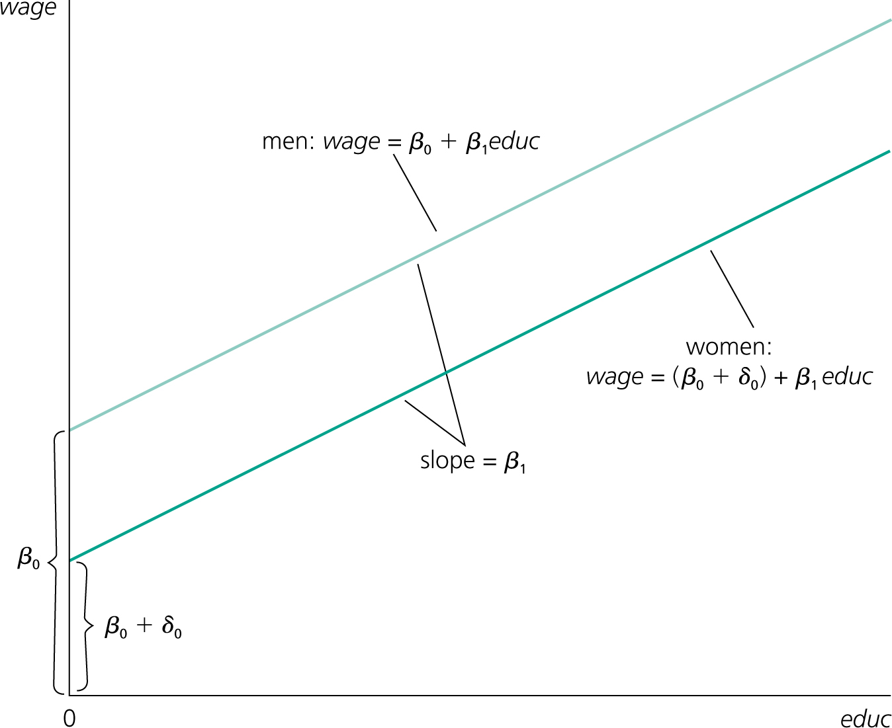

```{r setup, include=FALSE}
options(htmltools.dir.version = FALSE)
library(knitr)
library(kableExtra)
opts_chunk$set(
  fig.path='figs/',
  out.width= '90%',
  warning = F,
  message = F,
  error=F,
  fig.align = 'center'
)
library(tidyverse)
require(cowplot)
require(ggpubr)
require(haven)
require(plot3D)
require(stargazer)
require(quantmod)
require(wbstats)
require(lubridate)
require(scales)
require(lmtest)
require(sandwich)
require(car)


options("getSymbols.warning4.0"=FALSE)
# require(see)

```

layout: true

<div class="msu-header"></div> 

<div style = "position:fixed; visibility: hidden">
$$\require{color}\definecolor{yellow}{rgb}{1, 0.8, 0.16078431372549}$$
$$\require{color}\definecolor{orange}{rgb}{0.96078431372549, 0.525490196078431, 0.203921568627451}$$
$$\require{color}\definecolor{MSUgreen}{rgb}{0.0784313725490196, 0.52156862745098, 0.231372549019608}$$
$$\require{color}\definecolor{DUKEblue}{rgb}{0.00392156862745098, 0.129411764705882, 0.411764705882353}$$
</div>

<script type="text/x-mathjax-config">
MathJax.Hub.Config({
  TeX: {
    Macros: {
      yellow: ["{\\color{yellow}{#1}}", 1],
      orange: ["{\\color{orange}{#1}}", 1],
      MSUgreen: ["{\\color{MSUgreen}{#1}}", 1],
      DUKEblue: ["{\\color{DUKEblue}{#1}}", 1]
    },
    loader: {load: ['[tex]/color']},
    tex: {packages: {'[+]': ['color']}}
  }
});
</script>

<style>
.yellow {color: #FFCC29;}
.orange {color: #F58634;}
.MSUgreen {color: #14853B;}
.DUKEblue {color: #012169;}
</style>


```{r flair_color, echo=FALSE}
library(flair)
yellow <- "#FFCC29"
orange <- "#F58634"
MSUgreen <- "#14853B"
DUKEblue <- "#012169"
```


---
class: MSU
name: Overview

# This lecture  

__Goal:__

1. Briefly review last week (linear hypotheses and F-test, restricted/unrestricted model)

2. Relax assumption of normal errors (MLR.6)
  - *Asymptotic Normality*
--


3. Dummy variables

4. Fixed Effects

6. Panel Data

---
class: MSU
# Linear Hypothesis and F-tests

### Single hypothesis
- Uses just one $\beta_j$
- Usually $H_0: \beta_j = 0$

### Linear Hypothesis
- Testing for equality: $\beta_j = \beta_k$
  - $\beta_j - \beta_k = 0$
  - .pseudocode[car] packages, .pseudocode[linearHypothesis]
    
    
---
class: MSU
# Linear Hypothesis and F-tests

### F-test for test of joint significance
Answers the question **do these coefficients jointly equal to zero**?
- $\beta_j = \beta_k = \beta_l = 0$
- Which is another way of saying "do they explain $y$"
- Based on 
  - $SSR_{UR}$, the SSR from an unrestricted model
  - $SSR_{R}$, the SSR from the restricted ( $\beta = 0$ ) model
  
### R gives us an $F$-test for all coefficients jointly
- Compared to a restricted model where *only* $\beta_0$, the intercept.


---

class: MSU
# Asymptotic Normality

### Gauss-Markov Regression Assumptions: 

| | |
|:---:|:---|
|MLR.1| The population, $y$ is a linear function of the parameters $x$ and $u$: $y = \beta_0 + \beta_1 x_1 + \cdots + \beta_k x_k + u$ |
|MLR.2| The sample $(y_i, x_i): i = 1,2,\cdots,n$ follows the population model and are independent |
|MLR.3| No multicolinearity / "full rank": $x_j$ is not a linear transformation of $x_k$ for all $j,k$. |
|MLR.4| Zero conditional mean: $E[u \vert x_1,x_2,\cdots,x_k] = 0$ for all $x$. |
|MLR.5| $Var[u \vert x_1, \cdots, x_k]= \sigma^2_u$ for all $x$. |  
|MLR.6| $u$ is normally distributed ( $u \sim N$ ) |

---
class: MSU
# Asymptotic Normality

### If we combine MLR.6 with MLR.4 and MLR.5, we are assuming "exact normality"

### Exact Normality:
- The population error $u$ is *mean independent* of the explanatory variables $x_1, x_2, \cdots, x_k$
- And it is normally distributed with zero mean and variance $\sigma^2$: $u\sim N(0,\sigma^2)$
  - Let's call this "exact normality"
  - We need this *only* for inference (t's, F-tests)

### Mean Independence:
"Mean independence" is $E[u|x_1, \cdots, x_k] = c$ and $E[u] = 0$ (therefore $c=0$)

---
class: MSU
# Asymptotic Normality

### "Asymptotic" just means "pertaining to very large N's"
- That is, very large samples.
--

### The "asymptotic properties" of an estimator are:
- "What it does when $N\rightarrow \infty$"
  - When "N gets larger and larger"
- Particularly, does it get *closer and closer* to some desirable value?
--

### MLR6, the "exact normality" assumption, may not be necessary with a very large $N$
- Which is good, because it probably doesn't hold in many cases!

--

Let's look at one where exact normality doesn't hold

---
class: MSU
# Asymptotic Normality

### Example 3.5 in Wooldridge
$$NumArrests = \beta_0 + \beta_1 pcnv + \beta_2 avgsentence + \beta_3 ptime + \beta_4 qemp + u$$

Example 3.5 in Wooldridge discusses regressing *Number times arrested* on some variables of interest. Since most people are arrested zero times, $y|x_1, x_2, \cdots, x_k$ and the associated errors, $u|x_1, x_2, \cdots, x_k$ are most definitely not normally distributed!

So, the estimators are still:

--

- Unbiased (MLR1-4)

--

- Have valid variances (MLR5 or HC-robust)

--

- But we do not know the exact distribution to use: $u$ is not necessarily normal, so $\beta$ is not necessarily normally distributed. Therefore, our $t$-test is not valid.


---
class: MSU
# Asymptotic Normality

### The Central Limit Theorem to the rescue

The CLT states that any average, once standardized, is distributed standard normal when $n$ gets very large.

--

- By **average**, we mean anything that is the form $\frac{1}{N} \sum_{i=1}^N x_i$

--

- By **standardized**, we mean anything that subtracts the true mean and divides by the standard deviation
- We used this fact in looking at the *se of the mean*: 
$$\frac{\bar{Y} - \mu_Y}{\frac{\sigma}{\sqrt{n}}} \sim N(0,1)$$


---
class: MSU
# Asymptotic Normality

### $\hat{\beta}$ is also an average
- $\widehat{Cov}(Y,X)$ is an average: $\frac{1}{N-1} \sum_{i=1}^N (x_i - \bar{x})(y_i - \bar{y})$
- $\widehat{Var}(X)$ is also an average just the same
  - $\beta$ depends on a bunch of averages!

### So if we *properly standardize* it, we know it is asymptotically normal *regardless* of the distribution of $u$
- This is true even if $u$ is very obviously not normal.

--

### This only applies as $n \rightarrow \infty$. It is an asymptotic result

---
class: MSU
# Asymptotic normality

### Even when MLR.6 doesn't hold
We can say that our estimator, $\beta$, has a normal **asymptotic variance**

Which means it is normally distributed **when $n \rightarrow \infty$**.
- Asymptotic standard error
- Asymptotic 95% Confidence Interval, etc.

And, since a $t_{\infty - K - 1}$ is the same as a $N(0,1)$, we can use the normal tables instead of the t-tables.

When $n$ is small and $u$ is not normal, then we use "small sample" properties, which we won't cover in this class.

---
class: MSU
# Consistency


### Consistency is a property of an estimat**or**, much like "unbiased"
- It is about what happens to the estimator when $n$ gets larger and larger. 
- On the other hand, *bias* is about the expected value of the estimator.

### Definition
> An estimator is consistent when it converges in probability to the correct population value as the sample size grows.

#### Converges in probability
For any tiny, tiny number we can choose, say $\epsilon$, a consistent estimator $\hat{\beta}$ will have some $n$ large enough that $Pr(|\hat{\beta} - \beta| > \epsilon) \rightarrow 0$ as $n \rightarrow \infty$

---
class: MSU
# Consistency

### Remember our *standard error of the mean*
$$se(\bar{X}) = \sqrt{\dfrac{\sigma^2}{n}}$$

If we had a small $n$
- We had a pretty big std. err on $\bar{X}$

But if we had a really big $n$
- We got a std. error that was smaller and smaller...
--


With a big enough $n$, the std. error of the mean becomes very very small
- And a plot looks like a "spike"

### **That's the concept of consistent**


---
class: MSU
# Consistency

A good example of *biased* but *consistent* is the use of the population variation formula on a sample:
$$\hat{\sigma}^2_{biased} = \frac{1}{N}\sum_{i=1}^N (x_i - \bar{x})^2$$

Biased, yes. But *consistent* since the estimate goes to the correct value as $n\rightarrow \infty$

.footnote[The proof showing why the 1/N calculation is biased is long and drawn-out. Just remember that 1/N is biased.]
---
class: MSU
# Asympotic Normality

### The end result is that we can relax MLR6 in large samples and not worry about $u$ being normally distributed and **still:**
- Know that $\hat{\beta}$ is normally distributed
- Know that we can use a $t$-statistic (since we are still estimating $\hat{\sigma^2}$)
- And know that since $\hat{\sigma}^2$ is consistent, with large samples, $\frac{\hat{\beta}-\beta}{\sqrt{\frac{\hat{\sigma}^2}{SST_x}}} \sim N(0,1)$

---
class: inverseMSU
# Asymptotic Normality

### Any questions?

---
class: heading-slide

Dummy Variables


---
class: MSU
# Dummy Variables

### A dummy is any variable that takes **only** one of two values:

$$\{0,1\}$$

- This is also called a **binary** variable

### Sometimes called an "indicator variable" as well
- Because it "indicates" if something *qualitative* is true.
- Also, sometimes written as $\mathbb{1}(condition)$ e.g. $1(age>65)$
  - It is equal to 1 for that observation if that observation's age is greater than 65.
  - It is equal to 0 otherwise
  
### In Wooldridge Ch. 7.1
- He uses the example of $male$ and $female$, with a variable equal to $1$ if $female==TRUE$.

---
class: MSU
# Dummy Variables

### Since it takes on numeric values, we can use it in a regression:
$$y = \beta_0 + \beta_1 educ + \delta_0 1(female) + u$$
- Sometimes, it will just say that " $x_2$ is a binary indicator variable that takes on the value of 1 if..."
- In Wooldridge, it just says $y = \beta_0 + \delta_0 female + \cdots + u$
  - You are left to infer that $female$ is either $\{0,1\}$.
- There are other ways that a dummy variable may be indicated as well, but almost all authors will describe when a dummy/binary/indicator is being used.
--

- The "dummy' allows $y$ to vary by one discrete amount ( $\delta_0$ here) when the condition is true.

--

Clearly, the indicator must refer to something observable in the data
- They aren't magical!

---
class: MSU
# Dummy Variables

### The "separate intercept" interpretation
Wooldridge frames the coefficient on the binary variable as **intercept shift** between females and males.

```{r DummyEx0, include=T, echo=F, out.width='60%', caption='Wooldridge Fig 7-1', fig.align = 'center'}

```
For males, the intercept is $\beta_0$. For females, $\beta_0 + \delta_0$ (here $\delta_0 < 0$).


---
class: MSU
# Dummy Variables

### Since a binary variable is always either $\{0,1\}$, it always shifts by one constant amount
- Just like the Wooldridge Fig 7-1

### It doesn't alter the *slope* of the line directly, but it *can* account for variation (higher average wages for men) that then allows the slope to be better estimated
- So the slope may be different with the dummy included:
$$wage = \beta_0 + \beta_1 educ + u$$
and

$$wage = \alpha_0 + \alpha_1 1(female) + \alpha_2 educ + u$$
will not result in $\beta_1=\alpha_2$. They will be different estimates.

---
class: MSU
# Dummy Variables
.more-left[
```{r wage1, echo=F, include=T, out.width='100%', fig.align='center'}
wage = as_tibble(read_dta('..//Data/WAGE2.DTA')) %>%
  dplyr::mutate(male = !is.na(feduc)) %>%
  dplyr::mutate(wage = ifelse(male==T, wage*1.4, wage))


wage1 = lm(wage ~ educ, wage)
wage2 = lm(wage ~ educ + male, wage)

par(mar=c(4,4,0,3))
plot(wage ~ educ, pch=16, cex=1.3, col = alpha(ifelse(male==T, 'blue', 'red'), .15), data=wage)
abline(wage1, col='black', lwd=2, lty=2) 
abline(wage2$coefficients[1], wage2$coefficients[2], col='red', lwd=2)
abline(wage2$coefficients[1]+wage2$coefficients[3], wage2$coefficients[2], col='blue', lwd=2)
```
]

.less-right[
The black dashed line is the combined regression ignoring $female$

The blue is the fitted regression for $female==0$, the red for $female==1$
]


.footnote[Remember, you're adding a variable, and adding a variable can only *help* explain more variation (see our discussion on R2 and F-tests)]

---
class: MSU
# Dummy Variables

### Dummy Variables *with* continuous variables

$$OutOfPocket = \beta_0 + \beta_1 1(age>65) + \beta_2 cigarettes + u$$
Here, $OutOfPocket$ is the annual dollars spent out of pocket on healthcare.
- We think it is affected by number of cigarettes smoked
- We think it might be affected by age

### So why not just use the variable itself?
- Why a dummy $1(age>65)$ and not just $age$ as a RHS $x$?
---
class: MSU
# Dummy Variables

### So why not just use the variable itself?
- Why a dummy $1(age>65)$ and not just $age$ as a RHS $x$?


- First, we may not want to impose that constant marginal effect - sure, we could have $\beta_{age}$, but it means we'd be assuming the same effect of age from 10 years old to 11 years old as we do from 64 years old to 65!
--
<br>
- Second, there may be a "threshold" we're interested in
  - For example, Medicare starts at 65 years old.
  - Then being over 65 (and being on Medicare) would have an important effect to account for.
  - And we certainly wouldn't want age alone to try to explain it!

---
class: MSU
# Dummy Variables

In fact, we could include $age$ and the dummy variable:
$$OutOfPocket =\beta_0 + \beta_1 1(age>65) + \beta_2 age + \beta_3 cigarettes + u$$

### Here's what that data would look like:
----
.pull-left[
|Out of Pocket|Age|1(age>65)|
|:---:|:---:|:---:|
|7782|48|0|
|8136|63|0|
|9730|86|1|
|7928|66|1|
|...|...|...|
]

.pull-right[
As you can see, $Over65$ is fully determined by $age$, but that's OK. They will not be perfectly correlated (correlation is a linear concept).

Let's see how this compares to
- Just using age
- Just using the dummy
- Both
]


---
class: MSU
# Dummy Variables

### First, ignoring the over65 dummy, just using Out-Of-Pocket health spending on age:

```{r DummyEx1, echo=F, include=T, out.width='50%', fig.align='center'}
NN = 30
df = data.frame(x1 = c(rnorm(NN, 60, 20), 60),
                age = c(rpois(NN, 65), 65))
df$over65 = df$age>=65
df$OutOfPocket = 2000 + .2*df$x1 + 100*df$age - 1400*df$over65 + rnorm(NN+1, 0, 600)

write_dta(df, path='../Data/tempMLR3b.dta')


lm1 = lm(OutOfPocket ~ age, df)
lm1b = lm(OutOfPocket ~ over65, df)
lm2 = lm(OutOfPocket ~ age + over65, df)

ggplot(df, aes(x = age, y = OutOfPocket)) + geom_point() + theme_bw() + geom_vline(aes(xintercept=65)) + geom_smooth(method='lm', se=F) 
```
.footnote[I'm not going to include *cigarettes* here since it adds another dimension to plot]

---
class: MSU
# Dummy Variables

$$OutOfPocket = \beta_0 + \beta_1 age + u$$

```{r,  echo=T}

coeftest(lm1, vcov = vcovHC(lm1, 'HC1'))

```


---
class: MSU
# Dummy Variables

### Here's what just including $1(age>65)$ looks like

```{r DummyEx15, echo=F, include=T, out.width='55%', fig.align = 'center'}
undery = mean(df$OutOfPocket[df$over65==F])
overy = mean(df$OutOfPocket[df$over65==T])
ggplot(df, aes(x = age, y = OutOfPocket, colour = over65, group=over65)) + geom_point() + theme_bw() + theme(legend.position='none') + geom_vline(aes(xintercept=65)) + 
  geom_segment(aes(y = undery, yend= undery, x = min(df$age), xend=65), lwd=2, col='red') + 
  geom_segment(aes(y = overy, yend= overy, x =65, xend = max(df$age)), col='blue',lwd=2)
```

---
class: MSU
# Dummy Variables

$$OutOfPocket = \beta_0 + \beta_1 1(age>65) + u$$


```{r,  echo=T}
coeftest(lm1b, vcov = vcovHC(lm1b, 'HC1'))

```


---
class: MSU
# Dummy Variables

### Here's what that looks like including both $age$ and $1(age>65)$:

```{r DummyEx2, echo=F, include=T, out.width='55%', fig.align='center'}
pp = tibble(age = 50:85) %>% dplyr::mutate(over65 = age>=65) %>% dplyr::mutate(OutOfPocket = predict(lm2, newdata=.))

ggplot(df, aes(x = age, y = OutOfPocket, colour = as.factor(over65))) + geom_point() + theme_bw() + theme(legend.position='none') + geom_vline(aes(xintercept=65)) + geom_line(data = pp, lwd=1.5)
```


---
class: MSU
# Dummy Variables


```{r,  echo=T}

coeftest(lm2, vcov = vcovHC(lm2, 'HC1'))

```


---
class: MSU
# Dummy Variables

### One interpretation of $\beta_0$ is "the expected value of $y$ when $x=0$"
- I'm going add $cigarettes$ back in here:

$$OutOfPocket = \beta_0 + \beta_1 1(age>65) + \beta_2 cigarettes + u$$

- When does $x=0$ here?

- So, what is the $E[Y|age<65, cigarettes==0]$?

- What is the $E[Y|age>65, cigarettes==0]$?


---
class: MSU
# Dummy Variables

### That seems like a comparison of means because it is.

```{r, echo=T}
t.test(OutOfPocket ~ over65, data=df)
```

Compare that to the first regression with only a dummy for $1(age<65)$
---
class: MSU
# Dummy Variables

### Interpretation of Dummy Variables

#### The dummy variable has a "base" level that is *included in* $\beta_0$
- And the coefficient on the dummy **is the difference between the base level and the "dummy is true" level**
  - This is because $\beta_0 = E[Y|X=0]$ for all $X$
  
--

- If there are two dummies, $x_1$ and $x_2$:
  - $\beta_0$ is the $E[Y|x_1=0, x_2 = 0]$
  - That is, it is the value when both are "false"
  - And $\beta_1$ is the relative value if **only** $x_1$ were true, **ceteris paribus**
  - Same for $\beta_2$, **ceteris paribus**
--

- It does *not* tell us anything about $x_1$ and $x_2$ being true together, except that we can add the effects of $x_1$ being true and $x_2$ being true.

---
class: MSU
# Dummy Variables

### Dummy Variables fall under the category of "specification"
- All of the rules about $x$'s still hold
  - MLR3 - No Multicolinearity
- Dummies don't change the way we estimate equations or coefficients
- Dummies don't change our assumptions or use of the residuals $\hat{u}$
- Dummies don't change *how* we calculate $\hat{\beta}$, $se(\hat{\beta})$, or $SSR$ etc.

### Dummies *do* (hopefully) improve our model
- By accounting for and explaining variation that continuous variables don't
- And by being "interpretable"
  - Lots of ways we can account/explain variation, but not all are "interpretable"


---
class: MSU
# Dummy Variables
### The dummy variable trap

What if we add a variable for under 65 as well?

|Out of Pocket|Age|Over65|Under65|
|:---:|:---:|:---:|:---:|
|7782|48|0|1|
|8136|63|0|1|
|9730|86|1|0|
|7928|66|1|0|
|...|...|...|...|

--

### Remember MLR3? No perfect colinearity? Uh-oh.


---
class: MSU
# Dummy Variables

### So we can't have $1(age>65)$ and $1(age<65)$
- Because MLR.3, no multicolinearity
- We can only *identify* the *difference* between over/under 65.
  - The intercept, $\beta_0$ is the intercept for the *base* level
  - The coefficient is the *intercept shift*.
  
---
class: heading-slide

Any questions on dummies?

---
class: heading-slide

Panel Data
---

class: MSU
# Panel Data

### Panel Data is what we all a dataset where we have multiple observations for each unit of observation
- We have a sample of 100 people
- For each person, we have 12 years of earnings
  - We have $N=100 \times 12 = 120$

### Or
- We have a sample of 15 countries
- For each country we have 30 years of infant mortality rates
  - We have $N=15 \times 30 = 450$

---
class: MSU
# Panel Data

### Contrast Panel Data with other types of data:

#### Time series data
- We have one observation per time period
- But of only one thing.
  - There are no concurrent time periods.
  
Stock values would be a time series if talking about one stock:
- **AAPL** has one time series of data

---
class: MSU
# Panel Data

### AAPL
```{r AAPL, echo=F, include=T, out.width='50%', warning=F, fig.align='center'}
AAPL = as.data.frame(getSymbols(Symbols = 'AAPL', src='yahoo', env=NULL, auto.assign=F)) %>%
  dplyr::mutate(Date = ymd(row.names(.))) %>%
  dplyr::select(Date, AAPL = AAPL.Open)
ggplot(AAPL, aes(x = Date, y=AAPL)) + geom_path() + theme_bw()
```

Time series, not panel data.
---
class: MSU
# Panel Data

### Contrast Panel Data with other types of data:
#### Cross-sectional data
- We have multiple observation units, but only one observation of each

Country-level data (for a single year, or average) would be cross-sectional

```{r WB, echo=F, include=T, out.width='40%', warning=F, fig.align='center'}
require(ggrepel)

pop_data = wb(indicator = c("SP.POP.TOTL", "NY.GDP.MKTP.CD"), startdate = 2015, enddate = 2015, return_wide=T) %>%
  dplyr::mutate(GDP = NY.GDP.MKTP.CD/1000000, POP = SP.POP.TOTL/1000000) %>%
  dplyr::select(Country = country, GDP, POP) %>%
  dplyr::filter(!is.na(GDP) & !is.na(POP) & POP>1)

pop_two = wb(indicator = c("SP.POP.TOTL", "NY.GDP.MKTP.CD"), startdate = 1990, enddate = 2015, return_wide=T) %>%
  dplyr::mutate(GDP = NY.GDP.MKTP.CD/1000000, POP = SP.POP.TOTL/1000000) %>%
  dplyr::select(Country = country, GDP, POP, Year = date) %>%
  dplyr::filter(!is.na(GDP) & !is.na(POP) & POP>1) %>%
  dplyr::filter(Country%in%c('Cuba','Colombia') & Year %in% seq.int(1990, 2015, by=5)) %>%
  dplyr::mutate(GDPPC = GDP/POP,
                GDP = GDP/1000) %>%
  dplyr::mutate(POP = ifelse(Country=='Cuba',  POP*2.5, POP))

ggplot(pop_data %>% dplyr::sample_frac(.08), aes(x =log(POP), y=log(GDP))) + geom_point() + geom_label_repel(aes(label=Country)) + theme_bw()
```


---
class: MSU
# Panel Data

### We have been working with cross-sectional data so far.
- We will get to time series later on
- Let's focus on Panel Data today

### Let's say we had two countries that we observe
- Say, "Cuba" and "Colombia"
- And we observe each one once a year for five years

---
class: MSU
# Panel Data

```{r panel1, echo=F, include=T}
knitr::kable(pop_two, type='html', digits = 1) %>%
  kable_styling(font_size = 10)
```

---
class: MSU
# Panel Data
 
```{r panel2, echo=F, include=T, out.width='50%', fig.align='center'}
plot(GDP ~ POP, data=pop_two, pch=16, cex=1.3, col=alpha(ifelse(pop_two$Country=='Colombia','blue','red'), .3))
```

---
class: MSU
# Panel Data

### A naive approach

If we are interested in the effect of population on GDP, we might try fitting a line ignoring $Country$

```{r panel3, echo=F, include=T, out.width='50%'}
panel.lm1 = lm(GDP ~ POP, pop_two)
plot(GDP ~ POP, data=pop_two, pch=16, cex=1.3, col=alpha(ifelse(pop_two$Country=='Colombia','blue','red'), .3))
abline(panel.lm1)
```

---
class: MSU
# Panel Data

```{r panel4, echo=F, include=T, out.width='50%'}
panel.lm1 = lm(GDP ~ POP, pop_two)
panel.lm2 = lm(GDP ~ POP + as.factor(Country), data=pop_two)
plot(GDP ~ POP, data=pop_two, pch=16, cex=1.3, col=alpha(ifelse(pop_two$Country=='Colombia','blue','red'), .3))
abline(panel.lm2$coefficients[1], panel.lm2$coefficients[2], col='blue')
abline(panel.lm2$coefficients[1]+panel.lm2$coefficients[3], panel.lm2$coefficients[2], col='red')
```

Here, we have included a dummy for $Cuba$. 
- The slope is the same across countries (by our specification)
- The intercept is different (though the intercept is very far off the chart here)

---
class: MSU
# Panel Data

```{r panel4reg, echo=T}
lm1 = lm(GDP ~ POP + as.factor(Country), data = pop_two)
coeftest(lm1, vcov = vcovHC(lm1, 'HC1'))

```
---
class: MSU
# Panel Data

### In the previous slide regression:
- This is similar to the male grouping from before
- It has a slightly different interpretation
  - We think there is something unobserved about $Cuba$ that gives it a different average GDP, even conditional on POP.
  - The *dummy* is the *country-level effect* for all of the things about $Cuba$ that change it's GDP overall, independent of POP.
  
  
### Now, consider that we could have three countries in the data
- We would have one $\beta_0$ (the base level)
- And we would have **two** intercept shifts - one for each of the non-base levels

### When we allow there to be any number of binary indicators, we call them "fixed effects".

---
class: MSU
# Panel Data

### The most common form of Panel Data is Unit x Time
- That's what we have here: We observed Cuba over different time periods
- And Colombia over the same time periods

### So the fixed effect captures things about Cuba (relative to Colombia) that do not differ over time
- Things that are always there

### Of course, we can also have time fixed effects!
- If there is something different about, say, 2009 that is the same across multiple countries
- Like, say, a global recession...


```{r outputChromePrint, include=F, eval=F}

require(pagedown)
currentfile = gsub(pattern='\\.Rmd', '', basename(rstudioapi::getSourceEditorContext()$path))
inputpath = paste0('https://ajkirkpatrick.github.io/EC420MSU/',currentfile, '/', paste0(currentfile, '.html'))
browseURL(inputpath)
pagedown::chrome_print(input = inputpath,
                   output = file.path(currentfile, paste0(currentfile, '.pdf')),
                   #wait = 3,
                   timeout = 300,
                   format = 'pdf')

```