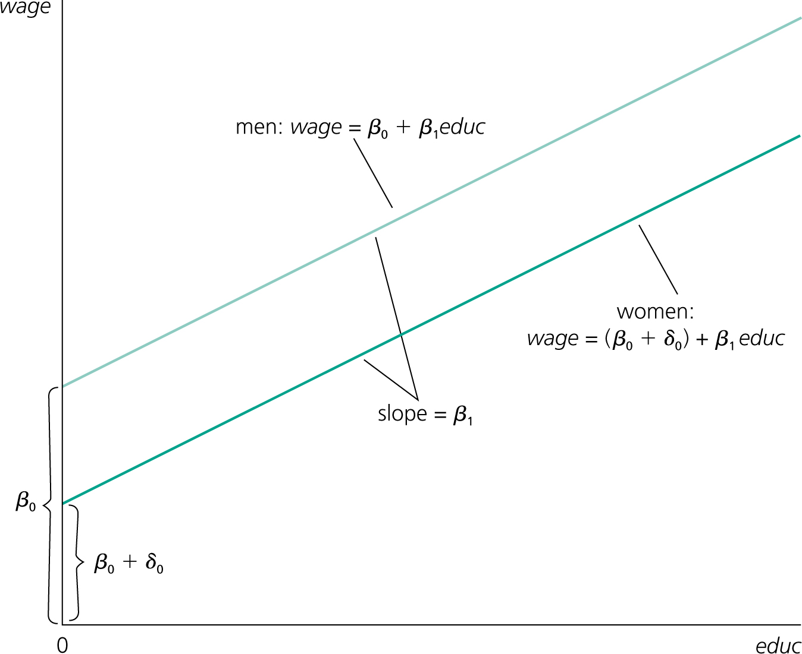

```{r setup, include=FALSE}
options(htmltools.dir.version = FALSE)
library(knitr)
library(kableExtra)
opts_chunk$set( 
  fig.path='figs/',
  out.width= '80%',
  fig.align = 'center',
  warning = F,
  message = F,
  error=F)
library(tidyverse)
require(cowplot)
require(ggpubr)
require(haven)
require(plot3D)
require(stargazer)
require(quantmod)
require(wbstats)
require(lubridate)
require(scales)
require(broom)
require(wooldridge)
require(lmtest)
require(sandwich)


options("getSymbols.warning4.0"=FALSE)
# require(see)

```

layout: true

<div class="msu-header"></div> 

<div style = "position:fixed; visibility: hidden">
$$\require{color}\definecolor{yellow}{rgb}{1, 0.8, 0.16078431372549}$$
$$\require{color}\definecolor{orange}{rgb}{0.96078431372549, 0.525490196078431, 0.203921568627451}$$
$$\require{color}\definecolor{MSUgreen}{rgb}{0.0784313725490196, 0.52156862745098, 0.231372549019608}$$
$$\require{color}\definecolor{DUKEblue}{rgb}{0.00392156862745098, 0.129411764705882, 0.411764705882353}$$
</div>

<script type="text/x-mathjax-config">
MathJax.Hub.Config({
  TeX: {
    Macros: {
      yellow: ["{\\color{yellow}{#1}}", 1],
      orange: ["{\\color{orange}{#1}}", 1],
      MSUgreen: ["{\\color{MSUgreen}{#1}}", 1],
      DUKEblue: ["{\\color{DUKEblue}{#1}}", 1]
    },
    loader: {load: ['[tex]/color']},
    tex: {packages: {'[+]': ['color']}}
  }
});
</script>

<style>
.yellow {color: #FFCC29;}
.orange {color: #F58634;}
.MSUgreen {color: #14853B;}
.DUKEblue {color: #012169;}
</style>


```{r flair_color, echo=FALSE}
library(flair)
yellow <- "#FFCC29"
orange <- "#F58634"
MSUgreen <- "#14853B"
DUKEblue <- "#012169"
```


---
class: MSU
name: Overview

# This lecture  

__Goal:__

1. Answer any questions on last lectures (inference and fixed effects)

2. Fixed Effects with Multiple Groups
  - Interpretation
  - Construction
  - "Within-group variation" and partialling out
  - Time fixed effects

3. Interactions w/dummies
  - Functional form
  - Interpretation
  - Interpretation
  - Interpretation!


---
class: heading-slide

Questions from last week?

---
class: MSU
# Fixed Effects

### Last class, we covered a binary variable fixed effect
- One variable taking the value of $\{0,1\}$. For example
  - $1(female)$
  - $1(age>65)$

### Interpretation
- A .orange[shift] in the intercept **relative to the base group**
  - Base group: $male$
  - Base group: $age<65$
- The "base group" (or "base level") is represented in the intercept: $\beta_0$
- The other group(s) ( $female$ , $age>65$ ) have shifted intercepts:
  - $\beta_0$ for the base (male, under 65)
  - $\beta_0 + \beta_1$ for a female under 65
  - $\beta_0 + \beta_1 + \beta_2$ for a female over 65
  - $\beta_0 + \beta_2$ for a male over 65
  
$$y = \beta_0 + \beta_1 1(female) + \beta_2 1(age>65) + u$$
  
---
class: MSU
# Fixed Effects

```{r DummyEx0, include=T, echo=F, out.width='80%', caption='Wooldridge Fig 7-1'}

```


---
class: MSU
# Fixed Effects

### Ceteris Paribus still applies
Interpretation of the dummy variable fixed effect coefficient is:
> "The change in the expectation of Y from being in the group relative to being in the base group, *ceteris paribus*"

We are using "in the group" here to mean "the observations for which the dummy is true"

### The "base level" is very important
- Since the in-group intercept is $E[Y|in-group] = \beta_0 + \beta_1$, but the coefficient is $\beta_1$, we have to be careful.
- The coefficient is the *difference* between the base level and the in-group.
- The "base" group is sometimes called **the omitted level**

---
class: MSU
# Fixed Effects

## Interpretation of $\{0,1\}$ dummy variables

### In the Wooldridge example
$$wage = \beta_0 + \beta_1 1(female) + \beta_2 educ + u$$
> "Conditional on education, females make on average $\beta_1$ more/less than males, ceteris paribus"

.footnote[More/less depending on whether or not the coefficient is negative]
---
class: MSU
# Fixed Effects


### In the age example:
$$Out-of-pocket = \beta_0 + \beta_1 age + \beta_2 1(age>65) + u$$
> "Individuals over 65 years of age pay $\beta_2$ more/less in out-of-pocket expenses relative to those under 65, controlling for the linear effect of age, ceteris paribus"

Here, we have to be a little more specific since the fixed effect and the continuous variable, $age$, both refer to age. It would be strange to say "conditional on age, being 65 means paying $\beta_1$ more/less".

---
class: MSU
# Fixed Effects

### We can have more than one fixed effect:
$$wage = \beta_0 + \beta_1 1(female) + \beta_2 1(age>65) + u$$
- $E[wage | male, under 65]$ = $\beta_0$

--

- $E[wage | female, under 65]$ = ??

--

- $E[wage | female, over 65]$ = ??


---
class: heading-slide

Fixed effects with multiple groups

---
class: MSU
# Fixed Effects

### What if we have three groups?
Take *education* as an example - we can "bin" education into:

| High School or less | | 2- or 4-year college degree | | Graduate degree|
|:---:|:---:|:---:|:---:|:---:|
|"HS"||"College"||"Graduate"|

When this is represented with one variable, it's called a **categorical** variable

---
class: MSU
# Fixed Effects 

### Our three groups would work as follows:

|wage|experience|educ|education
|:---:|:---:|:---:|:---:|
|9000|0|12|HS|
|20000|5|16|College|
|60000|12|14|College|
|27000|2|18|Graduate|
|32000|10|9|HS|

.footnote[In the US, primary (required) education is 12 years, undergraduate is 4 additional years, and graduate school is 2-5+ additional years.]
---
class: MSU
# Fixed Effects

### Base level with categorical variable
- There is still a "base level" (or "omitted level")
- It is *your* choice as to which one is the "base level"
  - Coefficient estimates will still add up the same.
  - Interpretability is easier if you choose wisely
  - We should choose "HS" as the "base level" here, so that estimates are relative to HS
    - This is incorporating *ordinal* information since we think $wage_{grad} > wage_{college} > wage_{HS}$
  
### Numeric representation
- To represent a categorical variable with 3 categories, we need to create **two** more columns
  - If there are $K$ categories, then we need $K-1$ new columns
  - Whichever one we don't create a column for is the "base"
    - It's effect will be found in the $\beta_0$ (the intercept)
    
---
class: MSU
# Fixed Effects

### Using "HS" as the base level:
|wage|experience|education|education==College|education==Graduate|
|:---:|:---:|:---:|:---:|:---:|:---:|
|9000|0|HS|0|0|
|20000|5|College|1|0|
|60000|12|College|1|0||
|27000|2|Graduate|0|1|
|32000|10|HS|0|0|

If we run this in R (leaving out the "education" column), we would get a coefficient for $education==College$ and $education==Graduate$
- These would be the increase in the expected wage resulting from moving between the HS group to the College (or Graduate, respectively) group, *ceteris paribus*.

---
class: MSU
# Fixed Effects

In R, categorical variables are a special type of variable called "**factor**"


.small[.pseudocode[df$education = as.factor(df$education)]]
- R stores the labels separately, but will let you refer to them
- If we use .pseudocode[str(df)], we can see the factor structure
- .red[I'm going to switch to a dataset that has a categorical in it]
```{r Categorical1, echo=T}
census = wooldridge::census2000
str(census)
```

---
class: MSU
# Fixed Effects

### To go from a factor to a character string
```{r fac2chr, echo=T}
census$state = as.character(census$state)
head(census)
str(census)
```

---
class: MSU
# Fixed Effects

### More important, how to go from character string to factor

```{r chr2fac, echo=T}
census$state = as.factor(census$state)
head(census)
str(census)
```

---
class: MSU
# Fixed Effects

### If you use a factor variable in a regression, R will construct the additional columns
```{r AddVars, echo=T}
census.small = census[census$state=='South Carolina'|census$state=='Arizona'|
                      census$state=='Nevada',c('lweekinc','state','educ', 'exper')]
census.small$statefactor = as.factor(census.small$state)
head(census.small, 10)
```
---
class: MSU
# Fixed Effects

```{r factor2dataquiet, echo=F}
census.small$statefactor = droplevels(census.small$statefactor)
```
### How does R convert factors to data columns?
```{r factor2data, echo=T}
head(model.matrix(lweekinc ~ educ + exper + statefactor, data = census.small)) # we won't use model.matrix except to peek "under the hood"
```

.red[Question]: What is the base level?


---
class: MSU
# Fixed Effects

```{r two, echo=T}
summary(lm(lweekinc ~ educ + exper + statefactor, data = census.small))
```

---
class: MSU
# Fixed Effects

### A "within-group" interpretation
- Group fixed effects explain the *mean* of the $y$ variable within that group
  - E.g. our Cuba/Colombia example on Monday
  - The intercept is just the difference in means (conditional on the other $x$'s)
  

- The group fixed effect accounts for the averge difference *between* groups
  - And leaves the rest of the $x$'s to explain the variation in $y$ *within* the group
  
  
- If we think of "partialling out" the fixed effect, this makes even more sense.

---
class: MSU
# Fixed Effects

Let's go to our wage/education/experience example. We might think there is a "gender experience gap" where men tend to be more experienced (e.g. due to not giving birth):
$$wage = \beta_0 + \beta_1 1(female) + \beta_2 experience + u$$

Partial out the fixed effect:
$$experience = \delta_0 + \delta_1 1(female) + v$$

$\hat{v}$ is $experience$ that isn't associated with being female. It has had the "gender experience gap" *removed*.

That is, the variation in $\hat{v}$ does not reflect the "male experience gap", so we are *identifying* $\beta_2$ off of variation within the group, eliminating variation between $male$ and $female$.


---
class: MSU
# Fixed Effects

### So, a regression using $\hat{v}$ in place of $experience$:

$$wage = \beta_0 + \beta_2 \hat{v}$$
Gives us the correct $\beta_2$ (remember our "partialling out" of $x_1,x_2$) using the "within group" variation in $experience$.


---
class: MSU
# Fixed Effects

### Time fixed effects
What if we have $N$ observations and $T$ time periods (a common type of panel data), but instead of worrying about group-level differences giving us biased estimates, we worried that some time trend or time-specific shock is making one time period different from the others?

Here, let's look at (entirely fake) data on North American GDP and EXPORT (share of GDP from exports).

We want to know if higher EXPORTS are associated with higher GDP.


---
class: MSU
# Fixed Effects 

```{r TimeFE, echo=F, include=T, out.width = '60%',  out.height='90%'}
set.seed(1970)
NN = 4
TT = 10
df = expand.grid(Country = c('US','CAN','MEX','DOM'),
                 Year = 2006:(2006+TT-1), stringsAsFactors=F)
df = df[order(df$Country, df$Year),]
df = merge(df, data.frame(Country = c('US','CAN','MEX','DOM'),
                          MU_C = c(67,63,40,41),
                          VAR_C = c(2,4,2,1),
                          TREND = c(1.03,1.07,1.15,.98),
                          StringsAsFactors=F),
                          by='Country')
df$EXPORT = rpois(NROW(df), 50)/100

df = df %>%
  dplyr::mutate(GDP = MU_C + (Year-2006)*TREND + 20*EXPORT) %>%
  dplyr::mutate(GDP = rnorm(n(), mean=GDP, sd = sqrt(VAR_C))) %>%
  dplyr::mutate(GDP = ifelse(Year%in%c(2009, 2010), GDP-7, GDP))

# write_dta(df, path='../Data/tempMLR4.dta')

a = ggplot(df, aes(x = Year, y=GDP, col=Country)) + geom_line(lwd=2) + theme_bw() + theme(legend.position='none')
b = ggplot(df, aes(x = EXPORT, y = GDP, col=Country)) + geom_point() + theme_bw()
plot_grid(a,b)
```

Since this is constructed (fake) data, I know the right coefficient on $EXPORT$, $\beta_{export}=20$

---
class: MSU
# Fixed Effects

```{r three, echo=T}
coeftest(lm(GDP ~ EXPORT, df), vcov = vcovHC, type = 'HC1')
```

```{r three-graphic, echo=F, out.width = '35%'}
ggplot(df, aes(x = EXPORT, y = GDP, col=Country)) + geom_point() + theme_bw() + geom_smooth(aes(col = NULL), method = 'lm', se=FALSE)
```

.footnote[Note I used a simplier call to `coeftest`. Before we had `vcov = vcovHC(OLSobject, 'HC1'))`, but that required two steps: one to create the OLS object, and one to call `coeftest`. This does it all at once.]

---
class: MSU
# Fixed Effects

```{r four, echo=T}
coeftest(lm(GDP ~ EXPORT + as.factor(Year), df), vcov = vcovHC, type='HC1')
# note - you can use "as.factor" in the ~ formula
```


---
class: MSU
# Fixed Effects

```{r five, echo=T}
coeftest(lm(GDP ~ EXPORT + as.factor(Year) + as.factor(Country), df), vcov = vcovHC, type='HC1')
```

---
class: MSU
# Fixed Effects

### Yes, you can specify more than one set of categorical variables
- Just as you can have more than one dummy variable
- The interpretation of each one is still the same: the effect of being in the group/time period relative to the base group/time period, *ceteris paribus*.
- These are called **two-way fixed effects** (TWFE)
  - When used on panel data
  - And when there is one fixed effect for each of the panel data's dimensions
    - $N$ countries and $T$ years here.

### Fixed effects and Partialling Out
On the next slide, GDP_HAT is the residual from regressing GDP on categorical Year and Country
- Same for EXPORT_HAT

---
class: MSU
#Fixed Effects

### Our original data before partialling out:
```{r twowayFEbefore, out.width = '65%', out.height = '90%', echo = F}
plot_grid(a,b)
```
---
class: MSU
# Fixed Effects

### After paritalling out left: YEAR and right: YEAR and COUNTRY
```{r twowayFE, echo=F, include=T, out.width = '65%', out.height = '90%'}
df = df %>%
  dplyr::mutate(EXPORT_HAT = resid(lm(EXPORT ~ as.factor(Year) + as.factor(Country), data=df)),
                GDP_HAT = resid(lm(GDP ~ as.factor(Year) + as.factor(Country), data=df)))

c = ggplot(df, aes(x = Year, y=GDP_HAT, col=Country)) + geom_line(lwd=2) + theme_bw() + theme(legend.position='none')
d = ggplot(df, aes(x = EXPORT_HAT, y = GDP_HAT, col=Country)) + geom_point() + theme_bw()
plot_grid(c,d)
```

---
class: MSU
# Fixed Effects


### The code I used to parital out and plot the prior slide:
```
df = df %>%
  dplyr::mutate(EXPORT_HAT = resid(lm(EXPORT ~ as.factor(Year) + as.factor(Country), data=df)),
                GDP_HAT = resid(lm(GDP ~ as.factor(Year) + as.factor(Country), data=df)))


c = ggplot(df, aes(x = Year, y=GDP_HAT, col=Country)) + geom_line(lwd=2) +
theme_bw() + theme(legend.position='none')

d = ggplot(df, aes(x = EXPORT_HAT, y = GDP_HAT, col=Country)) + geom_point() + theme_bw()

plot_grid(c,d)
```

---
class: heading-slide

Interactions with Dummies
---
class: MSU
# Interactions

### Dummy variables shift *the intercepts*
- Very useful when a group (or time) has a different mean

- Covers *"unobserved, time-invariant differences"*

### But what if we think that the *slopes* differ
- For instance, maybe each country in our GDP/EXPORT example has *it's own unique relationship* between $GDP$ and $EXPORT$?

- This can be *in addition* to thinking that each country has its own unique intercept
  - In fact, it would be odd to think that they'd have their own unique slope but *not* a unique intercept.
  
---
class: MSU
# Interactions

### How do we let the slopes vary?
- In a way very similar to letting the intercepts vary
- Let's look at it in an example with only two categories (a single dummy)

$$y = \beta_0 + \beta_1 1(condition) + \beta_2 x_1 + \underbrace{\beta_3 \times x_1 \times 1(condition)}_{\text{The interaction term}} + u$$

### A couple things to note:
- $x_1$ is our variable of interest here
- $condition$ is our group dummy (like $male$ or $age>65$ )
- $x_1$ appears twice, once with $\beta_2$, and *again* in the interaction of $x_1 \times 1(condition)$

---
class: MSU
# Interactions

$$y = \beta_0 + \beta_1 1(condition) + \beta_2 x_1 + \underbrace{\beta_3 x_1 1(condition)}_{\text{The interaction term}} + u$$
Refreshing our interpretation of the intercept:
- The intercept for the base group is $\beta_0$
- The intercept for the in-group defined by $condition$ is $\beta_0 + \beta_1$
--


Applying the same thought process to the interaction:
- **For the base group**, the marginal change in $y$ from a unit increase in $x_1$ is $\beta_2$
- **For the in-group**, the marginal change in $y$ from a unit increase in $x_1$ is $\beta_2 + \beta_3$

$$\text{For the base group: }\frac{\Delta y}{\Delta{x_1}} = \beta_2$$

$$\text{For the in-group:   }\frac{\Delta y}{\Delta{x_1}} = \beta_2 + \beta_3$$

---
class: MSU
# Interactions

### Of course, we can have >2 groups (categorical)
$$\begin{eqnarray}
y = \beta_0 &+& \beta_1 1(group==2) + \beta_3 1(group==3) + \beta_4 x_1  \\
&+& \beta_5 x_1 1(group==2) + \beta_6 x_1 1(group==3) + u
\end{eqnarray}$$

---
class: MSU
# Interactions 

### What does that look like?
|wage|experience|educ|educ = College|educ = Graduate|experience x educ == College|experience x educ == Graduate|
|:---:|:---:|:---:|:---:|:---:|:---:|:---:|
|9000|0|HS|0|0|0|0|
|20000|5|College|1|0|5|0|
|60000|12|College|1|0|12|0|
|27000|2|Graduate|0|1|0|2|
|32000|10|HS|0|0|0|0|

---
class: MSU
# Interactions

### And in R:
.pseudocode[lm(wage ~ as.factor(educ) + exper + as.factor(educ)*exper, data=df)]

Here, you'll get **intercept .orange[shift]** coefficients on:
- educ = College
- educ = Grad


And you'll get **slope .orange[shift]** coefficients on:
- experience for educ = College
- experience for educ = Graduate

---
class: MSU
# Interactions 

### The wage/education/experience regression would be:
$$\begin{eqnarray}
wage = \beta_0 &+& \beta_1 1(educ==College) + \beta_2 1(educ==Grad) + \beta_3 exper \\
&+& \beta_4 x_1 1(educ==Coll) + \beta_5 x_1 1(educ==Grad) + u
\end{eqnarray}$$
### Expected Values conditional on X:
- $E[wage|exper, educ = HS] = \beta_0 + \beta_3 \times exper$
- $E[wage|exper, educ = Coll] = (\beta_0 + \beta_1) + (\beta_3 + \beta_4) \times exper$
- $E[wage|exper, educ = Grad] = (\beta_0 + \beta_2) + (\beta_3 + \beta_5) \times exper$

### Just as we do with the intercepts, we add to the base level
- Note that when we have three categories $\{HS,Coll,Grad\}$ and we want the $E[wage|exper, educ==Grad]$, we do **not** add in the intercept-shift or slope-shift for $educ==Coll$.

---
class: MSU
# Interactions

### The naive pooled (black) and the intercept-shift only:
```{r SlopeShift1, echo=F, include=T, out.width='60%'}
NN = 60
LEV = data.frame(educ = c('HS','Coll','Grad'),
                 slope = c(1, 4, 5),
                 meanexper = c(15,8, 8),
                 meanwage = c(25,40,50),
                 stringsAsFactors=F)

ww = LEV[sample(1:3, size=NN, replace=T),] %>%
  dplyr::mutate(exper = rpois(NN, meanexper)) %>%
  dplyr::mutate(wage = meanwage + slope*exper + rnorm(NN, 0, 8)) %>%
  dplyr::select(wage, exper, educ) %>%
  dplyr::mutate(educ = factor(educ, levels=c('HS','Coll','Grad')))

a = ggplot(ww, aes(x = exper, y = wage, col = educ)) + geom_point(lwd=2) + theme_bw() #+ theme(legend.position='none')
lm.pooled = coefficients(lm(wage ~ exper, ww))
lm.FE = coefficients(lm(wage ~ educ + exper, ww))

a + geom_abline(intercept = lm.pooled[1], slope = lm.pooled['exper'], lwd=2, col='black', lty=2) +
  geom_abline(intercept = lm.FE[1], slope = lm.FE[4], col='red', lwd = 2) + 
  geom_abline(intercept = lm.FE[1]+lm.FE[2], slope = lm.FE[4], col='green', lwd = 2) +
  geom_abline(intercept = lm.FE[1]+lm.FE[3], slope = lm.FE[4], col='blue', lwd = 2)

```

---
class: MSU
# Interactions

### And letting *intercept* and *slope* vary:
```{r SlopeShift2, echo=F, include=T, out.width='60%'}
lm.FE2lm = lm(wage ~ educ + exper + educ*exper, ww)
lm.FE2 = coefficients(lm.FE2lm)

a + 
  geom_abline(intercept = lm.FE2[1], slope = lm.FE2[4], lwd=2, col='red') +
  geom_abline(intercept = lm.FE2[1] + lm.FE2[2], slope = lm.FE2[4] + lm.FE2[5], lwd=2, col='green') +
  geom_abline(intercept = lm.FE2[1] + lm.FE2[3], slope = lm.FE2[4] + lm.FE2[6], lwd=2, col='blue')
  
```

---
class: MSU
# Interactions

```{r TableOutx, echo=F}
# knitr::kable(tidy(lm.FE2lm), digits=2) %>%
#   kable_styling()
coeftest(lm.FE2lm, vcov = vcovHC, type='HC1')
```

---
class: MSU
# Interactions


The true slopes (since this is fictional data) are:

| educ | Slope |
|:---:|:---:|
| HS | `r LEV$slope[1]`|
| Coll |`r LEV$slope[2]`|
| Grad | `r LEV$slope[3]`|

---
class: MSU
# Interactions

### How would we say this?
> $\beta_4$ is the college-specific increase in the relationship between per-year-of-experience and wages relative to HS graduates

- We can also just think of it in terms of slope: a positive $\beta_4$ means the slope is steeper (more up) than HS

### Significance
- The statistical test that is output in these regressions refers to whether or not that coefficient is zero
- For a intercept-shift ( $\beta_1$ or $\beta_2$ ), the test tells us whether or not the *intercept* (or *mean*) outcome of the in-group is different from the base level.
- For a slope-shift (interaction, e.g. $\beta_3$ or $\beta_4$ ), the test tells us whether or not the *slope* is different of the in-group is different from the base level.
  - That is, it asks: "does this group have a *different relationship between exper and wage* than the base group?"

---
class: MSU
# Interactions

### Two-dummy interactions:
$$\begin{eqnarray}
Out-of-pocket = \beta_0 &+& \beta_1 1(single) + \beta_2 1(age>65) \\
&+& \beta_3 1(single) 1(age>65) + u
\end{eqnarray}$$

We have the same interpretation for $\beta_0$ thru $\beta_2$
- **But** $\beta_3$ tells us the $E[Out-of-pocket|\text{both things true}]$

### This means a single person over 65 adds *four* beta's together:
- $E[O-o-p|\text{married, 64 years old}] = \beta_0$
- $E[O-o-p|\text{single, 64 years old}] = \beta_0 + \beta_1$
- $E[O-o-p|\text{married, 66 years old}] = \beta_0 + \beta_2$
- $E[O-o-p|\text{single, 66 years old}] = \beta_0 + \beta_1 + \beta_2 + \beta_3$

This is because a single person over 65 is all four things at once. $\beta_3$ is interpreted as the additional effect of being *both* >65 and single.


```{r outputChromePrint, include=F, eval=F}

require(pagedown)
currentfile = gsub(pattern='\\.Rmd', '', basename(rstudioapi::getSourceEditorContext()$path))
inputpath = paste0('https://ajkirkpatrick.github.io/EC420MSU/',currentfile, '/', paste0(currentfile, '.html'))
browseURL(inputpath)
pagedown::chrome_print(input = inputpath,
                   output = file.path(currentfile, paste0(currentfile, '.pdf')),
                   #wait = 3,
                   timeout = 300,
                   format = 'pdf')
print(inputpath)

```
