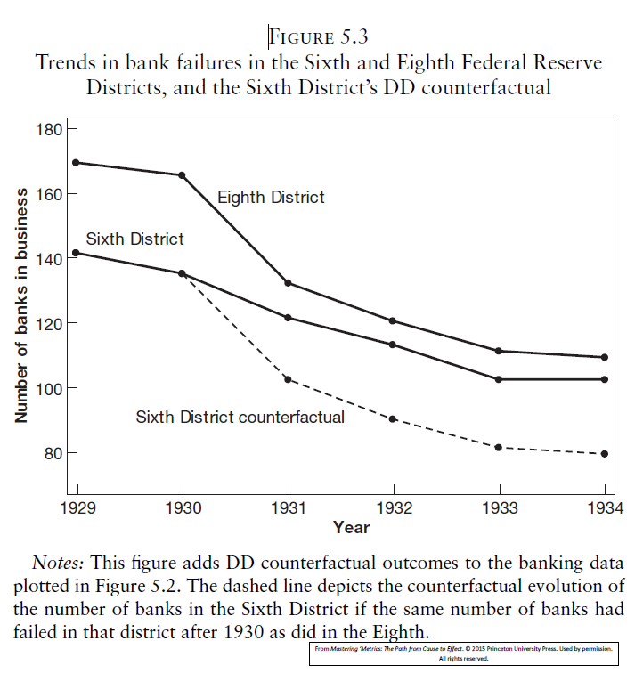

```{r setup, include=FALSE}
options(htmltools.dir.version = FALSE)
library(knitr)
library(kableExtra)
opts_chunk$set(
  fig.align="center",fig.height=4, #fig.width=7,# out.width="748px", #out.length="520.75px",
  dpi=300, #fig.path='Figs/',
  cache=T,
  echo=F)
library(tidyverse)
require(cowplot)
require(ggpubr)
require(haven)
require(plot3D)
require(stargazer)
require(quantmod)
require(wbstats)
require(lubridate)
require(scales)
require(broom)

options("getSymbols.warning4.0"=FALSE)
# require(see)

```

layout: true

<div class="msu-header"></div> 


---
class: MSU
name: Overview

# Last class(es)

Solving endogeneity with Instrumental Variables

- Conceptual

  - "Partialling in" exogenous variation in our endogenous variable
  
  - In practice (2SLS)
  
Simultaneity

- A type of endogeneity common in economics

---
class: MSU
# Today

When is IV/2SLS causal?

- $ATE$?

- Counterfactual

**Difference-in-differences** or $DID$

- Why?

- How?

---
class: MSU
# Last class(es)

If we go way back, we started with a problem rooted in the Rubin *potential outcomes* framework.

We want to know $E[Y_1- Y_0]$, the *Average Treatment Effect*, and

$$E[Y | D = 1] - E[Y | D=0] \neq E[Y_1 - Y_0]$$
That is, comparing the average outcome from those who are treated to those who are not treated does not yield the $ATE$

---
class: MSU
# Last class(es)

### We fail to get the $ATE$ because of selection bias:

$$\begin{align}
E[Y|D=1] - E[Y|D=0] &= \color{blue}{\overbrace{E[Y_1 - Y_0|D=1]}^{\text{SATE}}} \\
&- \color{red}{\underbrace{\{ E[Y_0|D=1]  - E[Y_0|D=0]\}}_{\text{Selection Bias}}}
\end{align}$$

And that selection bias is because the *potential outcomes* for those who get treated are different from those who do not get treatment:
$$(Y_{i0},Y_{i1}) \not \perp D$$
- The $\not\perp$ means "(not) independent of"

<br><br>
This statement is important. If the potential outcomes $Y_{i0}$ and $Y_{i1}$ determine treatment, then we have selection bias because $E[Y_0|D=1] \neq E[Y_0|D=0]$.
  

---
class: MSU
# Last class(es)


### $D$ is a (potentially endogenous) RHS variable like $x$
- e.g. think of $D$ as *Attending KIPP*

### Let's tie a concept from IV to this:
The *independence assumption* for the instrument was that it was *as good as randomly assigned* conditional on other exogenous $x$'s.

Another way of saying this is:

$$(Y_{i0},Y_{i1}) \perp Z | X_{exogenous}$$
"Conditional on exogenous $X_{exogenous}$, the potential outcomes are independent of $Z$."
- The $X_{exogenous}$ here is not the "problem", endogenous $D$ is (e.g. *Attending KIPP*).

---
class: MSU
# Last class(es)

Since:

$$(Y_{i0},Y_{i1}) \perp Z | X_{exogenous}$$

Then $\hat{D} = \hat{\gamma}_0 + \hat{\gamma}_1 z_1 + \hat{\gamma}_2 x_{exogenous}$ **also** has this property:

$$(Y_{i0},Y_{i1}) \perp \hat{D} | X_{exogenous}$$
And we have (with IV) solved selection bias. $\hat{D}$ is *as good as randomly assigned*.
<br><br><br>
We call this the *conditional independence assumption* or *CIA*

---
class: MSU
# Last class(es)

### Counterfactual

Since $(Y_{i0},Y_{i1}) \perp \hat{D} | X_{exogenous}$, then our selection bias, $\color{red}{E[Y_0|\hat{D}=1]  - E[Y_0|\hat{D}=0]} = 0$

- Another way of saying this is that, because $Z$ is exogenous (and thus so is $\hat{D}$) we have a **valid counterfactual** for $E[Y_0|D=1]$.

- Remember that a *counterfactual* is defined by:
  - An outcome that has more than one potential value
  - A choice or occurrance that may change the realization of the outcome

<!-- --- -->
<!-- class: MSU -->
<!-- # LATE -->

<!-- Every IV has -->
<!-- - Always-takers -->
<!-- - Never-takers -->
<!-- - Compliers -->
<!-- - (Hopefully no) defiers -->

<!-- **If** we have *no defiers*, then what we end up from an IV estimate is **LATE**: -->
<!-- $$\frac{E[Y|Z=1] - E[Y|Z=0]}{E[D|Z=1]-E[D|Z=0]} = \beta^{IV} = LATE$$ -->
<!-- <br><br> -->

<!-- - $LATE$ is the **Local Average Treatment Effect**, a **causal** estimate. -->

<!-- - $LATE$ is the $ATE$ *for the compliers*. -->

---
class: MSU
# LATE

### And one more bit of terminology you may run into:

The **intent to treat effect**, $ITT$ is the numerator of the $LATE$. It is the coefficient on:
$$y = \gamma_0 + \gamma_1 z + u$$

The term pops up from time to time - you already know *what* it is, we just want to give it a name.

It is not the first stage. Nor is it the second stage. It is the effect of the the instrument on $y$ directly.
- "The change in test scores per change in winning the lottery"

---
class: heading-slide
Difference-in-differences

---
class: MSU
# Diff-in-diff

### Difference-in-differences

> In the absence of random assignment, treatment and control groups are likely to differ for many reasons

.pull-right[MM, Ch. 5]

<br>
### Our goal is to get a valid counterfactual for $E[Y_0|D=1]$
So that we have solved our selection bias problem

But we might not have a good instrument

Or we might worry that there are other unobserved things about the group being treated

DiD is another tool for your econometric toolbox

---
class: MSU
# Diff-in-diff

### Diff-in-diff is closely related to our discussion on fixed effects
$$y_{it} = \beta_0 + \beta_1 x_{it} + \phi_i + \delta_t + u_{it}$$
- Where $\phi_i$ is a vector of effects for each $i$ (except the base or omitted level)
- And where $\delta_t$ is a vector of effects for each time period $t$ (except for a base or omitted level)

### $\phi_i$ controls for persistent individual-specific effects
- "persistent" means "constant over time" within $i$
- $\delta_t$ does the same, but for effects in a time period $t$ that are constant over all $i$

---
class: MSU
# Diff-in-diff

### Of course, we must have panel data for DID
- We need multiple $i$ and multiple $t$

### We have to have some "treated" $i$, and some "untreated" $i$
- The "treatment group"
- The "control group"
  - This group helps us build our counterfactual
  - And our counterfactual helps us fix selection bias
  - And fixing selection bias gets us to an $ATE$!
  
---
class: MSU
# Diff-in-diff

### The intuition:

#### Let's start with a simple difference. We observe some before and after data, where $\tau$ is the time that the treatment starts:
$$y_{t} = \beta_0 + \beta_1 D_{t} + u$$
and
$$D_{t} = 1(t>\tau)$$

Since $\beta_1$ is the difference in $y_{t<\tau}$ and $y_{t>\tau}$, then:
.pull-left[$$E[y|D=1] = E[y|t>\tau]$$]
.pull-right[$$E[y|D=0] = E[y|t>\tau]$$]


---
class: MSU
# Diff-in-diff

### Which means
$$\beta_1 = E[y|D=1]-E[y|D=0]$$
plus:
$$\beta_0 = E[y|D=0]$$

---
class: MSU
# Diff-in-diff

### The simple difference is a naive estimator of the treatment effect of interest.
Even if we take a bunch of before-after observations: $y_{it} = \beta_0 + \beta_1 D_{it} + u_{it}$, we might still have a problem.

### The problem here is that *treatment is not necessarily as good as randomly assigned*.
The biggest threat is that there is something *unobserved* that *varies between treated units* that might be correlated with the start of treatment, $\tau$.

---
class: MSU
# Diff-in-diff

### An example
Let's say $\tau$ is the time that a minimum wage increases in a state, and $y$ is total hours worked in the city
- Interesting because we want to see the effect of minimum wage on employment
- **But** when states decide to increase their minimum wage, it's *may be* because they think the national economy is on the rise
- So treatment is correlated with *better economy* and that can drive employment up.
- Treatment time is endogenous!
  
---
class: MSU
# Diff-in-diff

### Some more examples:
$\tau$ may be the time in which a superfund site is cleaned up, and $y$ is the average home value around the superfund site
- Economic rationale: If cleaning up a highly polluted site increases the value of homes (by more than the cost of cleanup), we are increasing welfare by cleaning up pollution.
- **But** it may be the house prices are on the way up when there are good economic times, and government has more revenue during good economic times for cleanup. Or people who move into this neighborhood might be better at lobbying for cleanup.
- Treatment time is endogenous!


---
class: MSU
# Diff-in-diff

### Yet another example:
$\tau$ may be the start of an incentive program for solar panel installation in a state, and $y$ is the number of solar panel installations in a given month.
- If this incentive program is effective, we would expect to see an increase in the number of solar panels installed after $\tau$
- **But** it might be that the program was enacted because policymakers thought solar would be becoming more popular everywhere
- Treatment time is endogenous!
  
  
--

### The common theme is that treatment time may be endogenous, so $\beta_1$ is biased.
- $E[u|D]\neq 0$
- Those time periods (months, years) that are treated have different $(Y_{t0},Y_{t1})$
- Here, potential outcomes are over **time**.

---
class: MSU
# Diff-in-diff

## Counfounder:

###We might say:
> There is an unobserved, time-variant trend confouding our estimate

**Confounder** is something that is biasing our estimate by "looking like" our treatment variable $D$.

**National** trends **confound** our estimate when they coincide with treatment time $\tau$.


---
class: MSU
# Diff-in-diff

When we have panel data, we have multiple $i$'s with treatment:
$$
\begin{eqnarray}
y_{1t} &=& \beta_0 + \beta_1 D_{1t} + u_{1t} \nonumber \\
y_{2t} &=& \beta_0 + \beta_1 D_{2t} + u_{2t} \nonumber
\end{eqnarray}
$$

Unfortunately, we can't just fixed-effect away the problem. We would worry that:
$$y_{it} = \beta_0 + \beta_1 D_{t} + \phi_i + u$$

is still potentially biased because *some other time-variant effect possibly correlated to the treatment time* confounds $\beta_1$. 
- "There were going to be lots of solar panels installed anyways", etc.
- National trend in employment going up

---
class: MSU
# Diff-in-diff

### The control group
- Observed $i$ that are not treated
- They provide the counterfactual
- They are affected by the same unobserved time trend
- We should be able to "subtract off" that time trend
- Let's use a new dummy variable for members of this group: 
  - $TREAT_i=0$ for those in the control group
  - $TREAT_i=1$ for those in the treatment group


Since treatment is time-variant, let's re-name $D_t$:
- $POST_t=0$ in the pre-treatment period
- $POST_t=1$ in the post-treatment period.

A treated $t$ (time) for $i$ (individual/unit) is $POST_t \times TREAT_i==1$

---
class: MSU
# Diff-in-diff

### First, take the before-after differences for the $i$ that get treated:
$$\begin{align}
\delta_{TREAT} &= E[y|POST==1, TREAT==1] \\
&- E[y|POST==0, TREAT==1]\end{align}$$
$\delta_{TREAT}$ is what we had before just looking at treated units before-after.


As usual, we could get this from a regression of $Y$ on $TREAT$ and $POST$

---
class: MSU
# Diff-in-diff
### Second, take the before-after differences for the $i$ that did not get treated:
$$\begin{align}\delta_{CONTROL} &= E[y|POST==1, TREAT==0] \\
&- E[y|POST==0, TREAT==0]\end{align}$$

If we asssume that *this* $\delta_{CONTROL}$ is "what would have happened to the treated in the absence of treatment", then it provides a good counterfacutal.

---
class: MSU
# Diff-in-diff

### Finally, take the *difference* in the *differences*:
$$\delta_{DID} = \delta_{TREAT} - \delta_{CONTROL}$$
That's it!

--

Plugging in those two equations and using $\bar{y}$ for $E[y]$:
$$\begin{align}\hat{\delta}_{DID} &= \left(\bar{y}_{TREAT=1,POST=1} - \bar{y}_{TREAT=1,POST=0}\right) \\
&- \left(\bar{y}_{TREAT=0, POST=1} - \bar{y}_{TREAT=0,POST=0} \right)\end{align}$$
---
class: MSU
# Diff-in-diff

We know that we can get an unbiased and consistent estimate of 

$$E[y|TREAT=1,POST=1] - E[y|TREAT=1,POST=0]$$

using a regression **only** on $TREAT_i==1$:

$$y_{it} = \beta_0 + \beta_2 POST_t + u \quad \text{(using only treated } i)$$

Similarly, we could do the same for those observations where $TREAT_i==0$

**But** there is an easier way

---
class: MSU
# Diff-in-diff

#### We could regress:
$$y_{it} = \beta_0 + \beta_1 TREAT_i + \beta_2 POST_t + \underbrace{\beta_3}_{\delta_{DID}} TREAT_i * POST_t + u$$
We can see this by calculating:

- $E[Y|TREAT=1,POST=1] = \beta_0 + \beta_1 + \beta_2 + \beta_3$ 
- $E[Y|TREAT=1,POST=0] = \beta_0 + \beta_1$ 
- $E[Y|TREAT=0,POST=1] = \beta_0 + \beta_2$ 
- $E[Y|TREAT=0,POST=0] = \beta_0$ 

--

$$\begin{align}\small
E[y|TREAT=1,POST=1] - E[y|TREAT=1,POST=0] &=& \\ (\beta_0 + \beta_1 + \beta_2 + \beta_3) - (\beta_0 + \beta_1) &=& \beta_2 + \beta_3
\end{align}$$

and 

$$\begin{align}\small
E[y|TREAT=0,POST=1] - E[y|TREAT=0,POST=0] &=& \\ (\beta_0 + \beta_2 ) - (\beta_0 ) &=& \beta_2
\end{align}$$


---
class: MSU
# Diff-in-diff

### In the regression:
$$y_{it} = \beta_0 + \beta_1 TREAT_i + \beta_2 POST_t + \underbrace{\beta_3}_{\delta_{DID}} TREAT_i * POST_t + u$$

$\delta_{DID}$ is the difference between the before-after differences. It is the unexpected "jump" that occurs in the treatment $i$ at time of treatment $t=\tau$ relative to those that don't get treatment. 

We can see this visually, and see the counterfactual.

---
class: MSU
# Diff-in-diff


---
class: MSU
# Diff-in-diff




---
class: MSU
# Diff-in-diff


---
class: MSU
# Assumptions

### Assumptions:

We made an assumption when we were talking about controls and counterfactuals. Specifically, we made the assumption that the *unobserved time trend* would affect both the **treatment** and the **control** the same.

Another way of saying this is (from MM):
> Absent any policy differences (treatment), the **trend** in the control group is what we would have seen in the treatment group.

Or, from Wooldridge:
> The average trends would be the same for the control and treatment in the absence of treatment

---
class: MSU
# Assumptions

#### This is the **parallel trends assumption**
> In the absence of treatment, the trends in both groups would have been the same.

### We do not get to observe this
We never see the treatment group's untreated trend after treatment.
- That's why this is an assumption.

### But we do see the pre-treatment trend
Which may help us make a convincing argument
- But can never guarantee that we our parallel trend assumption holds


---
class: MSU
# Diff-in-diff


---
class: MSU
# Assumptions

### Restating the parallel trends assumption a different way:
We have to assume that there are no time-variant, $i$-specific effects. We can have constant $i$-specific fixed effects, we can have $t$-specific fixed effects (trends), but we can't have something that changes over time (e.g. changes right at the treatment time $\tau$) and *only* happens to the treated units.

### The parallel trends assumption is our *identifying assumption*
If it does not hold, we are not identifying the ATE as we cannot write it in terms of population parameters we can estimate from the data.

If it does hold, then we do identify the $ATE$ and it is $\delta_{DiD}$.

---
class: MSU
# Diff-in-diff extensions

### More flexible DID
We don't have to limit our fixed effects to $TREAT_i$. We can be more flexible:

$$y_{it} = \beta_0 + \beta_1 POST_t + \beta_2 TREAT_i + \beta_3 POST_t * TREAT_i + \phi_i + u_{it}$$

Here, $\beta_2$ wouldn't be identified because it just a combination of $\phi_i$'s (remember our *full rank* assumption). Dropping it out results in a $DID$ estimator that lets every treated (and control) group have its own intercept instead of one common one for all treated $i$. $\beta_3$ is the $DID$ estimator, has the same interpretation, and is identified.

---
class: MSU
# Diff-in-diff extensions

### Time-varying treatment
What if we have a treatment that isn't the same time period for all $i$? 
$$y_{it} = \beta_0 + \beta_1 D_{t} + \beta_2 TREAT_i + \beta_3 TREAT_i * D_{t} + u_{it}$$
This wouldn't work because there isn't a common $D_{t}$, and if we used $D_{it}$, we'd be estiamting $\beta_3$, which is already ${it}$-specific!

But:
$$y_{it} = \beta_0 + \beta_1 TREAT_i + \beta_2 TREAT_i * D_t + \delta_{t} + u_{it}$$

Where $\delta_{t}$ flexibly controls for a common time trend. This would result in $\beta_2$ being the $DID$ estimate. .footnote[Recent work in DiD casts doubt on this when treatments are staggered]

---
class: MSU
# Diff-in-diff extensions

Finally, a very flexible:

$$y_{it} = \beta_0 + \beta_1 D_{it} + \delta_t + \phi_i + u_{it}$$

Where $D_{it}=1$ during a post-treatment period in a treated $i$.

---
class: MSU
# Diff-in-diff extensions

### $i$-specific trends
We can relax the parallel trends assumption a little bit by assuming that we can estimate different time trends (using an interaction) and that these trends would *continue to hold even in the absence of treatment*. This is a "parallel trend in trends" assumption.

$$y_{it} = \beta_0 + \beta_1 D_{it} + \phi_i + \underbrace{\sum_{t=1}^{T} \delta_i * t}_{i-\text{specific time trend}} + u_{it}$$

So, we can have non-parallel trends, but we **do** have to assume that those trends **continue** in the absence of treatment.

---
class: MSU
# Diff-in-diff extensions


---
class: MSU
# Upcoming 

For more examples, see Video 5.1 at
- https://mattmasten.github.io/bootcamp/

General panel methods
- Serial correlation
- Clustered std. errors

Synthetic Controls
- Reading is a pair of papers that I will post that will be annotated
- We can ignore some of the technical details


```{r outputChromePrint, include=F, eval=F}

require(pagedown)
currentfile = gsub(pattern='\\.Rmd', '', basename(rstudioapi::getSourceEditorContext()$path))
inputpath = paste0('https://ajkirkpatrick.github.io/EC420MSU/',currentfile, '/', paste0(currentfile, '.html'))
browseURL(inputpath)
pagedown::chrome_print(input = inputpath,
                   output = file.path( paste0(currentfile, '.pdf')),
                   #wait = 3,
                   timeout = 300, 
                   format = 'pdf')

```
