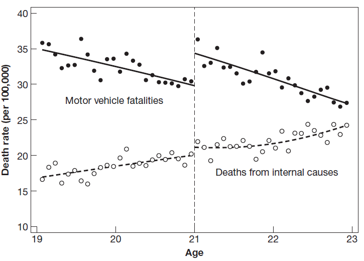

```{r setup, include=FALSE}
options(htmltools.dir.version = FALSE)
library(knitr)
library(kableExtra)
library(here)
opts_chunk$set(
  fig.align="center",fig.height=4, #fig.width=7,# out.width="748px", #out.length="520.75px",
  dpi=300, #fig.path='Figs/',
  cache=T,
  echo=F,
  engine.path=list(stata="C:/Program Files/Stata16/StataIC-64.exe")#, warning=F, message=F
  )
library(tidyverse)
require(cowplot)
require(ggpubr)
require(haven)
require(Statamarkdown)
require(plot3D)
require(stargazer)
require(quantmod)
require(wbstats)
require(lubridate)
require(scales)
require(broom)
require(PNG)

options("getSymbols.warning4.0"=FALSE)
# require(see)

```

layout: true

<div class="msu-header"></div> 


---
class: MSU
name: Overview

# Last class(es)

- Diff-in-diff

  - Made an assumption (parallel trends)
  
  - That let us say we know $E[Y_0|D=1]$

  - Had to use the Parallel Trends assumption
  
  - Could estimate as a regression (simple!)
  
- Synthetic

  - Concept: pre-treatment match gives us post-treatment counterfactual
  


---
class: MSU

# Regression Discontinuity

### Let's return to the endogeneity issue:
$$\color{blue}{y_{i} = \beta_0 + \beta_1 D_i + \beta_2 x_{i} + u_{i}}$$

And we have the usual endogeneity problem that: $D_i$ may be correlated with $u_i$, even once we condition on exogenous $x_i$.

--

### Let's set up an example
.pull-left[
- $y_i$ is semesters of college attended
- $D_i$ is "getting a scholarship"
]

.pull-right[

- $x_i$ is parental income
- $u_i$ is potentially endogenous error
]

We might think that *ability*
  1. Affects semesters of college attended
  2. Unobserved (and thus in $u_i$)
  3. Correlated with getting a scholarship

--

$$\Rightarrow (Y_{i0},Y_{i1}) \not\perp D_i | x_i$$


---
class: MSU
# Regression Discontinuity

### Let's return to the endogeneity issue:
$$\color{blue}{y_{i} = \beta_0 + \beta_1 D_i + \beta_2 x_{i} + u_{i}}$$

### What if we had a scholarship that was awarded to all students with a 1200 SAT score or above?
- $D_i = 1(SAT_i > 1200)$

### Does this solve our endogeneity problem?
- Is $SAT_i$, the student's SAT score, exogenous?
--

- What do we learn about scholarships in general from understanding the effect of *this* particular scholarship? We'll return to this in a little bit.

---
class: MSU
# Regression Discontinuity

### Does this solve our endogeneity problem?
- Is $SAT_i$, the student's SAT score, exogenous?

### What if I compared a student with an 800 to a student with a 1600 (and with the exact same $x_i$)

- Would you be concerned about that unobserved *ability* in $u_i$?

--

### What about comparing a 900 student to a 1500 student?

--

### What about comparing a 1000 student to a 1400 student?

--

### What about comparing a 1100 student to a 1300 student?

---
class: MSU
# Regression Discontinuity

### What about comparing a 1190 student to a 1210 student?

--

### What about comparing a 1199 student to a 1201 student?

---
class: MSU
# Regression Discontinuity

<br><br>
The intuition behind RD is as follows:
### If we compare students within a *small enough window* around a threshold, then treatment $D_i$ is **as good as randomly assigned**

--

And *as good as randomly assigned* lets us treat the treatment as **exogenous**

The *unobserved* endogenous problem in $u_i$ is no longer a problem.


---
class: MSU
# Regression Discontinuity

### What do we need for an RD?
I. A **threshold**
  - And it has to be exogenous
  - Usually from a policy
  - Arbitrary policies are...great!

```{r Image1, echo=F, include=T, out.width='60%', caption='Scott Cunninghams Twitter', message = F, warning=F}
# 
# 
require(jpeg)
img <-jpeg::readJPEG('RD_Federalism.jpg')
require(grid)
grid.raster(img)
```

---
class: MSU
# Regression Discontinuity

### What do we need for an RD?
II. A **running variable**
  - We need some variable that crosses the threshold
    - It cannot be binary
  - It has to be *observed*
  - It has to determine the treatment of interest $^\dagger$
<br><br><br>
> "Although treatment isn't randomly assigned, we know where it comes from"

.pull-right[ 
$-$ Mastering Metrics, Ch. 4]

.footnote[ 
$^\dagger$ A *fuzzy* RD relaxes this assumption]
---
class: MSU
# Regression Discontinuity

### The **running variable** in our example is SAT score
- Crosses the threshold
- Non-binary
- Observed
- Determines scholarship (treatment) discontinuously
  - A "jump"

---
class: MSU
# Regression Discontinuity

### What do we need for an RD?
III. A **window**
  - We need somewhere to "draw the line"
  - In our SAT example, some of us would have been OK with 1150 and 1250. 
    - Some would want 1190 to 1210
    - Some would say 1195 to 1205


---
class: MSU
# Regression Discontinuity

### A **threshold**
- Set exogenously

### A **running variable**
- Determines treatment
- Continuous
- Observable

### A **window**
- How close is close enough

### The identifying assumption:
.large[Within a small enough **window**, the treatment (as determined by the **running variable** and the **threshold**) is as good as randomly assigned]

---
class: MSU
# Regression Discontinuity

### Specification of an RD
- Let's call the running variable $x_r$
- Let's call the threshold $\tau$
<br><br><br>
--

### Our RD equation would be:
$$y_i = \beta_0 + \beta_1 D_i + \beta_2 x_{i,r} + \beta_3 x_{exogenous} + u_i$$

.pull-left[
- $y_i$ is outcome
- $D_i=1(x_{i,r} > \tau)$
- $\tau$ is the threshold
]

.pull-right[
- $x_{i,r}$ is the *running variable*
- $x_{i, exogenous}$ is an exogenous covariate (a control)
- $u_i$ is the error
]


---
class: MSU
# Regression Discontinuity

### Our RD equation would be:
$$y_i = \beta_0 + \beta_1 D_i + \beta_2 x_{i,r} + \beta_3 x_{exogenous} + u_i$$

and

$$D_i = 1(x_{i,r} > \tau)$$

<br>
#### Note that we have a continuous running variable $x_{i,r}$ with a linear coefficient
- We can still control for the effect of the running variable
- That's why we need the $\tau$ threshold where treatment "jumps"

#### And we can still control for other things
- $x_{exogenous}$

---
class: MSU
# Regression Discontinuity

### Our RD equation would be:
$$y_i = \beta_0 + \beta_1 D_i + \beta_2 x_{i,r} + \beta_3 x_{exogenous} + u_i$$

#### But where is the window?
- We *could* just use a sample within the window
- Define the window as being (a,b)
  - R: `myData[myData$xir >=a & myData$xir <=b,]`
--

- Another option is to use *local linear regresion*, which can be implemented as a *weighted regression*

---
class: MSU
# Weighted Regression

### A quick aside to establish weighted regression:
We know that OLS minimizes the sum of the squared error term $u_i$
$$\sum (y_i - \beta_0 - \beta_1 x_1)^2 = \sum (u_i)^2$$

### Weighted regression just puts weights on that sum:
$$\sum w_i(u_i)^2$$
and 

$$\sum w_i = 1$$

---
class: MSU
# Weighted Regression

### Weights can set the estimation sample
If we said that $w_i=0$ if $i$ is not "in the window", and constant otherwise, we would just be setting the estimating sample.

### Weights can be continuous
What if we set $w_i$ to be some function of *how far away from the threshold* an observation $x_{i,r}$ is?
- If $x_{i,r}$ is far away from $\tau$, then it gets a low weight
- If $x_{i,r}$ is practically equal to $\tau$, then it gets a high weight

$$\tilde{w_i} = \frac{1}{|x_{i,r}-\tau|}$$

Of course, we might have to re-scale all the $w_i$'s to make sure they add to 1:

$$w_i = \frac{\tilde{w}_i}{\sum_{j=1}^N \tilde{w}_j}$$


---
class: MSU
# Weighted Regression

### This "local linear regression" because it puts more weight on those observations where $x_{i,r}$ is very close to $\tau$
- You still have to determine the form of the weights
- We call the function that generates weights the *kernel*
- Since we are not making an assumption about how the distance away from $\tau$ enters the main regression, this is **non-parametric**.


---
class: MSU
# Weighted Regression

### Other kernels include:
.pull-left[
- Rectangular Kernel
  - Puts equal weight on all observations between $a$ and $b$]
  
.pull-right[
- Triangle Kernel
  - Puts weight on those closer to the center
]

```{r Kernels, echo=F, include=T}

par(mfrow=c(1,2))

plot(0, type='n', xlim=c(-3,3), ylim=c(0,1), ylab = 'w_i', xlab = 'x_ir')
lines(x=c(-2,2), y=c(.25,.25))
abline(v=c(-2,2), lwd=1, lty=2, col='gray50')

plot(0, type='n', xlim=c(-3,3), ylim=c(0,1), ylab = 'w_i', xlab = 'x_ir')
lines(x=c(-2,0), y=c(0,.5))
lines(x=c(0,2), y=c(.5,0))
abline(v=c(-2,2), lwd=1, lty=2, col='gray50')
```
---
class: MSU
# Regression Discontinuity

Applying weights to OLS is easy:

`myOLS = lm(Y ~ X1 + D + X2, data=myData, weights = 1/abs(myData$X1 - tau))`


---
class: MSU
# Regression Discontinuity

.font40[this page left intentionally blank]


---
class: MSU
# Regression Discontinuity

### Example 1
Maimonides Rule
- 12th century rabbinic scholar who determined that 40 students was the max. class size.
- Anything larger had to be cut into two 20/21-person classes
- Angrist and Lavy (1999) used threshold to look at effect of class size on student outcomes
--

  - What is the endogeneity problem between student outcomes and *assignment* of class sizes?
  - What is the threshold and is it exogenously set?
  - What is running variable?
  - Evaluate whether or not we have an as-good-as-random treatment assignment
  
---
class: MSU
# Regression Discontinuity

### Example 2
Superfund cleanup
- All superfund sites have a risk score
- Congress determines how far down the 
- Greenstone and Gallagher (2008) and Gamper-Rabindran and Timmins (2011) used threshold to look at effect of cleanup on housing prices
--

  - What is the endogeneity problem between home values and *assignment* of superfund cleanup?
  - What is the threshold and is it exogenously set?
  - What is the running variable?
  - Evaluate whether or not we have an as-good-as-random treatment assignment
  

---
class: MSU
# Running Variables

$$\color{blue}{y_{i} = \beta_0 + \beta_1 D_i + \beta_2 x_{i,r} + u_{i}}$$

```{r RV1, echo=F, include=T, out.width='80%'}
knitr::include_graphics('MMfig43a.png')
```

---
class: MSU
# Running Variables

$$\color{green}{y_{i} = \beta_0 + \beta_1 D_i + \beta_2 x_{i,r} + \beta_3 x_{i,r}^2 + \beta_4 x_{i,r}^3 + u_{i}}$$

```{r RV2, echo=F, include=T, out.width='80%'}
knitr::include_graphics('MMfig43b.png')
```


---
class: MSU
# Running Variables

$$\color{brown}{y_{i} = \beta_0 + \beta_1 D_i + \beta_2 (x_{i,r}-\tau) + \beta_3 (x_{i,r}-\tau) * D_i + u_{i}}$$
Here, we let the *slope* of the coefficient on the running variable change when it crosses the threshold. To the left of the threshold, $\frac{dy}{dx_{i,r}}=\beta_2$, and to the right, it is $\beta_2 + \beta_3$ (dashed line).

```{r RV3x, echo=F, include=T, out.width='60%'}
knitr::include_graphics('MMfig44.png')
```

---
class: MSU
# Running Variables

```{r RV3, echo=F, include=T, out.width='80%'}
knitr::include_graphics('MMfig43c.png')
```

This one is not so good - the dashed line fits a possible non-linear trend.
- Note that there is an upward trend just before the threshold
- That trend is more consistent with a polynomial trend, and the linear trend + threshold gives a false effect.

---
class: MSU
# RD Diagnostics

### The implicit assumption in our RD "window"
is that everything else *around* the threshold $\tau$ varies *smoothly*
- Then, we can control for it parametrically.

### Which means that *other variables* not affected by the treatment should vary smoothly over the threshold
- After all, if some unrelated variable is "jumping" at the threshold, then we shouldn't have much confidence in that threshold being exogenous
  - And this would ruin our assumption.
  
  
> (Z)ero effects on outcomes that should be unchanged by treatment raise our confidence in the causal effects we are after

.pull-right[ $-$ Mastering Metrics]


  
---
class: MSU
# RD Diagnostics

```{r RV4, echo=F, include=T, out.width='80%'}

```


---
class: MSU
# Fuzzy RD

### What if the threshold doesn't perfectly determine treatment, but the other assumptions hold?
In this case, we would have:
- Something exogenous
- That has an affect on treatment
- But doesn't affect outcome except through treatment

--

### It's an instrument!

---
class: MSU
# Fuzzy RD

Back to our original example, except maybe we don't have perfect awarding of scholarships to SAT>1200

### First Stage:
$$\color{red}{SCHOLARSHIP_i = \alpha_0 + \alpha_1 SAT_i + \alpha_2 1(SAT_i>1200) + \alpha_3 x_i + v_i}$$
This is just like our .blue[original] equation, but with $SCHOLARSHIP_i$ on the LHS.

---
class: MSU
# Fuzzy RD


### Second Stage:
$$\color{red}{y_i = \beta_0 + \beta_1 \widehat{SCHOLARSHIP}_i + \beta_2 SAT_i + \beta_3 x_i + u_i}$$

$\beta_1$ is our treatment of interest.

Note that $SAT_i$ is still in the second stage **but** the threshold dummy $1(SAT_i>1200)$ is *not*.

This just follows the IV method, but gets the first-stage exogeneity from the RD specification! The *crossing of the threshold* is the exogenous event.

---
class: MSU
# Fuzzy RD

### In practice...
We rarely get a threshold that is perfectly "sharp".
- Age of drinking is pretty sharp
- But many other things don't have a perfect relationship

### So fuzzy is more common in the literature
- And remember: when you have an instrument that is almost perfectly correlated with the endogenous variable, IV turns into OLS.
  - If the first stage $Z$ has a perfect prediction of $D$, then $\hat{D}=D=Z$


```{r outputChromePrint, include=F, eval=F}

require(pagedown)
currentfile = gsub(pattern='\\.Rmd', '', basename(rstudioapi::getSourceEditorContext()$path))
inputpath = paste0('https://ajkirkpatrick.github.io/EC420MSU/',currentfile, '/', paste0(currentfile, '.html'))
browseURL(inputpath)
pagedown::chrome_print(input = inputpath,
                   output = file.path( paste0(currentfile, '.pdf')),
                   #wait = 3,
                   timeout = 300,
                   format = 'pdf')

```
