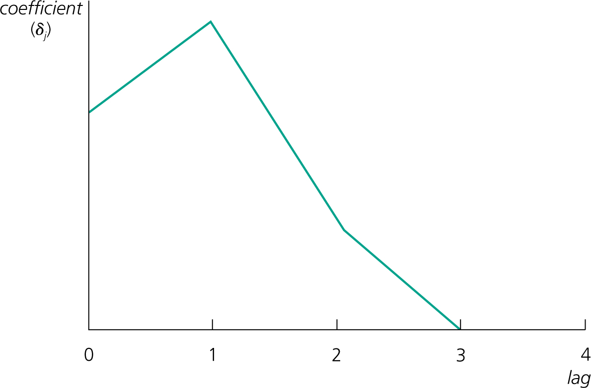
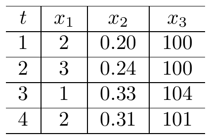
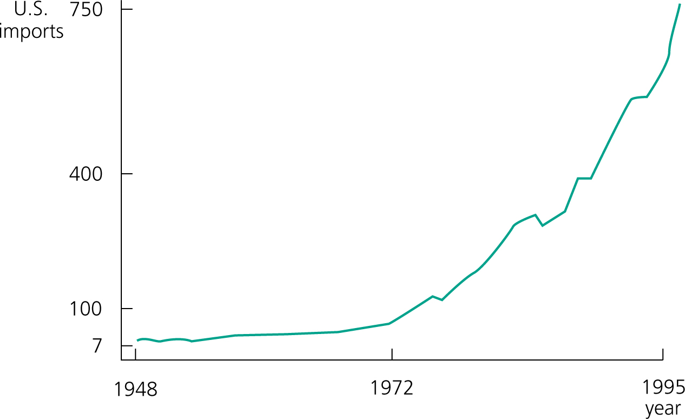

```{r setup, include=FALSE}
options(htmltools.dir.version = FALSE)
library(knitr)
library(kableExtra)
library(magick)
library(here)
opts_chunk$set(
  fig.align="center",fig.height=4, #fig.width=7,# out.width="748px", #out.length="520.75px",
  dpi=300, #fig.path='Figs/',
  cache=T,
  echo=F,
  engine.path=list(stata="C:/Program Files/Stata16/StataIC-64.exe")#, warning=F, message=F
  )
library(tidyverse)
require(cowplot)
require(ggpubr)
require(haven)
require(Statamarkdown)
require(plot3D)
require(stargazer)
require(quantmod)
require(wbstats)
require(lubridate)
require(scales)
require(broom)

options("getSymbols.warning4.0"=FALSE)
# require(see)

```

layout: true

<div class="msu-header"></div> 


---
class: MSU
name: Overview

# Last class(es)

Regression Discontinuity

- "Treatment is as good as random within a small enough window around a threshold"

Diff-in-Diff

Instrumental Variables

### These were identification strategies to get causal estimates of $ATE$ (or $LATE$ or something like an $ATE$)


---
class: MSU

# Today

Today, we shift gears completely.

### Time series

- Define

- Lag models

- Can we use MLR1-MLR6 and call a time series OLS estimate unbiased?
  - No.

---
class: heading-slide

Time series definitions

---
class: MSU
# Definition

### Time series data is any data that has a *temporal order*
- Can be ordered by time
- Time only flows one way, which is helpful.

### Time series usually implies a single unit of observation with multiple observations
- E.g. it isn't panel data
- But panel data can be thought of as $N$ time-series'.
- For now, one unit of observation, $T$ observations.

### Stochastic Process
- A **stochastic process** or **time series process** is a *sequence of random variables indexed by time*
- "Stochastic" means "random"

---
class: MSU

# Definition

### Each sequence we observe is a *realization* of the stochastic *process*
- Just as we pulled a sample from a population, the time series data we *do* observe can be thought of as a drawn from a population of possible time series'.
- The "population" then is the set of all possible time series' that could have been drawn.
- We only get to see one realization of the possible time series.
- We want to learn about the underlying structure.

---
class: MSU
# Definition

### The **static** model
$$y_t = \beta_0 + \beta_1 z_t + u_t$$

- Looks just like our usual OLS model, but instead of $i$, we have $t$

- We could run this regression for $\beta_1$

---
class: MSU
# Definition

### There are many different ways we can account for things that happen over time
- We could let our outcome $y$ in time $t$, say $y_t$, be a function of current values of $z$ *and* past values of $z$.
- We could let $y_t$ be a function of past values of $y$, say $y_{t-1}$
- We could let $y_t$ be a function of past values of $u$ as well.

### We have specific names for the types of time series models we might employ.
- Each one describes a different dynamic process
- Here are some of them.

---
class: MSU
# FDL

### Finite Distributed Lag (FDL) Model
$$\color{blue}{y_t = \alpha_0 + \delta_1 z_t + \delta_2 z_{t-1} + \delta_3 z_{t-2} + u_t}$$

The subscripts are not indicating different $z$ variables. The subscripts refer to the ordering in time.

We call the previous time period the "lag", so this is "y regressed on z, the first lag of z, and the second lag of z"

The FDL is saying that:
- $E[y_t|z_t, z_{t-1}, z_{t-2}]$ at time $t$ is explained by contemporaneous $z$, the previous period's $z$ (which is $z_{t-1}$), and the $z$ before that, $z_{t-2}$.
  - "contemporaneous" means "at the same time".
  - Notice that our PRF tells us $E[y_t]$ conditional on a bunch of **lags** (previous values) of $z$. 

---
class: MSU
# FDL

### In the previous slide's Finite Distributed Lag model:
The marginal effect of $z$ (the effect of increasing $z$ by one unit) is now *time-specific*
$$\frac{dy_{s}}{dz_{t}} = \begin{Bmatrix}
\delta_1 &\text{ if s = t}\\
\delta_2 &\text{ if s = t+1}\\
\delta_3 &\text{ if s = t+2}\\
0 &\text{ otherwise}
\end{Bmatrix}$$

<br><br>
### This is a FDL with order two
becuase there are two lags of $z$ in addition to the contemporaneous $z$

---
class: MSU
# FDL

### We are essentially "tracing out" the effect of an increase in $z$ at time $t$
$$\color{blue}{y_t = \alpha_0 + \delta_1 z_t + \delta_2 z_{t-1} + \delta_3 z_{t-2} + u_t}$$

If $z_t$ were one unit higher (permanently):
- $E[y_t]$ would be $\delta_1$ higher
- $E[y_{t+1}]$ would be $\delta_1+\delta_2$ higher
- $E[y_{t+2}]$ would be $\delta_1+\delta_2+\delta_3$ higher
- $E[y_{t+3}],\cdots$ would be $\delta_1+\delta_2+\delta_3$ higher

```{r W101, echo=F, include=T, out.width='30%', fig.cap='Lag distribution'}

```


---
class: MSU
# FDL

### We call the contemporaneous effect, $\delta_1$, the "impact multiplier"

### If we add up all of the $z$ coefficients, $\delta_1+\delta_2+\delta_3$
then we get the total cumulative changes in $y$. This is the **long run multiplier**.

<br>
### Why care about the **long run multiplier**?
If $y$ were "monthly wages" and $t$ were month, then the **long run multiplier** would be the total monthly wage increase due to the one-unit, permanent change in $z$. 
- It adds up all of the lagged effects.


---
class: MSU
# FDL

### A FDL of order $q$
$$y_t = \alpha_0 + \delta_0 z_t + \delta_1 z_{t-1} + \cdots + \delta_q z_{t-q} +  u_t$$

### With Long Run Multiplier (or Long Run Propensity):
$$LRP=\delta_0 + \delta_1 + \cdots + \delta_q$$

### This is a **static model** if we set:
$$\delta_2, \delta_3, \cdots, \delta_q=0$$

---
class: MSU
# FDL

### In any time series (and in the FDL)
things tend to be correlated over time. $z_t$ and $z_{t-1}$ are probably not independent

$z_t$ and $z_{t-1}$ might even be highly correlated
- so in a regression with $z_t$ and $z_{t-1}$, we could have multicolinearity problems
- which leads to imprecise estimates (high $se(\hat{\delta_2})$)


<br><br>
### Let's look a the properties of the time-series estimators
---
class: heading-slide

Finite Sample Properties

---
class: MSU
# Notation and details

```{r SampleTS1, echo=F, include=T, warning=F, out.width='70%'}
ts1 = tibble(
  t = 1:4,
  x_1 = c(2,3,1,2),
  x_2 = c(.2, .24, .33, .31),
  x_3 = c(100, 100, 104, 101)
)

# C:\PROGRA~1\MIKTEX~1.9\miktex\bin\x64\xelatex.exe -interaction=batchmode C:\Users\jkirk\AppData\Local\Temp\Rtmp4MkRFc\file28ac2c2b17d6.tex

#temp_tex_file = 'C:\\Users\\jkirk\\AppData\\Local\\Temp\\Rtmp4MkRFc\\file28ac2c2b17d6.tex'

# tt = knitr::kable(ts1, align='c', escape = F, col.names = c("$t$"," $x_1$ "," $x_2$ "," $x_3$ "), format='latex')
# aa = jsave_kable_latex(tt, 'something2.png', keep_tex=T)  

# ?normalizePath

```

$x_{2,2}=.24$

$\mathbf{x}_{t_1} = \{2,.20,100\}$

$\mathbf{X}$ = the whole thing.

---
class: MSU
# Unbiased

### TS1 - Linear In Parameters: 
$$y_t = \beta_0 + \beta_1 x_{t1} + \cdots + \beta_k x_{tk} + u_t$$

### TS2 - No Perfect Collinearity: 
No independent variable (RHS) is constant nor a perfect linear combination of the others.

---
class: MSU
# Unbiased

### TS3 - Zero Conditional Mean 
$$E[u_t|\mathbf{X}] = 0, \quad t= 1, 2, \cdots, n$$
- Note the $\mathbf{X}$. This is saying that $u_t$ is uncorrelated with **every** $x$ in all time periods. 
- Even in the future!
- Call this *strict exogeneity* or *nonrandom X*

---
class: MSU
# Unbiased

### TS3 - Zero Conditional Mean

#### Strict exogeneity can fail due to:
- Omitted variables
- Measurement error (we will cover this later)
- $u_t$ correlated with $x_{t-s}$ where $s$ is any lag/lead.
  - Let's say $x_{t-1}$ has an effect on $y_{t}$ and we don't specify a FDL
  - And let's say $x_{t-1}$ is correlated with $x_{t-s}$:
$$\begin{eqnarray}
y_{t} &=& \beta_0 + \beta_1 x_t + \tilde{u_t} \nonumber \\
y_{t} &=& \beta_0 + \beta_1 x_t + \{\gamma_1 x_{t-s} + u_t\} \nonumber
\end{eqnarray}$$

And thus $E[u_t|\mathbf{x}_t] \neq 0$

---
class: MSU
# Unbiased 

### TS3 - Zero Conditional Mean

#### Strict exogeneity can also fail due to:
- $y_t$ has an effect on $x_{t+s}$
  - E.g. tax revenue in year $t$, $y_t$ affects future infrastructure investment $x_{t+1}$.
$$\begin{eqnarray}
y_{t} &=& \beta_0 + \beta_1 \tilde{x}_t + u_t \nonumber \\
y_{t+1} &=& \beta_0 + \beta_1 \tilde{x}_{t+1} + u_{t+1} \nonumber \\
y_{t+1} &=& \beta_0 + \beta_1 \underbrace{\{\gamma_1 y_{t} + x_{t+1}\}}_{\tilde{x}_{t+1}} + u_{t+1} \nonumber \\
y_{t+1} &=& \beta_0 + \beta_1 \{ \gamma_1 (\beta_1 \tilde{x}_{t} + u_{t}) + x_{t+1} \} + u_{t+1} \nonumber \\
y_{t+1} &=& \beta_0 + \beta_1 x_{t+1} + \color{red}{\gamma_1 \beta_1 \tilde{x}_{t} + \gamma_1 \beta_1 u_{t}} + u_{t+1} \nonumber
\end{eqnarray}$$

If $\tilde{x}_{t+1}$ is correlated with $y_{t}$, and since $y_{t}$ is very much correlated with $u_{t}$, then $x_{t+1}$ is correlated with $u_{t}$ and $E[u_t|\mathbf{X}] \neq 0$. We have violated *strict exogeneity*.

---
class: MSU
# Unbiased

### TS3 - Zero Conditional Mean
- If we have the "right" number of lags in a FDL, we are controlling for the effect of past $x$
  - That means we don't have to worry if $x_t$ is correlated with $u_{t-1}$ in a one-lag FDL.
  - Because it is *controlled for* - just like when we included the omitted variable that caused bias.
- **But** we do worry about $y_t$ having an effect on $x_{t+1}$ still. 
  - A FDL doesn't fix that.
  
  
---
class: MSU
# Unbiased

### TS1 - Linear In Parameters: 
$$y_t = \beta_0 + \beta_1 x_{t1} + \cdots + \beta_k x_{tk} + u_t$$

### TS2 - No Perfect Collinearity: 
No independent variable (RHS) is constant nor a perfect linear combination of the others.

### TS3 - Zero Conditional Mean:
$$E[u_t|\mathbf{X}]=0$$
<br>
## Under assumptions TS1, TS2, and TS3 hold, our OLS estimator is unbiased.

---
class: MSU
# Variances

We need two more assumptions to get a variance of our estimator:

### TS4 - Homoskedasticity:
$$Var[u_t | \mathbf{X}] = Var[u_t] = \sigma^2, \quad t=1,2,\cdots,n$$

### TS5 - No Serial Correlation
$$Corr(u_t, u_s | \mathbf{X}) = 0\quad \forall t\neq s$$
- Conditional on $\mathbf{X}$, errors at any two times $t$ and $s$ are uncorrelated.
- This is a **huge** assumption
- Let's discuss this...


---
class: MSU
# Variances

### TS5 - No Serial Correlation
- Serial Correlation is lso known as *autocorrelation*
- Imagine you have a time series of $y_t = \beta_0 + \beta_1 x_t + u_t$
- Now, imagine that some unobserved influence increased $y_{t+1}$ by a small amount
  - $u'_{t+1}>u_{t+1}$
  - The new $u$ is a little larger than what would have been without the unobserved influence
--
- Thus far, this is not a problem
- But...if that effect is persistent and $u'_{t+2}>u_{t+2}$
  - Now, what you observe is $u'_{t+1},u'_{t+2}$ and those two *are correlated*.


---
class: MSU
# Variances

### Serial Correlation
- Another way of thinking of Serial Correlation is this:
  - If knowing that $u_{t}>0$ told you something about $u_{t+1}$, then $Corr(u_t, u_{t+1})\neq 0$.
  - This violates assumption TS5
  
### This was not a problem when we had *random sampling* in MLR.
- There was no "order" to $i$.
- But here, we are randomly drawing the series from the population of possible series.

### TS5 does *not* require anything of $Corr(x_t,x_{t+1})$
- This is about the *unobserved*, not the observed $\mathbf{X}$
---
class: MSU
# Variances

### Under assumptions TS1-TS5
$$Var(\hat{\beta}_j|\mathbf{X}) = \frac{\sigma^2}{SST_j(1-R_j^2)}, \quad j=1,\cdots,k$$
- This is our usual expression for the variance of the $\beta_j$ in MLR.
- We estimate $\hat{\sigma}^2$ the same way: $\hat{\sigma}^2 = \frac{1}{N-k-1} \sum \hat{u}_t^2$
- (BLUE): the OLS estimator is the Best Linear Unbiased Estimator conditional on $\mathbf{X}$ 
--


### TS6 - Normality and *iid* errors, we have the same inference as before
- $t$-statistic, $F$-statistic, confidence intervals, and p-values.

---
class: MSU
# Functional Form

### TSR1 - TSR6 are very restrictive
- Remember, we had to assume no serial correlation, nonrandom $\mathbf{X}$ with no effect of $y_t$ on $x_{t+1}$.

### If we make these heroic assumptions
- We can use dummy and factor variables just the same
- Natural logs, $ln(x_t)$, are percentage changes just the same
- We can do an *event study analysis*
  - A time-series with a binary dummy for treatment

### We will relax these assumptions in a little bit

---
class: heading-slide

Functional Forms and Time Trends

---
class: MSU
# Functional Form

### Index number
- An *index number* is a time series that usually measures the progression of some important macroeconomic variable
  - Index of Industrial Production (IIP)
  - Consumer Price Index (CPI)
- In regressions, we frequently want to control for larger macroeconomic trends like inflation.
- In an index, you have a *base year* which usually equals $1$ or $100$
- In subsequent years, if the index has gone up by, say, 3%, the new value of the index will be $1.03$ or $103$.
- If it goes up another 2% relative to the *base level*, the new value will be $1.05$ of $105$
--

### Converting base years
- You'll often need to convert indexes to a common base year
- $newindex_t = 100\left(\frac{oldindex_t}{oldindex_{newbase}}\right)$

---
class: MSU
# Time Trends

### Many time series have seasonal factors
- Unemployment especially - Nov-Dec reflects temporary holiday employment at FedEx or Amazon or Sears
- Census employment every 10 years for 1 year

$$\begin{eqnarray}
y_t &=& \beta_0 + \beta_1 1(Winter) + \beta_2 1(Spring) + \beta_3 1(Summer)  \\
&+& \beta_4 x_t + \beta_5 x_{t-1} + \beta_6 1(census)+  u_t
\end{eqnarray}$$

---
class: MSU
# Time Trends

### If there is a natural, smooth progression in the $y$, we may want to control for it
It may be due to unobserved factors, but much like a fixed effect, we don't have to see it to control for it. $t$ is continuous here:

$$y_t = \alpha_0 + \alpha_1 x_1 + \alpha_2 x_2 + \alpha_3 t + u_t$$

- $\alpha_3$ is a linear time trend. It says that $y_t$ goes up by $\alpha_3$ per t.
- Ignoring this would make $y_t$ correlated with *anything* that is growing just like $y$
  - A regression of "number of total posts on Instagram" and "number of drownings in the ocean" will probably be correlated because both tend to grow over time.
- This is an example of a **spurious regression problem**

### Including the time trend $t$ in the regression fixes this

---
class: MSU
# Time Trends

### What about the $x$'s when we include a time trend?
$$\color{green}{y_t = \beta_0 + \beta_1 x_{1,t} + \beta_2 t + u_t}$$

Remember, we can think of the *partialling out*:
$$y_t = \alpha_0 + \alpha_1 t + v_t$$
$$\tilde{y}_t = y - \hat{\alpha}_0 - \hat{\alpha}_1 t$$

Same for $x_t$
$$x_t = \delta_0 + \delta_1 t + w_t$$
$$\tilde{x}_{1,t} = x_t - \hat{\delta}_0 - \hat{\delta}_1 t$$
### These are the $y$ and $x$ time series *without* their time trends. They are *detrended*.

---
class: MSU
# Time Trends

### Then, when we regress 
$$\color{green}{y_t = \beta_0 + \beta_1 x_{1,t} + \beta_2 t + u_t}$$

We are doing the equivalent to

$$\tilde{y}_t = \gamma_0 + \gamma_1 \tilde{x}_1 + \epsilon_t$$
And $\gamma_1=\beta_1$. This is the regression of the *detrended* $y$ on the *detrended* $x$.

---
class: MSU
# Time Trends

### If we log-transform $y_t$, we get a trend in percent change which is exponential
```{r TimeTrendExp, echo=F, include=T, out.width='80%'}

```

---
class: MSU
# Stationary TS

### Chapter 11 introduces *stationary* time series:
- A stationary time series is a time series where the *joint distribution* of the variables in the time series is the same in each time period.

- If the *joint pdf* of $(x_{t},x_{t+1})$ is the same as the joint distribution of $(x_{t+h},x_{t+1+h})$, then $x_t$ is *stationary*.

- The series can be *stationary* but also highly correlated. In fact, $x_{t}=x_{t+1}$ would mean they are perfectly correlated, but they can still be stationary!

<br>
### If we think of the random sampling in a time series as drawing a chain of observations from the overall population
then we start to see why stationarity is important. It means it doesn't matter where in the "chain" we draw from.

---
class: MSU
# Stationary TS

### Non-stationarity
- Non-stationarity is not uncommon. Think about our time trend regression:
$$\color{green}{y_t = \beta_0 + \beta_1 x_{1,t} + \beta_2 t + u_t}$$
Ignore the $x_{1,t}$ for a moment. It's pretty clear that the joint distribution of $(y_t, y_{t+1})$ is not the same as $(y_{t+h}, y_{t+1+h})$, but we *can* control for that. Sometimes we can't, and that becomes a problem

---
class: MSU
# Stationary TS

### Why is non-stationarity a problem?
> (I)f we want to understand the relationship between two or more variables using regression analysis, we need to asssume some sort of stability over time. If we allow the relationship between two variables to change arbitrarily in each time period, then we cannot hope to learn much about how a change in one affects the other(...)

<br>

### Much of time series econometrics is about being very specific as to how big of a problem this may be, and when it stops being a problem
- If we assume that everything past one lag is uncorrelated, time series is very easy!
- We already saw that assuming $y_t$ has no effect on $x_{t+1}$ made things very easy!


```{r outputChromePrint, include=F, eval=F}

require(pagedown)
currentfile = gsub(pattern='\\.Rmd', '', basename(rstudioapi::getSourceEditorContext()$path))
inputpath = paste0('https://ajkirkpatrick.github.io/EC420MSU/',currentfile, '/', paste0(currentfile, '.html'))
browseURL(inputpath)
pagedown::chrome_print(input = inputpath,
                   output = file.path( paste0(currentfile, '.pdf')),
                   #wait = 3,
                   timeout = 300,
                   format = 'pdf')

```