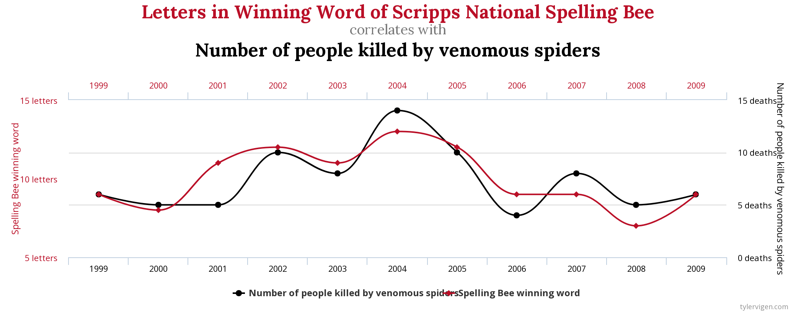
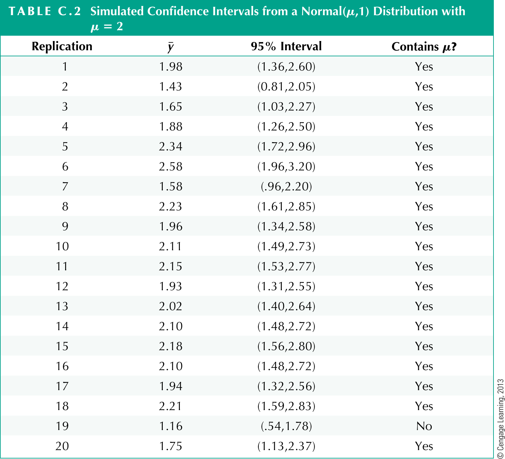
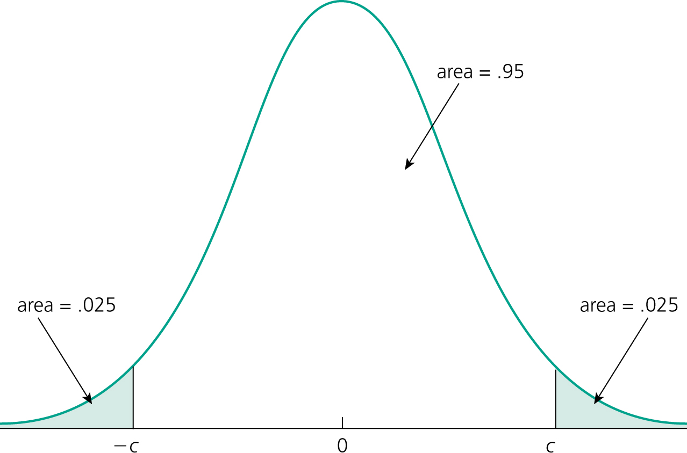
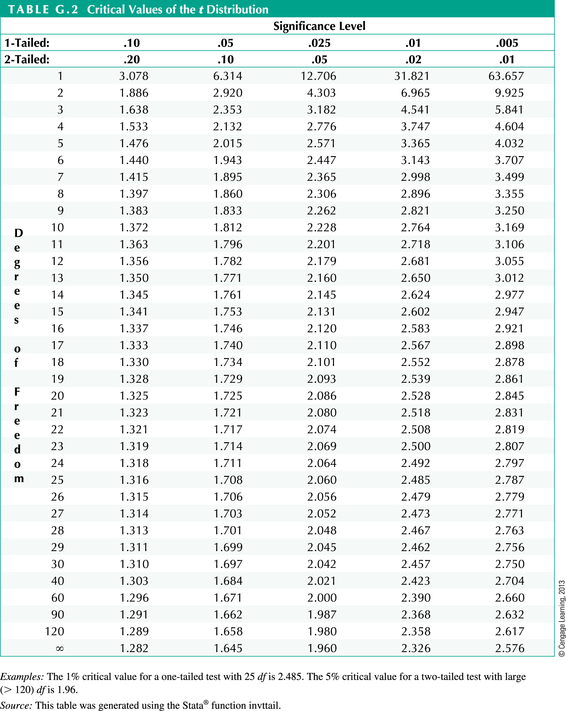
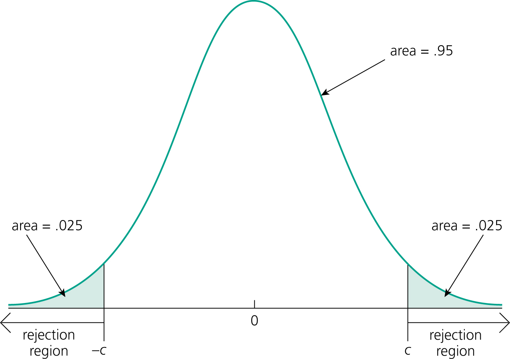

```{r setup, include=FALSE}
options(htmltools.dir.version = FALSE)
library(knitr)
library(kableExtra)
library(magick)
library(here)
opts_chunk$set(
  fig.align="center",fig.height=4, #fig.width=7,# out.width="748px", #out.length="520.75px",
  dpi=300, fig.path='figs/',
  cache=T,
  cache.path = 'caches/',
  echo=F,
  engine.path=list(stata="C:/Program Files/Stata16/StataIC-64.exe")#, warning=F, message=F
  )
library(tidyverse)
require(cowplot)
require(ggpubr)
require(haven)
require(Statamarkdown)
require(plot3D)
require(stargazer)
require(quantmod)
require(wbstats)
require(lubridate)
require(scales)
require(broom)
require(visualize)

options("getSymbols.warning4.0"=FALSE)
# require(see)

```

layout: true

<div class="msu-header"></div> 


---
class: inverseMSU
name: Overview

# This lecture  

__Goal:__ Refresh or catch up on statistical concepts relevant to econometrics.

--

0. Selected questions from D2L

1. Random variables

3. Sample vs. Population

2. Probability density functions (PDF/PMF, CDF)

4. Mean, variance (in population, in sample)

5. Correlation, independence, mean independence, iid

--

6. Types of distributions (normal, uniform, student-t, $\chi^2$, bernoulli, poisson)

7. Statistical inference

8. Useful functions and properties


---
class: heading-slide

Questions from last week

---
class: MSU
# Class Business

### Some of the most common questions re: the class from your cards on Monday
- Will we go over R?

  - Most definitely. I will post instructions on installing R and Rstudio, and you will take a tutorial as part of your first problem set. 


---
class: heading-slide

Stats Review!

---
class: heading-slide

Random Variables

---
class: MSU
# Random variables

## Wooldridge defines a random variable as

"_...one that takes on numerical values and has an outcome that is determined by an experiment._"

--
 
When referring to a random variable (RV), we use an upper-case e.g. $X$

--

RV's have _realizations_ ("...determined by an experiment")

- Like flipping a coin
- Or rolling a die

--

We label these using lower-case: $x$

--

And when we have multiple realizations of a RV, we can label them: $\{x_1, x_2, x_3\} = \{`r sample(1:6, 3)`\}$


---
class: MSU

# Random variables

And when we have a map of how this RV behaves, we have a __distribution__ e.g. $X \sim N(0,1)$
- E.g. the "normal" distribution.
- One important element of a distribution is the _support_, which is the possible values that the RV can take
--


As an example, maybe $X$ is a roll of a normal die
- The support of $X$ is $\{1,2,3,4,5,6\}$
- The distribution of $X$ is:
  - $Pr(X=1) = \frac{1}{6}$
  - $Pr(X=2) = \frac{1}{6}$
  - $Pr(X=3) = \frac{1}{6} \cdots$
--

- The random variable is not the realizations
  - "The map is not the territory"
  
---
name: RV2
class: MSU

# Random variables

## Discrete vs. Continuous

A random variable is discrete if it can take on only a finite or countably infinite number of values. 
- Bernoulli (coin flip) can take on only two values, $\{0,1\}$. It is discrete.
- Poisson (count) can take on the values $\{0,1,2,...\}$, which is countably infinite. It is discrete.
- Normal can take on any value $\in\{-\infty, +\infty\}^*$
- Whether or not a RV is discrete or continuous is determined by it's support

.footnote[
<html><div style='float:left'></div><hr color='#EB811B' size=1px width=796px></html>
<sup>*</sup> $\in$ = "in"]
 
 
 
---
class: MSU
# Sample vs. Population

## Population

The "population" is what we'd like to learn about. 

Let $X$ be a random variable (RV) representing a population
- $X$ could be "hourly wage"
- $X$ could be "age"
--


There is some feature of the population we are interested in
- The mean hourly wage
- The distribution of age
- This is the "population statistic"
--


But we cannot collect complete data on the population:
- It may be too expensive or it just isn't possible

So we have to take a *sample*

---
class: MSU
# Sample vs. Population

### For example:
When we do national Presidential polling, we are *trying* to measure the national vote. The RV here is "voting preference"

- Call the true fraction of all people who intend on voting for Candidate A the "population statistic"
- But we do not get to call every person in America
- Even if we had infinite phones and infinite interns, the *population* we're interested in might not be that easy to figure out
  - "Likely voters"
- So we instead settle for getting as close to the population statistic as we can. We use a sample.


---
class: MSU
# Sample vs. Population

## Population Effect

- In econometrics, we're often going to be concerned about a population _effect_:
  - Effect of a drug on a health outcome
  
  - Effect of a work training program
  
--

- Just as there is a population statistic we can call "average vote", there is a "population effect" of a drug or work training program.

  - Just as we can't call everyone in the country about their vote, we can't test everyone in the country for a drug's effect
  
--

- We don't observe the whole population, so we cannot directly calculate the population statistic we're interested in.
  

---
class: MSU
# Sample vs. Population

## Sample

The sample is what we observe. 

It is always taken from the population. We use $N$ (or $n$) to denote it's size.

And under certain conditions<sup>*</sup> the sample tells us about the population

Population statistics will __always get a greek letter__. Sample statistics don't.
.pull-left[- $\mu$ is the population mean
- $\sigma^2$ is the population variance]
.pull-right[- $\bar{x}$ is the sample mean
- $s^2$ is the sample variance]


.footnote[<html><div style='float:left'></div><hr color='#EB811B' size=1px width=796px></html>
<sup>*</sup> We will learn a lot about these conditions this semester.]


---
class: MSU
# Sample vs. Population

For any *population statistic* we are interested in, there will be a *sample statistic* that will tell us something about the *population statistic*.
- In the voting example, our sample poll tells us *something* about the population
--


## The sample statistic will never be exactly the population statistic
--

## But it will be close
--

The statistical applications of econometrics are all about quantifying "how close"


---
class: MSU
# Sample vs. Population


## In everything we do for the first half, we will use the concept of "population" and "sample" heavily.


Please make sure you are comfortable with the difference.


## Any questions?

---
class: heading-slide

Probability density functions


---
class: MSU

# PDF and CDF

## _Probability density function_
The _probability density function_ (pdf) of $X$ summarizes the information concerning the possible outcomes of $X$ and the corresponding probabilities in the population

$$f_X(x) = \left\{  \begin{eqnarray} p_j  \text{  if } x = x_j  \\
                                                        0 \text{  otherwise} \\
                                                        \end{eqnarray}\right.$$

The _pdf_ tells us the probability of realizing any value within a very small window around the value. If we know the distribution, including the parameters, then we can plug in any value.

--

In a Normal $X \sim N(\mu, \sigma^2)$, then $f_X(t) = \frac{1}{\sqrt{2 \pi \sigma^2 }}e^{-\frac{(t-\mu)^2}{2\sigma^2}}$
- Just note that the pdf pertains to a RV, $X$, and some number you want to plug in, here labeled $t$.

--

A _pdf_ must __always sum (discrete) or integrate (continuous) to one__

---
class: MSU
# PDF and CDF

## A PDF
```{r normalex, echo=F, include=T, out.width='90%'}
set.seed(92585)
# normvar = data.frame(value = rnorm(10000))
curve(dnorm, from=-3, to=3, ylab = 'Pr(X=x)')
```
---
class: MSU
# PDF and CDF

## The _cumulative density function_, or _cdf_:

The _cdf_ tells us the probability of a RV realization being less than some value:

$$Pr(X\leq t) = F_X(t) = \int_{-\infty}^{t} f_X(s)ds$$

--

## The _cdf_ has a few useful properties:

The probability of a RV $X$ being __greater than__ some value $t$ is $1-F_X(t)$

The derivative of the _cdf_ at any value $t$ is the _pdf_ at $t$

The _cdf_ is always $\in [0,1]$

--

The _cdf_ is denoted as $F$, while the PDF is $f$.

---
class: MSU

# An example

```{r distributionexample, echo=F, message=F, include=T}
set.seed(92585)
normvar = data.frame(value = rnorm(10000))
hh <- ggplot(normvar, aes(x=value, y = ..density..)) + geom_histogram() + geom_density(col = 'lightgreen', lwd=2) + ylab('pdf') + theme_bw()
pp <- ggplot(normvar, aes(x=value)) + stat_ecdf(geom = "step", col='blue', lwd=2) + theme_bw() + ylab('cdf')
pp
```

---
class: MSU
# Another example

```{r distributionexample2, echo=F, message=F, include=T}
set.seed(92585)
normvar1 = data.frame(value = rnorm(10000))
normvar2 = data.frame(value = rnorm(10000, mean = -1, 1))
normvar = data.frame(rbind(normvar1, normvar2), id = c(rep(1,10000), rep(2,10000)))
pp <- ggplot(normvar, aes(x=value, group=id)) + stat_ecdf(geom = "step", aes(col=id), lwd=2) + theme_bw() + theme(legend.position='none') + ylab('cdf')
pp
```

---
class: MSU
# PDF and CDF

## The PDF and the CDF describe the RV. Therefore, they are statements about the population.
- They are also not directly observed
- We may say that $X \sim N(0,1)$
  - "X is distributed Normal with a mean of 0 and a variance of 1"
  - But we never get to know this for sure in practice
--


## A probability distribution (and thus an RV described by a distribution), has "moments"
- Mean
- Variance
- And more!

Let's look at those. But first, we'll define their sample equivalents.


---
class: heading-slide

Mean, variance

---
class: MSU
# Mean, variance

### Sample mean

It should surprise nobody in this room that the _sample mean_ is calculated as:

$$\bar{x} = \frac{x_1 + x_2 + ... + x_n}{N} = \frac{1}{N} \sum^{N}_{n=1} x_n$$

Note that $N$ is the sample size, $n$ is the index, and $x_n$ are the realizations of $X$

$\bar{x}$ is a *sample statistic* and a *descriptive statistic* (it describes the sample ${x_1, ..., x_n}$). We will also see that it is an *estimate* of the population mean, $\mu_X$. Let's hold off on this for now.

---
class: MSU

# Mean, variance

### Property of the sample mean (and summation operator)

Remember that multiplying the sample by a constant means you can take the constant out:

$$\frac{1}{N}\sum_{n=1}^{N} c x_n = c\bar{x}$$

But you cannot do this with the product of two RVs

$$\frac{1}{N}\sum_{n=1}^{N} x_n y_n \neq \bar{x}\bar{y}$$

You can move the addition or subtraction of a constant in or out:

$$\frac{1}{N}\sum_{n=1}^{N} (x_n - c) = \bar{x} - \frac{1}{N} Nc = \bar{x} - c$$
---
class: MSU
# Mean, variance

Just as we cannot say that the mean of the product of two RV's is the product of the means, we cannot say that the mean of one RV squared is the mean squared
$$\frac{1}{N}\sum_{n=1}^{N} x_n^2  \neq \bar{x}^2$$
--

That is, the average of the square of a sample is **not** the square of the average

If we had a sample from $X$ of $\{1,2,6\}$, then $\bar{x} = \frac{1+2+6}{3} = 3$

But $\frac{1+4+36}{3} = 13.6667$ which is **not** $9$.

---
class: MSU
# Mean, variance

The *sample average*, $\bar{x}$, can be treated like a constant since it is the realization from a sample. 

This is important as we will be working with deviations from the mean a lot:

$$\frac{1}{N}\sum_{n=1}^{N} x_n - \bar{x}$$

--


.pull-left[
```{r exDeviationsFromMean, include=T, echo=F, fig.height=3}
df = data.frame(ClassID = c(letters[1:6], 'Avg'), Score = c(4,5,3,5,5,2,NA))
df[7,'Score'] = mean(df$Score, na.rm=T)


knitr::kable(df, format='latex', align = 'cc') %>% 
  column_spec(column = 2, border_left=T) %>%
  row_spec(row = 6, hline_after = T) %>%
  as_image(height =3, file = 'graphics/exDeviationsFromMeanTable.png')

#            extra_css = 'border-bottom: 1px solid')
# %>%
#   kable_styling(bootstrap_options = "striped", full_width = F, font_size=16)
```
]


.pull-right[

One particularly important property is revealed here: the sum of all deviations from the *sample mean* is zero.

$(4-4) + (5-4) + (3-4) +\\(5-4) + (5-4) + (2-4) = 0$

$$\frac{1}{N}\sum_{n=1}^{N} x_n - \bar{x} = \bar{x} - \bar{x} = 0$$
]


---
class: inverseMSU

# Mean, variance

### Expected value

The expected value is a very similar concept to the mean. When refering to an RV, "mean" and "expected value" are interchangable.

Expected value is a population concept, while the sample mean exists only for any set of *realizations* of a RV.

The _expected value_ of a RV is the "measure of central tendency"
- A fancy way of saying "tells us about the middle"
- Sometimes called the "first moment"

It is represented by the $E$ operator and is read as "the expectation of $X$". In a discrete RV, the Expectation is defined by:

$$E(X) = x_1 f(x_1) + x_2 f(x_2) + ... + x_n f(x_n)$$

.pull-right[<small>Remember, f is the pdf, and is a population concept</small>]

---
class: MSU

# Mean, variance

### For continuous RVs:

$$E(X) = \int_{-\infty}^{+\infty} x_s f(x_s) ds$$

This is the integral over all possible values of $x$, weighted by the pdf at that value.

Note that we don't use a sample to calculate this - we need to know the support (the values $X$ can take) and the pdf, $f(x)$.

---
class: MSU

# Mean, variance


### Expectation operator

$E(X)$ has some useful properties (similar to the mean), where $c$ is a constant (not a RV):

- $E(cX) = c E(X)$
- $E(cX + b) = b + c E(X)$

That is, you can add and multiply constants in and out of the expectation


---
class: MSU
# Mean, variance

### In general:
- $E(XY) \neq E(X)E(Y)$ (in general)
  - This __will__ be true in certain cases, which will be __very__ useful to us!
  
- $E(X^2) \neq [E(X)]^2$

### Conditional Expectation
In an upcoming lecture, we will think about conditional expectations:

- $E(X|Y=y)$ is the expectation of X _conditional on_ $Y$ taking the value $y$
  

We will work a lot more with the expected value in this class


---
class: MSU

# Mean, variance

### Expected value continued...

The _expected value_ will also be the best guess of a realization of a RV
- "best" as in "minimizes the sum of differences between realizations and the guess"
- If I have to pay $1 for every unit off I am from a realization of a RV, I am best-off by guessing the expected value
- This applies for any monotonically increasing loss function
  - Loss function is any way of calculating a penalty
    - For example, it could be the square of the difference
    - Or, the absolute value of the difference
  - "Increasing" means its result increases with the input
    - This excludes _The Price Is Right_ pricing
   
---
class: MSU
# Mean, variance

### Expected value and (population mean) are essentially interchangable

$$E(X) = \mu_X$$
Both are population concepts, so these are not observed
- Thus, the greek letter for $\mu$
- The extra $X$ in $\mu_X$ just clarifies what RV's population mean we're referring to

  
---
class: MSU

# Mean, variance

## Variance

_variance_ is a "measure of diffusion"
- A fancy way of saying "how spread out are the likely values"
- Sometimes called the "second moment"
- Not all RVs have a finite variance; some are $\infty$
  - All samples do - you can always calculate the variance from a finite number of draws
  - ...but not all RVs have a finite variance

Most important, two RVs or two samples of two RVs can have the same mean but different variance
  - The mean is still the "best guess"
  - The variance tells us how far off your "best guess" will be on average
  - Higher variance = more spread = further off
  
---
class: MSU

# Mean, variance

Variance, in a sample, is calculated by summing the squared differences between the realizations of $X$ and the mean of $X$. The concept of variance can refer to the population (population variance) **or** the sample (sample variance)

It is written as $Var(X)$ or $\sigma^2_X$ (or $s^2$ for sample variance)

If we know the whole population and the population mean, we would use:

$$Var(X) = \sigma^2_X = \frac{1}{N} \sum_{n=1}^{N} (x_n - \mu)^2$$

But we rarely know $\mu$ or observe the whole population. 

But we do have a good sample analog using $\bar{x}$!

---
class: MSU
# Mean, variance

### Sample variance

So, we can get a **sample variance**, $s^2$, by first calculating $\bar{x}$, taking it as a constant, and calculating:

$$s^2 = \frac{1}{N-1} \sum_{n=1}^{N} (x_i - \bar{x})^2$$

__Note the $N-1$ in the denominator! This corrects for the fact that $\bar{x}$ is an estimate__

---
class: MSU

# Mean, variance

### We can write the variance using expectations as well:

(Note that I'm using the population variance here)

$$\begin{eqnarray*}
\frac{1}{N} \sum_{n=1}^{N} (x_n - \mu)^2 &=& \frac{1}{N} \sum_{n=1}^{N} \left[ x_n^2 - 2x_n\mu + \mu^2 \right] \text{     (Expand polynomial)} \\
&=& \frac{1}{N} \sum_{n=1}^{N} x_n^2 - \frac{1}{N} \sum_{n=1}^{N} 2\mu x_n  + \frac{1}{N} \sum_{n=1}^{N} \mu^2 \text{     (Distribute the sum)}\\
&=& \frac{1}{N} \sum_{n=1}^{N} x_n^2 -  2\mu  \frac{1}{N} \sum_{n=1}^{N} x_n + \frac{1}{N} N\mu^2 \text{     (Move constants out)} \\
&=& E(X^2) - 2\mu E(X) + \mu^2 \\
&=& E(X^2) - 2E(X)E(X) + [E(X)]^2 \\
&=& E(X^2) - [E(X)]^2
\end{eqnarray*}$$

---
class: MSU

# Mean, variance

Operations on Variance where $a$ and $b$ are constants differ from the Expected Value operations:

$$Var(aX + b) = a^2 Var(X) + 0$$

- Constants have zero variance.

- Scaling $X$ by $a$ scales variance by $a^2$.

- This **will** be important in this class.

---
class: MSU
# Mean, variance

### If we have an RV, and we know it's population mean and variance: $\mu$ and $\sigma^2$
We can standardize $X$ by subtracting the mean and dividing by the standard deviation:

$$Z = \frac{X-\mu}{\sigma}$$

Write $a$ as $\frac{1}{\sigma}$ and $b$ as $-\frac{\mu}{\sigma}$. Then 

$$Z = \frac{1}{\sigma} X + -\frac{\mu}{\sigma} = aX + b$$

$$E(Z) = aE(X) + b = \frac{\mu}{\sigma} - (\frac{\mu}{\sigma}) = 0$$
$$Var(Z) = a^2Var(X) + 0 = \frac{1}{\sigma^2} \sigma^2 = 1$$

We used the operations for variance and mean to show the (familiar) result of standardization.
---
class: MSU

# Mean, variance
Low variance is $\sigma^2 = 1$; high variance is $\sigma^2 = 16$.
Both means are zero.

```{r exVariance1, echo=F, include=T}

N = 100000
lowvar = rnorm(N, 0, 1)
highvar = rnorm(N, 0, 4)
value = c(lowvar, highvar)
df = data.frame(id = c(rep('low',N),rep('high',N)), value)

lv = ggplot(df, aes(x = value, y = ..density.., col=as.factor(id), group=as.factor(id))) +
  geom_line(stat='density') + theme_bw() + theme(legend.position = 'none')
lv
```

---
class: heading-slide

Leave-off point.

---
class: MSU
# Last week

### Random variables
- "The map is not the territory"
- Described by their distribution
  - PDF/PMF (Probability Density/Mass Function)
  - CDF (Cumulative Density Function)
  - Expected Value (Mean)
  - Variance
  - E and Var are derived from PDF/CDF

---
class: MSU
# Last week


### Population vs. Sample
- Population statistic is what we're interested in
  - $\mu$ is the population mean
  - $E[X] = \mu_X$
  - $\sigma^2$ is the population variance
  - $Var[X] = \sigma^2$
- We **do not get to observe the population or any of its statistics**
- But we have realizations of the random variable (RV)
  - RV $X$ has realizations $\{x_1, x_2, x_3, \cdots\}$
  - And with those realizations, we can calculate *sample mean* and *sample variance*
  - *Sample variance* has $\frac{1}{N-1}$ correction

We use greek letters like $\mu$ for (unobservable) population statistics
- And they have non-greek sample analogs like $\bar{x}$
   
---
class: MSU
# Covariance, correlation

We may be interested in how **two random variables** behave together.
- Income and age
- Wage and education
- Corn yields and fertilizer
- Snowfall and traffic fatalities
- "Letters in Winning Word in Scripps National Spelling Bee" and "Deaths from Venemous Spiders"

Each of these are *pairs* of RV's.

Just as we have measures of central tendency and dispersion, we will have a measure of this association betwen RV's: **covariance**.

And we can also express the relationship between the PDF's of the RV's.

---
class: MSU
# Yes, it's real




---
class: MSU
# Covariance, correlation

## Let's define **Covariance** between $X$ and $Y$

$$Cov(X,Y) = \sum_{n=1}^N (x_n - \mu_X)(y_n - \mu_Y)$$

Note that we are *summing the pairwise deviations from the mean*.

Note that this is a population concept (which will have a sample analog)

Covariance will be:

-**higher** if $x$ is above the mean when $y$ is also above the mean

-**lower** if $x$ is below the mean when $y$ is also below the mean

-**zero** if $x$ is randomly above/below the mean when $y$ is above/below the mean

--

Covariance is a measure of how closely two RV's track each other.

---
class: MSU

# Covariance, correlation

### With some algebra, we can also write covariance as:

$$Cov(X,Y) = \sum_{n=1}^N (x_n - \mu_X)(y_n - \mu_Y) = E(XY) - \mu_X \mu_Y$$

Just as $E(X)$ was important to the *measure of central tendency* and $E(X^2)$ was important to the *measure of dispersion* (variance), $E(XY)$ is important to the covariance, a *measure of association*.

---
class: MSU

# Covariance, correlation

#### We can also scale the covariance so that it is between -1 and 1:

$$\frac{Cov(X,Y)}{\sqrt{Var(X)Var(Y)}} = \rho \in [-1, 1]$$

We will use $\rho$ for the *correlation coefficient*, though you'll frequently see $\rho$ used for other purposes as well.

With regards to the elements of $\rho: Cov(X,Y), Var(X), Var(Y)$, in what case would:
--

- $\rho = 1$?
--

- $\rho =-1$?
--

- $\rho = 0$


---
class: MSU
# Covariance, correlation

## When we have two RV's added to each other

$$Var(X+Y) = Var(X) + Var(Y) + 2 Cov(X,Y)$$

--

When two RVs are added to each other, their covariance must be included when calculating the variance of the sum.
- Intuitively, imagine a perfectly correlated $X$ and $Y$ - picture how big the variance would be if, when $X$ is large, $Y$ were also large. 
- It would be much larger than the case where $X$ and $Y$ were perfectly negatively correlated.


.footnote[See Wooldridge v6 Appendix B-4d for more information]


---
class: MSU
# Covariance, correlation

For constants $a$ and $b$ and RVs $X$ and $Y$:

$$Cov(aX, bY) = ab Cov(X,Y)$$
and therefore:

$$Var(aX + bY) = a^2 Var(X) + b^2 Var(Y) + 2abCov(X,Y)$$

When a RV is multiplied by a constant, the variance is multiplied by the *square* of the constant.

When two RVs are added to each other, their covariance must be included when calculating the variance of the sum.


---

class: MSU

# Covariance, correlation

Now that we've looked at covariance using the $Cov(X,Y)$ notation, what about in probability distribution function?

The *joint PDF* tells us the probability of seeing a pair of values for $X$ and $Y$:

$$f_{X,Y}(x, y) = Pr(X=x, Y=y)$$

Note the subscript on $f$ has both $X$ and $Y$ in it, and the joint pdf takes *two* values as inputs.

So in the joint pdf, you'll see both $x$ and $y$.
- It would be strange to have $X$ and $Y$ correlated and not have a pdf that includes $x$ and $y$

---

class: MSU

# Independence of RVs

This bring us to **independence** of random variables, which will be extra-important in this class.

### Two RVs are independent if and only if their joint pdf is equal to the product of the marginal pdfs

$$X \perp Y \iff f_{X,Y}(x,y) = f_X(x) f_Y(y)$$

- $\perp$ is read as "independent" 
- Sometimes you'll see $\perp \!\!\! \perp$
- The symbol $\iff$ means "if and only if"
  - This will be common in future courses
  - It means that when one side holds true, the other side will always hold true.
- $f_X(x)$ is the pdf of $X$, just as we used it before.
  - This will be called the *marginal pdf of X*.

Independence is *defined* in this way, but it has many implications.

---
class: MSU

# Independence of RVs
Intuitively, it means that **knowing a realized value of $X$ tells us nothing at all about the realized value of $Y$**.

Think about flipping a coin $X$ and rolling a die $Y$
- If $X$ lands on "heads", what do you think the die roll will be?

--

- The die roll would have the same probability of each number $\{1,\cdots,6\}$, regardless of how coin $X$ landed!

--

- If we were to write the pdf of the die roll $Y$, *it would not have the realization of the first in it*.
$$f_Y(y) = \frac{1}{6}\quad \text{ for any  } \quad y \in \{1,\cdots,6\}$$
  - See - no "X" in there at all! $Y \perp X$
  - $f_{Y|X}(y|x) = f_{Y}(y)$ is another way of saying this
  


---
class: MSU

# Independence of RVs

If $X$ and $Y$ are independent:

$$f_{X} = \frac{f_{X,Y}(x,y)}{f_Y(y)}$$

--

Because $E(X)$ and $E(Y)$ are defined by their pdf's, $X \perp Y$ implies that the expectations can be separated:

$$E(XY) = E(X)E(Y)$$

--

And this means that $X \perp Y$ implies that:

$$X \perp Y \Rightarrow \overbrace{Cov(X,Y) = E(XY) - E(X)E(Y)}^{\text{defined before}} = \overbrace{E(X)E(Y)}^{\text{because }X \perp Y} - E(X)E(Y)\\ = 0$$

If $X$ has no information about $Y$, then we would expect $Cov(X,Y)$ to be zero!


---
class: MSU

# Independence of RVs

When $X$ and $Y$ are *not* independent ( $\not\perp$ ), we can use the *conditional pdf* for $X$ and $Y$. The conditional pdf is written as: $f_{X|Y}(x|y)$
- The symbol '|' is read as "conditional"
- In a discrete RV, $f_{X|Y}(x|y) = Pr(X=x | Y=y)$

### Example:

Let $X$ be life expectancy and let $Y$ be smoking status ( $Y=1$ if a smoker).
- $f_X(x)$ is the marginal pdf of life expectancy (ignoring smoking status)
- $f_Y(y)$ is the marginal pdf of smoking status (ignoring any data we may have on life expectancy)
--

- $f_{X|Y}$ has a different result when we learn about a realization's smoking status. 
- $f_{X|Y}(x|y=1)$ will have higher probabilities on lower values of $x$ here

We are pretty sure that *knowing about a random draw's smoking status* tells us something about the distribution of their life expectancy.

---
class: MSU

# Independence of RVs

Of course, there is an Expectation equivalent: the *conditional expectation*:

$$E(X|Y) = \int_{-\infty}^{+\infty} x_s f_{X|Y}(x_s | Y=y) ds$$

That is, the weighted sum/integral of the *conditional pdf* of $X$

--

If $X$ and $Y$ are independent, then:

$$E(X|Y) = E(X)$$

This property does not always imply independence (it is not $\iff$).
- We call this property *mean independence*, meaning the *mean* of $X$ is not affected by realizations of $Y$.
- This property will be crucial in the next unit.

--

#### Remember, that mean independence does not imply independence!


---
class: MSU
# Independence of RVs

### iid

You will see "iid" frequently - it means "independent and identically distributed". It refers to collections of random draws from random variables that are:
- *independent* - the realization of one draw does not give any information about the realization of any other draws
- *identically distributed* - each draw is from a RV that has the same pdf

When we have iid random variables, we can say something about the distribution they all share. 

Since they all have the same mean (same distribution), then we can say something about the mean.

---
class: heading-slide

Types of distributions

---
class: MSU

# Types of distributions

### Bernoulli 

The *Bernoulli* distribution is a very simple distribution, best known as the "coin flip" distribution.

It is for a binary 0/1 outcome variable and has only one "parameter", $\theta$.

For a coin flip, $\theta$ = .5

The full distribution is:

$$f_X(x) = \left\{  \begin{eqnarray} \theta \quad \text{if } x = 1  \\
                                                        1-\theta \quad \text{if } x=0 \\
                                                        0 \quad \text{otherwise}
                                                        \end{eqnarray}\right.$$

This is a distribution because it sums to 1 and it covers every possible value in the domain of $X$.

---
class: MSU

# Types of distributions

### Normal

Also known as *gaussian*, the normal is very useful. It is written as $N(\mu, \sigma^2)$

It has two parameters:
- $\mu$ is the "location" parameter
- $\sigma^2$ is the "scale" parameter
- $E(X) = \mu$ and $Var(X) = \sigma^2$

$$f_X(x) = \frac{1}{\sigma\sqrt{2\pi}} exp(-\frac{(x-\mu)^2}{2\sigma^2})$$

The normal has support for all real numbers. That is, *every real number* has a non-zero probability of being realized. 

---
class: MSU

# Types of distributions

### Standardization of the Normal

Standardizing the normal to $Z$:
$$Z = \frac{X-\mu}{\sigma} \sim N(0,1)$$

The $\sim$ is read as "is distributed"

Subtracting the (population) mean and dividing by (population) standard deviation results in a normal RV with mean 0 and variance of 1.

The pdf of the standard normal is $\phi(z) = \frac{1}{\sqrt{2\pi}} exp[-\frac{z^2}{2}]$

The standard normal is very useful, so it appears in a lot of texts. Thus, it gets its own notation:
- The standard normal pdf is written as $\phi(z)$.
- The standard normal cdf is written as $\Phi(z)$. 

---

class: MSU

# Types of distributions

### Standard normal pdf:
```{r standardNormalExamplePdf, echo=F, include=T, fig.width=8}
curve(dnorm, from=-5, to=5, xlab='X', ylab='f(x)')
```

---

class: MSU

# Types of distributions

### Standard normal cdf:
```{r standardNormalExampleCdf, echo=F, include=T, fig.width=8}
curve(pnorm, from=-5, to=5, xlab='X', ylab='f(x)')
```

---
class: MSU

# Types of distributions

### Properties of the Normal Distribution

- If $X \sim N(\mu, \sigma^2)$, then $Y = aX + b \sim N(a\mu + b, a^2\sigma^2)$
  - This is not true for other distributions.
- If $X$ and $Y$ are jointly normally distributed, then they are independent if and only if $Cov(X,Y)=0$

Any linear combination of indpendent, identically distributed (iid) normal random variables has a normal distribution:
- Given $X \sim N(\mu_X, \sigma^2_X)$ and $Y \sim N(\mu_Y, \sigma^2_Y)$

$$\Rightarrow X+Y \sim N(\mu_X + \mu_Y, \sigma^2_X + \sigma^2_Y + 2 \rho \sigma_{X} \sigma_Y)$$

---
class: MSU

# Types of distributions

### The Chi-Square Distribution, $\chi^2$

If $Z_i$, $i$=1,...,n is iid standard normal $N(0,1)$, then the sum of these varaibles squared:

$X = \sum_{i=1}^{n} Z_i^2 \sim \chi^2_n$ 

is distributed Chi-squared with $n$ degrees of freedom

### The t-distribution:

If $Z \sim N(0,1)$ and $X \sim \chi^2_n$ and $Z$ and $X$ are independent, then:

$$T=\frac{Z}{\sqrt{\frac{X}{n}}} \sim t_n$$

T is distributed t with $n$ degrees of freedom.

---
class: MSU

#Types of distributions

### The F-distribution:

If $X_1 \sim \chi^2_{k_1}$ and $X_2 \sim \chi^2_{k_2}$, and they are independent, then:

$$F = \frac{\frac{X_1}{k_1}}{\frac{X_2}{k_2}} \sim F(k_1,k_2)$$

F is distributed F with $k_1$, $k_2$ degrees of freedom. 

The F-distribution is useful when you are testing the ratio of two Chi-squared distributions.

---
class:inverseMSU

.font400[Statistical inference]

.footnote[Many thanks to Prof. Herriges for the basis for this section]
 
---
class: MSU

# Statistical inference

Our goal is to learn something about a *population* given the availability of a *sample* from that population.
- We will spend a lot of time making the connection between a sample and the population
- We have already done this when we introduced the sample mean and compared it to the (unknown) population mean

If $X_1, X_2,..., X_n$ are independent random variables all drawn from a common pdf, $f(x;\theta)$, then ${X_1, X_2,...,X_n}$ is said to be a *random sample* from $f(x;\theta)$.
- Here, the $\theta$ *parameterizes* the distribution.
- $\theta$ might be $\theta = \{\mu,\sigma^2\}$

The realization would be denoted by ${x_1,x_2,...,x_n}$.

If we know (or will assume) a specific distribution for $X$ but do not know the specific values of the parameters of that distribution, then we **estimate** the parameter(s) from the available sample

---
class: MSU

# Statistical inference

### Estimator

The *estimator* of $\theta$ is a rule that assigns to each possible outcome of the sample a value of $\theta$
- It is specified before any sampling. It does not depend on the sample.

For example, we may be interested in the *population mean* $\mu$. The sample average is an *estimator* of $\mu$.

$$\bar{Y} = \frac{1}{N} \sum_{n=1}^{N} Y_n$$

---
class: MSU

# Statistical inference

But $Y$ is a random variable - it changes every time we take a sample. We can calculate an *estimate*:

$$\bar{y} = \frac{1}{N} \sum_{n=1}^{N} y_n$$

The *estimate* pertains to the realized sample. An *estimator* is a mapping (e.g. a "plan") for learning about the unknown parameters of the distribution.

---
class: MSU

# Statistical inference

The *estimator* is a function of random variables, so it is also a random variable. Let's generalize and refer here to the estimator as $W = h(Y_1,...,Y_n)$, and $\theta$ is the population parameter.

- The distribution of the estimator is known as the **sampling distribution**
- An estimator is **unbiased** if $E(W) = \theta$ 
- The bias is given by $Bias(W) = E(W) - \theta$


---
class: MSU
# Statistical inference
Now, relate these to our earlier discussion on mean and variance:
- $\bar{Y}$ is an unbiased estimator of the population mean $E(Y) = \mu_Y$
- The *sample variance*, $s^2$ from ealier can be shown to be an unbiased estimate of $Var(Y)=\sigma^2$

$$s^2 = \frac{1}{N-1} \sum_{n=1}^{N} (Y_i - \bar{Y})^2$$

---
class: MSU

# Statistical inference

If $\bar{Y}$ is an *estimator*, a function of multiple RV's, then $\bar{Y}$ **is a Random Variable itself**

And it has a mean and variance.
- The mean of $\bar{Y}$ is the mean of the distribution of $Y$
- The variance of $\bar{Y}$ is related to $N$ and $\sigma_Y$

If we assume that $Y \sim N(\mu, \sigma^2_Y)$:

$$\begin{eqnarray*}
Var(\bar{Y}) &=& Var(\frac{1}{N}\sum y_i) \quad \text{(by def of average)}\\
 &=& \frac{1}{N^2}Var(\sum y_i) \quad \text{(By operation of variance)}\\
 &=& \frac{1}{N^2}N\sigma^2_Y \quad \text{(Sum of iid } y_i) \\
 &=& \frac{\sigma^2_Y}{N}  \quad (\text{Cancel } N) \end{eqnarray*}$$
---
class: MSU
# Statistical inference

## That gives us a *sampling distribution* for $\bar{Y}$
So if $Y \sim N(\mu, \sigma^2_Y)$, then the sampling distribution of $\bar{Y} \sim N(\mu, \frac{\sigma^2_Y}{N})$
<br><br>
This is a very important link because it tells us:
- $E[\bar{Y}] = \mu$, the population statistic of interest
- $Var(\bar{Y})$, so know how much dispersion there is around $\mu$.
  -\textbf{IF} we know $\sigma^2_Y$.
  - Remember, $Var(Y) = \sigma^2_Y$ and $Var(\bar{Y}) = \frac{\sigma^2_Y}{N}$ are different
  
---
class: MSU
# Statistical inference

## Central Limit Theorem (CLT)
The CLT is what tells us that $\bar{Y}$ is **normally** distributed.
<br>
In fact, it says that *any* normalized sum of iid variables is distributed normally
- "Normalized" here means "divided by $N$'
- **Even** when those iid variables are from a non-normal distribution
  - This is **amazing**.

---
class: inverseMSU
# Statistical inference

## Let's look at an example

Let's take a random variable, $X$, that is definitely not normally distributed.

We'll draw a sample of size $N=5$ and calculate the average, $\bar{x}$.

Then, we'll do the same thing again, drawing $N=5$ new realizations and calculating the average. And again. And again. $R=100$ times.

Despite the fact that $X$ is not normally distributed, if we plot all 100 values of $\bar{x}_r$ calculated from the 100 draws of $N=5$, **it is going to look like a normal distribution!

Even more notable, it will have a variance equal to the population variance of $X$ divided by $N$.
 

---
class: MSU
# Statistical inference

### So what do we do with this?
Even if we just have *one* $\bar{y}$ from *one* draw of size $N$, we we can learn alot about the population mean, $\mu$.

### Law of Large Numbers
$$\bar{y}_n = \frac{1}{n} \sum_{i=1}^n y_i \rightarrow E[Y] = \mu_Y \quad \text{when} \quad n \rightarrow \infty$$
Thus, we know that $E[\bar{Y}]=\mu_Y$

---
class: MSU
 
# Statistical inference
 
Now, that we have a distribution for our estimate, we can standardize it:
 
$$Z = \frac{\bar{Y}-\mu}{\sqrt{\sigma^2_Y/N}} \sim N(0,1)$$
 
Which implies that the now-standardized distribution of $\bar{Y}$, $Z$, looks like:

```{r NormalExAfter, echo=F, include=T, out.width='60%'}
par(mar=c(1,1,0,0)*2)
curve(dnorm, from=-4, to=4, xlab = 'y-bar', ylab = 'f(y-bar)')
abline(v = c(-1.96, 1.96))
```

<small>The vertical lines are where $F_(z)=\{.025, .975\}$. The area under the curve between the lines is .95<small>

---
class: MSU
# Statistical inference

### Thus, we can get our 95% CI

$$\begin{eqnarray*}
 .95 &=&Pr(-1.96 < \frac{\bar{Y}-\mu}{\frac{\sigma_Y}{\sqrt{N}}} < 1.96)\\
    &=& Pr(\bar{Y} - 1.96\frac{\sigma_Y}{\sqrt{N}} < \mu < \bar{Y} + 1.96\frac{\sigma_Y}{\sqrt{N}}\end{eqnarray*}$$

$\pm 1.96$ is the *critical value* for a Normal with a 95% confidence interval.
- You can find this in the Z-tables in any statistics text, including Wooldridge

---
class: MSU

# Statistical inference

### Confidence intervals (CI)

- We know the sampling distribution of $\bar{Y}$.
- We know the 95% CI

### Question:
--

- If I draw a new sample from $Y$, will the 95% CI on $\bar{Y}$ change?
--

- Will the population parameter we're interested in change?
--


### So which is correct:

A. "there is a 95 percent probability that
the true value of $\mu$ falls in the estimated confidence interval."

B. "for 95% of all random samples, the
constructed CI will contain $\mu$."

--

### B is correct.

---
class: clear

#### Wooldridge Table C-2

```{r WooldridgeTable, include=T, echo=F, out.width='70%'}

```

---
class: MSU
# Statistical inference

## The resulting standardized distribution tells us what we would expect to see **if $\mu$ is the true population mean**.
Remember, we acted as if we knew what $\mu$ was.

Although we know that $E[\bar{Y}] = \mu$, our realization of the sample mean, $\bar{y}$, is not exactly equal to $\mu$.

--

If we plug in any guess for the real $\mu$, we can take our sample estimate of $\bar{y}$, subtract our hypothesized $\mu$, divide by $\sigma/N$ and plot it on the distribution.

Let's call our hypothesized population mean $\mu_0$. It is the *null hypothesis*.

---
class: MSU
# Statistical inference

```{r NormalExAfter2, echo=F, include=T, out.width='80%'}
par(mar=c(1,1,0,0)*2)
curve(dnorm, from=-6, to=6, xlab = 'y-bar', ylab = 'f(y-bar)')
abline(v = .23, col='blue')
abline(v = -5.4, col='red')
```
- If the null hypothesis is correct, the black curve is the pdf ("what we'd expect to see")

- If our statistic $\frac{\bar{y} - \mu_0}{\sigma/N}$ is the red line, do we think we have the distribution right? 

- What about for the blue?
---
class: MSU
# Statistical inference

### Another problem: 

We can hypothesize about $\mu_0$, but what about $\sigma^2$? We don't know $\sigma^2$. If we did, we'd be in great shape.

But we have the **sample variance** estimator from before:

$$s^2 = \frac{1}{N-1} \sum_{n=1}^{N} (y_i - \bar{y})^2$$
---
class: MSU

# Statistical inference

But because we have an estimate of $\sigma^2_Y$, our standardized statistic is no longer $\sim N(\mu_Y, \frac{\sigma^2_Y}{N})$. Now it is:


$$\frac{\bar{Y}-\mu_Y}{\sqrt{\frac{s^2}{N}}} \sim t_{N-1}$$

It is distributed $t$ with $N-1$ degrees of freedom.
- The t-distribution is also given in your book (Table G-2)
- So we can look up the 95% critical values
--

- Note that the critical values will change as $N-1$ changes
- And that they get closer to the values for a Standard Normal as $N$ gets large.

---
class: MSU
# Statistical inference
### Critical values

By standardizing, we are relating the distribution of our **estimate** to a known distribution.

```{r WooldridgeC4, echo=F, include=T, out.width ='70%', fig.cap='Wooldridge Figure C-4'}

```

---
class: MSU
# Statistical inference

```{r WooldridgeG2, echo=F, include=T, out.width='50%', fig.cap='Wooldridge Figure G-2'}

```

---
class: MSU
name: YearsExample

# Statistical inference

#### An example: years to complete a PhD

.pull-left[
```{r setupInferenceExample, echo=F, include=T}
df = data.frame(Years = rpois(8, 10)/2)
ybar = round(mean(df$Years), 2)
se = round((sd(df$Years)/sqrt(NROW(df))), 3)

knitr::kable(df, format='latex', booktabs=T, align='c') %>%
  as_image(height=3, file='graphics/setupInferenceExampleTable.png')
```
]

.pull-right[
Calculate $\bar{x}$ and $s^2$

$N$ = `r NROW(df)`
--

$\bar{x}$ = `r round(mean(df$Years), 2)`
--

$s^2$ = `r round((sd(df$Years)^2), 3)`
--

$\sqrt{\frac{s^2}{N}}$ = `r round((sd(df$Years)/sqrt(NROW(df))), 3)`

]

--

So once we standardize our $\bar{x}$, it is distributed $t_{8-1}$


---
class: MSU
# Statistical inference

The critical values, which we'll call $t_{crit}$ for $t_{8-1}$ are:

--

$\pm `r round(qt(.975,7), 3)`$

So the 95% confidence interval is $\bar{x} \pm t_{crit} \sqrt{\frac{s^2}{N}}$:

$$`r round(mean(df$Years), 2)` \pm `r round(qt(.975,7),3)` \times `r round((sd(df$Years)/sqrt(NROW(df))), 3)`$$

Which is $[`r round(mean(df$Years) - (2.306*sd(df$Years)/sqrt(NROW(df))), 3)`, `r round(mean(df$Years) + (2.306*sd(df$Years)/sqrt(NROW(df))), 3)`]$

For 95% of random samples, this confidence interval will include the true parameter.


---
class: MSU

# Statistical inference

What if we want to ask the question "does the average Ph.D. take 5 years?"

--

Often, we are interested in these *population* questions
- E.g.: does the average person obtain more education when college is subsidized?
--

- Similarly, we can ask "Does a MSU Ph.D. take five years on average?".

--

We call the **null hypothesis** $H_0$. 

It is what we can test and either **reject** or **fail to reject**
- We do not ever **accept** or **confirm** a null hypothesis
- $H_0$ is always a point estimate (=)

We call the alternative the **alternative hypothesis**, $H_1$.
- $H_1$ is always an inequality ( $>$ or $<$ ) or $\neq$
  - When $H_1$ takes the form $\neq$, it is a 2-tailed test.

---
class: MSU

# Statistical inference

### Hypothesis testing

There are two types of mistakes we can make in testing a hypothesis:
- Type I error: Rejecting the null hypothesis, $H_0$, when it is true
  - The *significance level of a test*, $\alpha$, is the *probability of a Type I error*.
  - Mathematically, $\alpha$ = Pr(Reject $H_0$ | $H_0$ is true)
- Type II error: Failing to reject the null hypothesis when it is false

---
class: MSU

# Statistical inference

Let's call our test statistic $T$
--

- So far, in all of our examples, our test statistic has been the population mean
  - But not always!
  
--

- The realized value (mapped from the sample to the estimate) we'll call $t$

- Given the test statistic, we can define a *rejection rule* which will tell us the values of $t$ for which $H_0$ is rejected.
  - Think of $H_0$ as the "guess"
  - The rejection regions are the values which rule out that guess
  
--

For example: if our test statistic, $T$ is "average miles driven per day" and our $H_0$ is something reasonable, then the rejection region will tell us the *realized* values $t$ that would make $H_0$ unlikely.
- If our $H_0$ is "5 miles per day" and we *realize* a value $t=100$, then we would be pretty convinced that the true value is not "5 miles per day".
--

- But if $t=5.1$, then we wouldn't have any evidence against our $H_0$

---
class: MSU

# Statistical inference

The rejection region depends on the alternative hypothesis:
- $H_1: \mu \neq \mu_0$ (where $\mu_0$ is the hypothesized value)
- $H_1: \mu > \mu_0$
- $H_1: \mu < \mu_0$

--

In a two sided case ( $H_1: \mu \neq \mu_0$ ), we reject the null hypothesis if the test statistic (e.g. sample average) differs too much from the hypothesized value in either direction.
- This is most common, especially when we are testing for "has zero effect".

--

In a one-sided case ( $H_1: \mu > \mu_0$ or $H_1: \mu < \mu_0$), we reject the null hypothesis if the test statistic is far above (below) the hypothesized value.
- On a right-tailed test where $H_1: \mu > \mu_0$, a test statistic that is very *low* does not reject the null hypothesis.

---
class: MSU

# Statistical inference

Simply comparing a realization of a test statistic $t$ to a hypothesized value, $H_0: \mu_0 = 5$ (for example) doesn't tell us everything we need to know.
- What if $t=5.1$?
- What if $t=1000$?

We need to know how varied $T$ is in the first place.
- If it's highly dispersed (high variance), then a realization of $t=1000$ might be perfectly reasonable under the null hypothesis that $\mu_0 = 5$.

--

Which is why we want to standardize the test statistic!

$$T = \frac{\bar{Y} - \mu_0}{\frac{S}{\sqrt{N}}} \sim t_{N-1}$$
Which means we do the same with the realization: $t = \frac{\bar{y}-\mu_0}{se(\bar{y})}$, where $se(\bar{y}) = \frac{S}{\sqrt{N}}$

--

This lets us compare the now-standardized $t$ to critical values of a distribution we know, $t_{N-1}$

---
class: MSU

# Statistical inference

- The size of the rejection region will depend upon how confident we want to be regarding our rejection of the null

- ...or to put it another way, how small we want the probability of a Type I error (significance level) to be

- If we want a significance level to be $100 \times \alpha$, then the critical level is $c_{\frac{\alpha}{2}}$

- This splits the rejection region evenly between $\bar{y}$ being too big and $\bar{y}$ being too small

---
class: MSU

# Statistical inference

```{r WooldridgeC6, echo=F, include=T, out.width='80%', fig.cap='Wooldridge Figure C-6'}

```


---
class: MSU

# Statistical inference

Let's go back to our [example "Years to completion of a Ph.D."](#YearsExample)...

.pull-left[
|Statistic   |  Value  |  Note |
|:-----|:---:|:---|
| $N$ | 8 | Number of observations  |
| $\bar{x}$ | 5.5 | Sample mean  |
| $s^2$ | 5.214 | Sample variance |
| $\frac{s}{\sqrt{N}}$ | 0.807 | Std. error of the mean |

```{r plott, include=T, echo=F, out.width='100%', message=F}
visualize.t(stat = round(qt(c(.025, .975), df=7), 2), section='tails', df=7)
abline(v = round((ybar - 5)/se, 4))
text(x = round((ybar - 5)/se, 4), y = .35, , pos=4, labels=paste0('t=',round((ybar - 5)/se, 4)))
```
]

.pull-right[
Calculate $t$ from the sample:
$$t = \frac{\bar{y}-\mu_0}{se(\bar{y})} = \frac{`r ybar` - 5}{`r se`} = `r round((ybar - 5)/se, 4)`$$

Now, does this fall into the rejection region?
Is it such an extreme value that it provides evidence against $H_0: \mu_0 = 5$?

First, we have to define the rejection region:
- For $\alpha=.95$, $\pm c_{\frac{\alpha}{2}} = \pm 2.36$

]

---
class: MSU

# Statistical inference

### P-values
- An alternative approach computes the corresponding *p-value* for a test statistic
  - The p-value is the probability of obtaining a result equal to or 'more extreme" than what was actually observed **when the null hypothesis is true**
  - "Under the null"
  
$$\text{p-value} = P(|T|>|t| | H_0)$$

If that probability is small, would it provide evidence *against* the null, or *for* the null?

--

In our [example](#YearsExample):
$$\begin{eqnarray*}
\text{p-value} &=& P(|T_{N-1}| > |t| | H_0) \\
&=& 2 \times P(T_{N-1} > `r round((ybar - 5)/se, 4)` | H_0 ) \\
&=& 2 \times `r 1-pt((ybar - 5)/se, df=7)` \\
&=& `r round(2*(1-pt((ybar - 5)/se, df=7)),3)`
\end{eqnarray*}$$
--

There is a `r scales::percent(2*(1-pt((ybar - 5)/se, df=7)))` chance of observing a t-statistic as big or bigger than the one found in our current sample. 

---
class: inverseMSU

# Statistical inference

Some useful examples from Wooldridge

- Example C.4 - p.696: Effect of Enterprise Zones on Business Investment
- Example C.5 - p. 698: Race Discriination in Hiring
- Example C.8 - p. 700: Effect of Job Training Grants on Worker Productivity
- Example C.9 - p. 702: Effect of Freeway Width on Commute Time


---
class: MSU

# Useful functions and properties

We will cover:

- Linear functions
- Non-linear functions
  - Polynomials (e.g. $x^3+2x^2+10x$)
  - Natural log
  - Exponential
- Non-linear functions in equations

This will be geared towards the use of these functions in a regression of the form:

$$y = \beta_0 + \beta_1 x_1 + \beta_2 x_2 + \cdots + \epsilon$$


---
class: MSU

# Useful functions and properties

### Linear functions

A linear function is one where the result is an affine transformation ( $ax + b$ ) of the inputs.

$$y = \beta_0 + \beta_1 x$$

Where $\beta_0$ is the *intercept* and $\beta_1$ is the slope (which forms a straight line).

--

Linear functions tell us something about *changes*. Specifically, the relationship between $\Delta x$ and $\Delta y$, where $\Delta$ is the change ( $\Delta x = x^1 - x^0$ )
- Here, $x^1$ is the "after change $x$" and $x^0$ is the "before change"
  - They are not exponents!
  
$$\begin{eqnarray*}
y^1 &=& \beta_0 + \beta_1x^1 \\
y^0 &=& \beta_0 + \beta_1x^0  \\
y^1 - y^0 &=& \beta_1(x^1 - x^0) \\
\Delta y &=& \beta_1 \Delta x
\end{eqnarray*}$$

---
class: MSU

# Useful functions and properties

The previous result can be written as:

$$\frac{\Delta y}{\Delta x} = \beta_1$$

Which is read as "the change in $y$ resulting from a change in $x$"

--

Note that this is the same as taking the derivative:

$$\frac{\partial{y}}{\partial{x}} = \beta_1$$

--

It is the slope of a line (rise over run)

In a linear equation relating $x$ to $y$, it is the **marginal effect** of $x$.


---
class: clear


```{r lineExample1, echo=F, include=T, out.width='100%'}
df = data.frame(distance_to_landfill = rpois(100, 4))
df$home_price = 100000 + df$distance_to_landfill*(1/4)*100000
df$home_price = (df$home_price + rnorm(100, 0, sd = 30000))/1000
hpr = lm(home_price ~ distance_to_landfill, df)
```

$$\text{home price} = \beta_0 + \beta_1 \times  \text{distance to landfill} + \epsilon$$

$$\text{home price} = `r round(hpr$coefficients[1], 0)` + `r round(hpr$coefficients[2],0)` \times \text{distance to landfill} + \epsilon$$
```{r lineExample2, echo=F, include=T, out.width='100%'}
plot(df, pch=3, xlab = 'Distance to landfill', ylab = 'Home price ($1,000)',
     main = paste0('beta=', dollar(hpr$coefficients[2], accuracy=2),'k'))
lines(df$distance_to_landfill, fitted(hpr), col='blue')
```


---
class: MSU

# Useful functions and properties

### Non-linear functions: Polynomials

Polynomials take the form $ax^3 + bx^2 + cx + d$

```{r polynomial, echo=F, include=T}
curve(expr = x^3 - 3*x^2 -1*x + 2, from=-100, to=100)
```


---
class: MSU

# Useful functions and properties

In a linear function, the change in $x$ (or derivative w.r.t $x$) is expressed only in terms of $\beta$.

In a non-linear function, the change in $x$ depends on the value of $x$. 
- $x$ remains in the dervative

$$\frac{d}{dx} (ax^3 + bx^2 + cx +d) = 3ax^2 + 2bx + c$$
- The slope of the line clearly changes depending on the value of $x$
- The *marginal effect* is not constant across $x$

--

So a regression equation may take the form of:

$$y = \beta_0 + \beta_1 x + \beta_2 x^2 + e$$

**We can still refer to this as a linear model as it is linear in the parameters!**

$$\frac{dy}{dx} \approx \beta_1 + 2\beta_2x \quad \text{When dx is small}$$

---
class: MSU

# Useful functions and properties

### The natural log, $ln(x)$

.pull-left[
- Increasing in $x$
- Domain is $x>0$
- Makes really big numbers small
]

.pull-right[
- $ln(xy) = ln(x) + ln(y)$
- Range is $(-\infty, +\infty)$
- In economics, "log" almost always means "natural log"
]

```{r naturalLog, include=T, echo=F, warning=F, out.width='90%'}
curve(log(x), 0.000001,2, ylim = c(-10, 2), ylab="ln(x)")
abline(v=0, col='red')
```

---
class: MSU

# Useful functions and properties

### The natural log, $ln(x)$

The natural log is particularly useful because of the following:

$$ln(1+x) \approx x \quad \text{when} \quad x \approx 0$$

$$\Delta ln(x) = ln(x^1) - ln(x^0) = ln \left(\frac{x^1}{x^0} \right) = ln\left(\frac{x^0 + \Delta x}{x^0}\right) = $$
$$ln\left(1 + \frac{\Delta x}{x^0}\right) \approx \frac{\Delta x}{x^0}$$
  - This is the percent change in $x$: $\frac{\Delta x}{x}$
  - $100 \times \Delta(ln(x)) = 100 \times [ln(x^1) - ln(x^0)] \approx \%\Delta x$
  

---
class: MSU

# Useful functions and properties

### The natural log, $ln(x)$

If we have the relationship:
$$ln(y) = \beta_0 + \beta_1 ln(x)$$

Then $\beta_1 = \frac{\Delta ln(y)}{\Delta ln(x)} = \frac{\%\Delta y}{\%\Delta x}$

And of course, the "percent change in $y$ per 1 percent change in $x$" has a special name in economics:

### It is the elasticity. $\epsilon = \beta_1$.

---
class: MSU

# Useful functions and properties

### Exponential function: $e^x$

.pull-left[
- Increasing in $x$
- $\frac{d}{dx}e^x = e^x$
- Domain is $(-\infty, +\infty)$
- Range is $(0, \infty)$
]

.pull-right[
- $ln(e^x) = x$
- $e^x \times e^y = e^{x+y}$
- $\frac{e^x}{e^y} = e^{x-y}$
- Explodes quickly with large $x$
]

```{r exponentExample, include=T, echo=F, out.width='80%'}
curve(exp(x), from=-3, to=5, ylab=expression(e^x))
```
---
class: inverseMSU

# Whew!

We made it!

--

Now is the time to ask questions. Now is the time to say where you got lost.

--

**Now is the time to visit office hours**. This week office hours are by appointment (but TA's office hours are drop-in). Some, maybe even a majority, can be perplexing - this is normal and expected.

--

Come and talk to me during office hours and we can work through them until you're comfortable.
